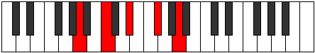

# Mode Phrynic

## Links

- [Documentation](index.md)
- [Scales Index](Scales.md)
- [Modes Index](Modes.md)
- [Chords Index](Chords.md)

## Parent Scale

[Phrynic](ScalePhrynic.md)

## Number

[585](https://ianring.com/musictheory/scales/585)

## Perfection

- 0 Perfect notes
- 4 Perfect notes

## Interval Pattern

3, 3, 3, 3

## Perfection Profile

[false false false false]

## Permutations

| Tonic | Notes | Signature | Illustration | Audio |
|-------|-------|-----------|--------------|-------|
| [C](ModeCNaturalPhrynic.md) | **C**, **D#**, **F#**, **A**, **C** | C |  | [midi](https://github.com/edipermadi/music/blob/main/docs/ModeCNaturalPhrynic.mid?raw=true) |
| [C#](ModeCSharpPhrynic.md) | **C#**, **E**, **G**, **A#**, **C#** | C |  | [midi](https://github.com/edipermadi/music/blob/main/docs/ModeCSharpPhrynic.mid?raw=true) |
| [Db](ModeDFlatPhrynic.md) | **Db**, **E**, **G**, **Bb**, **Db** | C |  | [midi](https://github.com/edipermadi/music/blob/main/docs/ModeDFlatPhrynic.mid?raw=true) |
| [D](ModeDNaturalPhrynic.md) | **D**, **F**, **G#**, **B**, **D** | C |  | [midi](https://github.com/edipermadi/music/blob/main/docs/ModeDNaturalPhrynic.mid?raw=true) |
| [D#](ModeDSharpPhrynic.md) | **D#**, **F#**, **A**, **C**, **D#** | C |  | [midi](https://github.com/edipermadi/music/blob/main/docs/ModeDSharpPhrynic.mid?raw=true) |
| [Eb](ModeEFlatPhrynic.md) | **Eb**, **Gb**, **A**, **C**, **Eb** | C |  | [midi](https://github.com/edipermadi/music/blob/main/docs/ModeEFlatPhrynic.mid?raw=true) |
| [E](ModeENaturalPhrynic.md) | **E**, **G**, **A#**, **C#**, **E** | C |  | [midi](https://github.com/edipermadi/music/blob/main/docs/ModeENaturalPhrynic.mid?raw=true) |
| [F](ModeFNaturalPhrynic.md) | **F**, **G#**, **B**, **D**, **F** | C |  | [midi](https://github.com/edipermadi/music/blob/main/docs/ModeFNaturalPhrynic.mid?raw=true) |
| [F#](ModeFSharpPhrynic.md) | **F#**, **A**, **C**, **D#**, **F#** | C |  | [midi](https://github.com/edipermadi/music/blob/main/docs/ModeFSharpPhrynic.mid?raw=true) |
| [Gb](ModeGFlatPhrynic.md) | **Gb**, **A**, **C**, **Eb**, **Gb** | C |  | [midi](https://github.com/edipermadi/music/blob/main/docs/ModeGFlatPhrynic.mid?raw=true) |
| [G](ModeGNaturalPhrynic.md) | **G**, **A#**, **C#**, **E**, **G** | C |  | [midi](https://github.com/edipermadi/music/blob/main/docs/ModeGNaturalPhrynic.mid?raw=true) |
| [G#](ModeGSharpPhrynic.md) | **G#**, **B**, **D**, **F**, **G#** | C |  | [midi](https://github.com/edipermadi/music/blob/main/docs/ModeGSharpPhrynic.mid?raw=true) |
| [Ab](ModeAFlatPhrynic.md) | **Ab**, **B**, **D**, **F**, **Ab** | C |  | [midi](https://github.com/edipermadi/music/blob/main/docs/ModeAFlatPhrynic.mid?raw=true) |
| [A](ModeANaturalPhrynic.md) | **A**, **C**, **D#**, **F#**, **A** | C |  | [midi](https://github.com/edipermadi/music/blob/main/docs/ModeANaturalPhrynic.mid?raw=true) |
| [A#](ModeASharpPhrynic.md) | **A#**, **C#**, **E**, **G**, **A#** | C |  | [midi](https://github.com/edipermadi/music/blob/main/docs/ModeASharpPhrynic.mid?raw=true) |
| [Bb](ModeBFlatPhrynic.md) | **Bb**, **Db**, **E**, **G**, **Bb** | C |  | [midi](https://github.com/edipermadi/music/blob/main/docs/ModeBFlatPhrynic.mid?raw=true) |
| [B](ModeBNaturalPhrynic.md) | **B**, **D**, **F**, **G#**, **B** | C |  | [midi](https://github.com/edipermadi/music/blob/main/docs/ModeBNaturalPhrynic.mid?raw=true) |
