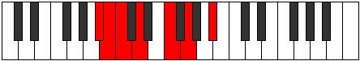

# Mode Phrynimic

## Links

- [Documentation](index.md)
- [Scales Index](Scales.md)
- [Modes Index](Modes.md)
- [Chords Index](Chords.md)

## Parent Scale

[Ionacrimic](ScaleIonacrimic.md)

## Number

[663](https://ianring.com/musictheory/scales/663)

## Perfection

- 4 Perfect notes
- 2 Perfect notes

## Perfection Profile

[true false true false true true]

## Permutations

| Tonic | Notes | Signature | Illustration | Audio |
|-------|-------|-----------|--------------|-------|
| [C](ModeCNaturalPhrynimic.md) | C, **Db**, Ebb, **Fb**, G, A, C | C |  | [midi](ModeCNaturalPhrynimic.mid) [ogg](ModeCNaturalPhrynimic.ogg) |
| [C#](ModeCSharpPhrynimic.md) | C#, **D**, Eb, **F**, G#, A#, C# | C |  | [midi](ModeCSharpPhrynimic.mid) [ogg](ModeCSharpPhrynimic.ogg) |
| [Db](ModeDFlatPhrynimic.md) | Db, **Ebb**, Fbb, **Gbb**, Ab, Bb, Db | C |  | [midi](ModeDFlatPhrynimic.mid) [ogg](ModeDFlatPhrynimic.ogg) |
| [D](ModeDNaturalPhrynimic.md) | D, **Eb**, Fb, **Gb**, A, B, D | C |  | [midi](ModeDNaturalPhrynimic.mid) [ogg](ModeDNaturalPhrynimic.ogg) |
| [D#](ModeDSharpPhrynimic.md) | D#, **E**, F, **G**, A#, B#, D# | C |  | [midi](ModeDSharpPhrynimic.mid) [ogg](ModeDSharpPhrynimic.ogg) |
| [Eb](ModeEFlatPhrynimic.md) | Eb, **Fb**, Gbb, **Abb**, Bb, C, Eb | C |  | [midi](ModeEFlatPhrynimic.mid) [ogg](ModeEFlatPhrynimic.ogg) |
| [E](ModeENaturalPhrynimic.md) | E, **F**, Gb, **Ab**, B, C#, E | C |  | [midi](ModeENaturalPhrynimic.mid) [ogg](ModeENaturalPhrynimic.ogg) |
| [F](ModeFNaturalPhrynimic.md) | F, **Gb**, Abb, **Bbb**, C, D, F | C |  | [midi](ModeFNaturalPhrynimic.mid) [ogg](ModeFNaturalPhrynimic.ogg) |
| [F#](ModeFSharpPhrynimic.md) | F#, **G**, Ab, **Bb**, C#, D#, F# | C |  | [midi](ModeFSharpPhrynimic.mid) [ogg](ModeFSharpPhrynimic.ogg) |
| [Gb](ModeGFlatPhrynimic.md) | Gb, **Abb**, Bbbb, **Cbb**, Db, Eb, Gb | C |  | [midi](ModeGFlatPhrynimic.mid) [ogg](ModeGFlatPhrynimic.ogg) |
| [G](ModeGNaturalPhrynimic.md) | G, **Ab**, Bbb, **Cb**, D, E, G | C |  | [midi](ModeGNaturalPhrynimic.mid) [ogg](ModeGNaturalPhrynimic.ogg) |
| [G#](ModeGSharpPhrynimic.md) | G#, **A**, Bb, **C**, D#, E#, G# | C |  | [midi](ModeGSharpPhrynimic.mid) [ogg](ModeGSharpPhrynimic.ogg) |
| [Ab](ModeAFlatPhrynimic.md) | Ab, **Bbb**, Cbb, **Dbb**, Eb, F, Ab | C |  | [midi](ModeAFlatPhrynimic.mid) [ogg](ModeAFlatPhrynimic.ogg) |
| [A](ModeANaturalPhrynimic.md) | A, **Bb**, Cb, **Db**, E, F#, A | C |  | [midi](ModeANaturalPhrynimic.mid) [ogg](ModeANaturalPhrynimic.ogg) |
| [A#](ModeASharpPhrynimic.md) | A#, **B**, C, **D**, E#, F##, A# | C |  | [midi](ModeASharpPhrynimic.mid) [ogg](ModeASharpPhrynimic.ogg) |
| [Bb](ModeBFlatPhrynimic.md) | Bb, **Cb**, Dbb, **Ebb**, F, G, Bb | C |  | [midi](ModeBFlatPhrynimic.mid) [ogg](ModeBFlatPhrynimic.ogg) |
| [B](ModeBNaturalPhrynimic.md) | B, **C**, Db, **Eb**, F#, G#, B | C |  | [midi](ModeBNaturalPhrynimic.mid) [ogg](ModeBNaturalPhrynimic.ogg) |
