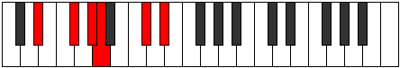
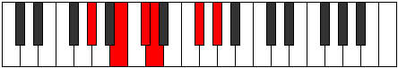

# Mode Phrynitonic

## Links

- [Documentation](index.md)
- [Scales Index](Scales.md)
- [Modes Index](Modes.md)
- [Chords Index](Chords.md)

## Parent Scale

[Gathitonic](ScaleGathitonic.md)

## Number

[1129](https://ianring.com/musictheory/scales/1129)

## Perfection

- 3 Perfect notes
- 2 Perfect notes

## Interval Pattern

3, 2, 1, 4, 2

## Perfection Profile

[false true true false true]

## Permutations

| Tonic | Notes | Signature | Illustration | Audio |
|-------|-------|-----------|--------------|-------|
| [C](ModeCNaturalPhrynitonic.md) | **C**, D#, F, **F#**, A#, **C** | C |  | [midi](https://github.com/edipermadi/music/blob/main/docs/ModeCNaturalPhrynitonic.mid?raw=true) |
| [C#](ModeCSharpPhrynitonic.md) | **C#**, E, F#, **G**, B, **C#** | C |  | [midi](https://github.com/edipermadi/music/blob/main/docs/ModeCSharpPhrynitonic.mid?raw=true) |
| [Db](ModeDFlatPhrynitonic.md) | **Db**, E, Gb, **G**, B, **Db** | C |  | [midi](https://github.com/edipermadi/music/blob/main/docs/ModeDFlatPhrynitonic.mid?raw=true) |
| [D](ModeDNaturalPhrynitonic.md) | **D**, F, G, **G#**, C, **D** | C |  | [midi](https://github.com/edipermadi/music/blob/main/docs/ModeDNaturalPhrynitonic.mid?raw=true) |
| [D#](ModeDSharpPhrynitonic.md) | **D#**, F#, G#, **A**, C#, **D#** | C |  | [midi](https://github.com/edipermadi/music/blob/main/docs/ModeDSharpPhrynitonic.mid?raw=true) |
| [Eb](ModeEFlatPhrynitonic.md) | **Eb**, Gb, Ab, **A**, Db, **Eb** | C |  | [midi](https://github.com/edipermadi/music/blob/main/docs/ModeEFlatPhrynitonic.mid?raw=true) |
| [E](ModeENaturalPhrynitonic.md) | **E**, G, A, **A#**, D, **E** | C |  | [midi](https://github.com/edipermadi/music/blob/main/docs/ModeENaturalPhrynitonic.mid?raw=true) |
| [F](ModeFNaturalPhrynitonic.md) | **F**, G#, A#, **B**, D#, **F** | C |  | [midi](https://github.com/edipermadi/music/blob/main/docs/ModeFNaturalPhrynitonic.mid?raw=true) |
| [F#](ModeFSharpPhrynitonic.md) | **F#**, A, B, **C**, E, **F#** | C |  | [midi](https://github.com/edipermadi/music/blob/main/docs/ModeFSharpPhrynitonic.mid?raw=true) |
| [Gb](ModeGFlatPhrynitonic.md) | **Gb**, A, B, **C**, E, **Gb** | C |  | [midi](https://github.com/edipermadi/music/blob/main/docs/ModeGFlatPhrynitonic.mid?raw=true) |
| [G](ModeGNaturalPhrynitonic.md) | **G**, A#, C, **C#**, F, **G** | C |  | [midi](https://github.com/edipermadi/music/blob/main/docs/ModeGNaturalPhrynitonic.mid?raw=true) |
| [G#](ModeGSharpPhrynitonic.md) | **G#**, B, C#, **D**, F#, **G#** | C |  | [midi](https://github.com/edipermadi/music/blob/main/docs/ModeGSharpPhrynitonic.mid?raw=true) |
| [Ab](ModeAFlatPhrynitonic.md) | **Ab**, B, Db, **D**, Gb, **Ab** | C |  | [midi](https://github.com/edipermadi/music/blob/main/docs/ModeAFlatPhrynitonic.mid?raw=true) |
| [A](ModeANaturalPhrynitonic.md) | **A**, C, D, **D#**, G, **A** | C |  | [midi](https://github.com/edipermadi/music/blob/main/docs/ModeANaturalPhrynitonic.mid?raw=true) |
| [A#](ModeASharpPhrynitonic.md) | **A#**, C#, D#, **E**, G#, **A#** | C |  | [midi](https://github.com/edipermadi/music/blob/main/docs/ModeASharpPhrynitonic.mid?raw=true) |
| [Bb](ModeBFlatPhrynitonic.md) | **Bb**, Db, Eb, **E**, Ab, **Bb** | C |  | [midi](https://github.com/edipermadi/music/blob/main/docs/ModeBFlatPhrynitonic.mid?raw=true) |
| [B](ModeBNaturalPhrynitonic.md) | **B**, D, E, **F**, A, **B** | C |  | [midi](https://github.com/edipermadi/music/blob/main/docs/ModeBNaturalPhrynitonic.mid?raw=true) |
