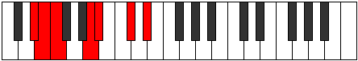

# Mode Phryptimic

## Links

- [Documentation](README.md)
- [Scales Index](Scales.md)
- [Modes Index](Modes.md)
- [Chords Index](Chords.md)

## Parent Scale

[Phralimic](ScalePhralimic.md)

## Number

[1223](https://ianring.com/musictheory/scales/1223)

## Luminosity

-1

## Transposition

1, 1, 4, 1, 3, 2

## Chord Pattern

IV

## Perfection

- 3 Perfect notes
- 3 Perfect notes

## Perfection Profile

true, false, false, true, true, false

## Permutations

| Tonic | Notes | Signature | Illustration | Audio |
|-------|-------|-----------|--------------|-------|
| [C](ModeCNaturalPhryptimic.md) | C, **Db**, **Ebb**, F#, G, **A#**, C | C |  | [midi](https://github.com/edipermadi/music/blob/main/docs/ModeCNaturalPhryptimic.mid?raw=true) |
| [C#](ModeCSharpPhryptimic.md) | C#, **D**, **Eb**, F##, G#, **A##**, C# | C |  | [midi](https://github.com/edipermadi/music/blob/main/docs/ModeCSharpPhryptimic.mid?raw=true) |
| [Db](ModeDFlatPhryptimic.md) | Db, **Ebb**, **Fbb**, G, Ab, **B**, Db | C |  | [midi](https://github.com/edipermadi/music/blob/main/docs/ModeDFlatPhryptimic.mid?raw=true) |
| [D](ModeDNaturalPhryptimic.md) | D, **Eb**, **Fb**, G#, A, **B#**, D | C |  | [midi](https://github.com/edipermadi/music/blob/main/docs/ModeDNaturalPhryptimic.mid?raw=true) |
| [D#](ModeDSharpPhryptimic.md) | D#, **E**, **F**, G##, A#, **B##**, D# | C |  | [midi](https://github.com/edipermadi/music/blob/main/docs/ModeDSharpPhryptimic.mid?raw=true) |
| [Eb](ModeEFlatPhryptimic.md) | Eb, **Fb**, **Gbb**, A, Bb, **C#**, Eb | C |  | [midi](https://github.com/edipermadi/music/blob/main/docs/ModeEFlatPhryptimic.mid?raw=true) |
| [E](ModeENaturalPhryptimic.md) | E, **F**, **Gb**, A#, B, **C##**, E | C |  | [midi](https://github.com/edipermadi/music/blob/main/docs/ModeENaturalPhryptimic.mid?raw=true) |
| [F](ModeFNaturalPhryptimic.md) | F, **Gb**, **Abb**, B, C, **D#**, F | C |  | [midi](https://github.com/edipermadi/music/blob/main/docs/ModeFNaturalPhryptimic.mid?raw=true) |
| [F#](ModeFSharpPhryptimic.md) | F#, **G**, **Ab**, B#, C#, **D##**, F# | C |  | [midi](https://github.com/edipermadi/music/blob/main/docs/ModeFSharpPhryptimic.mid?raw=true) |
| [Gb](ModeGFlatPhryptimic.md) | Gb, **Abb**, **Bbbb**, C, Db, **E**, Gb | C |  | [midi](https://github.com/edipermadi/music/blob/main/docs/ModeGFlatPhryptimic.mid?raw=true) |
| [G](ModeGNaturalPhryptimic.md) | G, **Ab**, **Bbb**, C#, D, **E#**, G | C |  | [midi](https://github.com/edipermadi/music/blob/main/docs/ModeGNaturalPhryptimic.mid?raw=true) |
| [G#](ModeGSharpPhryptimic.md) | G#, **A**, **Bb**, C##, D#, **E##**, G# | C |  | [midi](https://github.com/edipermadi/music/blob/main/docs/ModeGSharpPhryptimic.mid?raw=true) |
| [Ab](ModeAFlatPhryptimic.md) | Ab, **Bbb**, **Cbb**, D, Eb, **F#**, Ab | C |  | [midi](https://github.com/edipermadi/music/blob/main/docs/ModeAFlatPhryptimic.mid?raw=true) |
| [A](ModeANaturalPhryptimic.md) | A, **Bb**, **Cb**, D#, E, **F##**, A | C |  | [midi](https://github.com/edipermadi/music/blob/main/docs/ModeANaturalPhryptimic.mid?raw=true) |
| [A#](ModeASharpPhryptimic.md) | A#, **B**, **C**, D##, E#, **F###**, A# | C |  | [midi](https://github.com/edipermadi/music/blob/main/docs/ModeASharpPhryptimic.mid?raw=true) |
| [Bb](ModeBFlatPhryptimic.md) | Bb, **Cb**, **Dbb**, E, F, **G#**, Bb | C |  | [midi](https://github.com/edipermadi/music/blob/main/docs/ModeBFlatPhryptimic.mid?raw=true) |
| [B](ModeBNaturalPhryptimic.md) | B, **C**, **Db**, E#, F#, **G##**, B | C |  | [midi](https://github.com/edipermadi/music/blob/main/docs/ModeBNaturalPhryptimic.mid?raw=true) |
