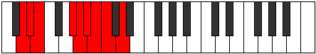

# Mode Phryptyllic

## Links

- [Documentation](index.md)
- [Scales Index](Scales.md)
- [Modes Index](Modes.md)
- [Chords Index](Chords.md)

## Parent Scale

[Aeoladyllic](ScaleAeoladyllic.md)

## Number

[1991](https://ianring.com/musictheory/scales/1991)

## Perfection

- 5 Perfect notes
- 3 Perfect notes

## Interval Pattern

1, 1, 4, 1, 1, 1, 1, 2

## Perfection Profile

[true true true true true false false false]

## Permutations

| Tonic | Notes | Signature | Illustration | Audio |
|-------|-------|-----------|--------------|-------|
| [C](ModeCNaturalPhryptyllic.md) | C, C#, D, F#, G, **G#**, **A**, **A#**, C | C |  | [midi](https://github.com/edipermadi/music/blob/main/docs/ModeCNaturalPhryptyllic.mid?raw=true) |
| [C#](ModeCSharpPhryptyllic.md) | C#, D, D#, G, G#, **A**, **A#**, **B**, C# | C |  | [midi](https://github.com/edipermadi/music/blob/main/docs/ModeCSharpPhryptyllic.mid?raw=true) |
| [Db](ModeDFlatPhryptyllic.md) | Db, D, Eb, G, Ab, **A**, **Bb**, **B**, Db | C |  | [midi](https://github.com/edipermadi/music/blob/main/docs/ModeDFlatPhryptyllic.mid?raw=true) |
| [D](ModeDNaturalPhryptyllic.md) | D, D#, E, G#, A, **A#**, **B**, **C**, D | C |  | [midi](https://github.com/edipermadi/music/blob/main/docs/ModeDNaturalPhryptyllic.mid?raw=true) |
| [D#](ModeDSharpPhryptyllic.md) | D#, E, F, A, A#, **B**, **C**, **C#**, D# | C |  | [midi](https://github.com/edipermadi/music/blob/main/docs/ModeDSharpPhryptyllic.mid?raw=true) |
| [Eb](ModeEFlatPhryptyllic.md) | Eb, E, F, A, Bb, **B**, **C**, **Db**, Eb | C |  | [midi](https://github.com/edipermadi/music/blob/main/docs/ModeEFlatPhryptyllic.mid?raw=true) |
| [E](ModeENaturalPhryptyllic.md) | E, F, F#, A#, B, **C**, **C#**, **D**, E | C |  | [midi](https://github.com/edipermadi/music/blob/main/docs/ModeENaturalPhryptyllic.mid?raw=true) |
| [F](ModeFNaturalPhryptyllic.md) | F, F#, G, B, C, **C#**, **D**, **D#**, F | C |  | [midi](https://github.com/edipermadi/music/blob/main/docs/ModeFNaturalPhryptyllic.mid?raw=true) |
| [F#](ModeFSharpPhryptyllic.md) | F#, G, G#, C, C#, **D**, **D#**, **E**, F# | C |  | [midi](https://github.com/edipermadi/music/blob/main/docs/ModeFSharpPhryptyllic.mid?raw=true) |
| [Gb](ModeGFlatPhryptyllic.md) | Gb, G, Ab, C, Db, **D**, **Eb**, **E**, Gb | C |  | [midi](https://github.com/edipermadi/music/blob/main/docs/ModeGFlatPhryptyllic.mid?raw=true) |
| [G](ModeGNaturalPhryptyllic.md) | G, G#, A, C#, D, **D#**, **E**, **F**, G | C |  | [midi](https://github.com/edipermadi/music/blob/main/docs/ModeGNaturalPhryptyllic.mid?raw=true) |
| [G#](ModeGSharpPhryptyllic.md) | G#, A, A#, D, D#, **E**, **F**, **F#**, G# | C |  | [midi](https://github.com/edipermadi/music/blob/main/docs/ModeGSharpPhryptyllic.mid?raw=true) |
| [Ab](ModeAFlatPhryptyllic.md) | Ab, A, Bb, D, Eb, **E**, **F**, **Gb**, Ab | C |  | [midi](https://github.com/edipermadi/music/blob/main/docs/ModeAFlatPhryptyllic.mid?raw=true) |
| [A](ModeANaturalPhryptyllic.md) | A, A#, B, D#, E, **F**, **F#**, **G**, A | C |  | [midi](https://github.com/edipermadi/music/blob/main/docs/ModeANaturalPhryptyllic.mid?raw=true) |
| [A#](ModeASharpPhryptyllic.md) | A#, B, C, E, F, **F#**, **G**, **G#**, A# | C |  | [midi](https://github.com/edipermadi/music/blob/main/docs/ModeASharpPhryptyllic.mid?raw=true) |
| [Bb](ModeBFlatPhryptyllic.md) | Bb, B, C, E, F, **Gb**, **G**, **Ab**, Bb | C |  | [midi](https://github.com/edipermadi/music/blob/main/docs/ModeBFlatPhryptyllic.mid?raw=true) |
| [B](ModeBNaturalPhryptyllic.md) | B, C, C#, F, F#, **G**, **G#**, **A**, B | C |  | [midi](https://github.com/edipermadi/music/blob/main/docs/ModeBNaturalPhryptyllic.mid?raw=true) |
