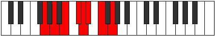

# Mode Phryrian

## Links

- [Documentation](README.md)
- [Scales Index](Scales.md)
- [Modes Index](Modes.md)
- [Chords Index](Chords.md)

## Parent Scale

[Aeolynian](ScaleAeolynian.md)

## Number

[1493](https://ianring.com/musictheory/scales/1493)

## Transposition

2, 2, 2, 1, 1, 2, 2

## Chord Pattern

I, IIb5, iii⁰, iv⁰b3, iv⁰b3, v, VI⁺, VI⁺, VII⁺, VII⁺

## Perfection

- 2 Perfect notes
- 5 Perfect notes

## Perfection Profile

[true false false false true false false]

## Permutations

| Tonic | Notes | Signature | Illustration | Audio |
|-------|-------|-----------|--------------|-------|
| [C](ModeCNaturalPhryrian.md) | C, **D**, **E**, **F#**, G, **Ab**, **Bb**, C | C |  | [midi](https://github.com/edipermadi/music/blob/main/docs/ModeCNaturalPhryrian.mid?raw=true) |
| [C#](ModeCSharpPhryrian.md) | C#, **D#**, **E#**, **F##**, G#, **A**, **B**, C# | C |  | [midi](https://github.com/edipermadi/music/blob/main/docs/ModeCSharpPhryrian.mid?raw=true) |
| [Db](ModeDFlatPhryrian.md) | Db, **Eb**, **F**, **G**, Ab, **Bbb**, **Cb**, Db | C |  | [midi](https://github.com/edipermadi/music/blob/main/docs/ModeDFlatPhryrian.mid?raw=true) |
| [D](ModeDNaturalPhryrian.md) | D, **E**, **F#**, **G#**, A, **Bb**, **C**, D | C |  | [midi](https://github.com/edipermadi/music/blob/main/docs/ModeDNaturalPhryrian.mid?raw=true) |
| [D#](ModeDSharpPhryrian.md) | D#, **E#**, **F##**, **G##**, A#, **B**, **C#**, D# | C |  | [midi](https://github.com/edipermadi/music/blob/main/docs/ModeDSharpPhryrian.mid?raw=true) |
| [Eb](ModeEFlatPhryrian.md) | Eb, **F**, **G**, **A**, Bb, **Cb**, **Db**, Eb | C |  | [midi](https://github.com/edipermadi/music/blob/main/docs/ModeEFlatPhryrian.mid?raw=true) |
| [E](ModeENaturalPhryrian.md) | E, **F#**, **G#**, **A#**, B, **C**, **D**, E | C |  | [midi](https://github.com/edipermadi/music/blob/main/docs/ModeENaturalPhryrian.mid?raw=true) |
| [F](ModeFNaturalPhryrian.md) | F, **G**, **A**, **B**, C, **Db**, **Eb**, F | C |  | [midi](https://github.com/edipermadi/music/blob/main/docs/ModeFNaturalPhryrian.mid?raw=true) |
| [F#](ModeFSharpPhryrian.md) | F#, **G#**, **A#**, **B#**, C#, **D**, **E**, F# | C |  | [midi](https://github.com/edipermadi/music/blob/main/docs/ModeFSharpPhryrian.mid?raw=true) |
| [Gb](ModeGFlatPhryrian.md) | Gb, **Ab**, **Bb**, **C**, Db, **Ebb**, **Fb**, Gb | C |  | [midi](https://github.com/edipermadi/music/blob/main/docs/ModeGFlatPhryrian.mid?raw=true) |
| [G](ModeGNaturalPhryrian.md) | G, **A**, **B**, **C#**, D, **Eb**, **F**, G | C |  | [midi](https://github.com/edipermadi/music/blob/main/docs/ModeGNaturalPhryrian.mid?raw=true) |
| [G#](ModeGSharpPhryrian.md) | G#, **A#**, **B#**, **C##**, D#, **E**, **F#**, G# | C |  | [midi](https://github.com/edipermadi/music/blob/main/docs/ModeGSharpPhryrian.mid?raw=true) |
| [Ab](ModeAFlatPhryrian.md) | Ab, **Bb**, **C**, **D**, Eb, **Fb**, **Gb**, Ab | C |  | [midi](https://github.com/edipermadi/music/blob/main/docs/ModeAFlatPhryrian.mid?raw=true) |
| [A](ModeANaturalPhryrian.md) | A, **B**, **C#**, **D#**, E, **F**, **G**, A | C |  | [midi](https://github.com/edipermadi/music/blob/main/docs/ModeANaturalPhryrian.mid?raw=true) |
| [A#](ModeASharpPhryrian.md) | A#, **B#**, **C##**, **D##**, E#, **F#**, **G#**, A# | C |  | [midi](https://github.com/edipermadi/music/blob/main/docs/ModeASharpPhryrian.mid?raw=true) |
| [Bb](ModeBFlatPhryrian.md) | Bb, **C**, **D**, **E**, F, **Gb**, **Ab**, Bb | C |  | [midi](https://github.com/edipermadi/music/blob/main/docs/ModeBFlatPhryrian.mid?raw=true) |
| [B](ModeBNaturalPhryrian.md) | B, **C#**, **D#**, **E#**, F#, **G**, **A**, B | C |  | [midi](https://github.com/edipermadi/music/blob/main/docs/ModeBNaturalPhryrian.mid?raw=true) |
