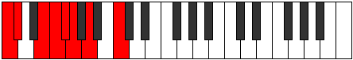

# Mode Phrythian

## Links

- [Documentation](index.md)
- [Scales Index](Scales.md)
- [Modes Index](Modes.md)
- [Chords Index](Chords.md)

## Parent Scale

[Zarian](ScaleZarian.md)

## Number

[755](https://ianring.com/musictheory/scales/755)

## Interval Pattern

1, 3, 1, 1, 1, 2, 3

## Chord Pattern

v, VII⁺

## Perfection

- 4 Perfect notes
- 3 Perfect notes

## Perfection Profile

[true false false true true false true]

## Permutations

| Tonic | Notes | Signature | Illustration | Audio |
|-------|-------|-----------|--------------|-------|
| [C](ModeCNaturalPhrythian.md) | C, **Db**, **E**, F, Gb, **Abb**, Bbb, C | C |  | [midi](https://github.com/edipermadi/music/blob/main/docs/ModeCNaturalPhrythian.mid?raw=true) |
| [C#](ModeCSharpPhrythian.md) | C#, **D**, **E#**, F#, G, **Ab**, Bb, C# | C |  | [midi](https://github.com/edipermadi/music/blob/main/docs/ModeCSharpPhrythian.mid?raw=true) |
| [Db](ModeDFlatPhrythian.md) | Db, **Ebb**, **F**, Gb, Abb, **Bbbb**, Cbb, Db | C |  | [midi](https://github.com/edipermadi/music/blob/main/docs/ModeDFlatPhrythian.mid?raw=true) |
| [D](ModeDNaturalPhrythian.md) | D, **Eb**, **F#**, G, Ab, **Bbb**, Cb, D | C |  | [midi](https://github.com/edipermadi/music/blob/main/docs/ModeDNaturalPhrythian.mid?raw=true) |
| [D#](ModeDSharpPhrythian.md) | D#, **E**, **F##**, G#, A, **Bb**, C, D# | C |  | [midi](https://github.com/edipermadi/music/blob/main/docs/ModeDSharpPhrythian.mid?raw=true) |
| [Eb](ModeEFlatPhrythian.md) | Eb, **Fb**, **G**, Ab, Bbb, **Cbb**, Dbb, Eb | C |  | [midi](https://github.com/edipermadi/music/blob/main/docs/ModeEFlatPhrythian.mid?raw=true) |
| [E](ModeENaturalPhrythian.md) | E, **F**, **G#**, A, Bb, **Cb**, Db, E | C |  | [midi](https://github.com/edipermadi/music/blob/main/docs/ModeENaturalPhrythian.mid?raw=true) |
| [F](ModeFNaturalPhrythian.md) | F, **Gb**, **A**, Bb, Cb, **Dbb**, Ebb, F | C |  | [midi](https://github.com/edipermadi/music/blob/main/docs/ModeFNaturalPhrythian.mid?raw=true) |
| [F#](ModeFSharpPhrythian.md) | F#, **G**, **A#**, B, C, **Db**, Eb, F# | C |  | [midi](https://github.com/edipermadi/music/blob/main/docs/ModeFSharpPhrythian.mid?raw=true) |
| [Gb](ModeGFlatPhrythian.md) | Gb, **Abb**, **Bb**, Cb, Dbb, **Ebbb**, Fbb, Gb | C |  | [midi](https://github.com/edipermadi/music/blob/main/docs/ModeGFlatPhrythian.mid?raw=true) |
| [G](ModeGNaturalPhrythian.md) | G, **Ab**, **B**, C, Db, **Ebb**, Fb, G | C |  | [midi](https://github.com/edipermadi/music/blob/main/docs/ModeGNaturalPhrythian.mid?raw=true) |
| [G#](ModeGSharpPhrythian.md) | G#, **A**, **B#**, C#, D, **Eb**, F, G# | C |  | [midi](https://github.com/edipermadi/music/blob/main/docs/ModeGSharpPhrythian.mid?raw=true) |
| [Ab](ModeAFlatPhrythian.md) | Ab, **Bbb**, **C**, Db, Ebb, **Fbb**, Gbb, Ab | C |  | [midi](https://github.com/edipermadi/music/blob/main/docs/ModeAFlatPhrythian.mid?raw=true) |
| [A](ModeANaturalPhrythian.md) | A, **Bb**, **C#**, D, Eb, **Fb**, Gb, A | C |  | [midi](https://github.com/edipermadi/music/blob/main/docs/ModeANaturalPhrythian.mid?raw=true) |
| [A#](ModeASharpPhrythian.md) | A#, **B**, **C##**, D#, E, **F**, G, A# | C |  | [midi](https://github.com/edipermadi/music/blob/main/docs/ModeASharpPhrythian.mid?raw=true) |
| [Bb](ModeBFlatPhrythian.md) | Bb, **Cb**, **D**, Eb, Fb, **Gbb**, Abb, Bb | C |  | [midi](https://github.com/edipermadi/music/blob/main/docs/ModeBFlatPhrythian.mid?raw=true) |
| [B](ModeBNaturalPhrythian.md) | B, **C**, **D#**, E, F, **Gb**, Ab, B | C |  | [midi](https://github.com/edipermadi/music/blob/main/docs/ModeBNaturalPhrythian.mid?raw=true) |
