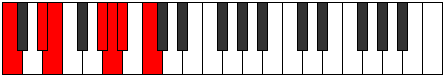

# Mode Phrythimic

## Links

- [Documentation](index.md)
- [Scales Index](Scales.md)
- [Modes Index](Modes.md)
- [Chords Index](Chords.md)

## Parent Scale

[Kanimic](ScaleKanimic.md)

## Number

[1817](https://ianring.com/musictheory/scales/1817)

## Perfection

- 3 Perfect notes
- 3 Perfect notes

## Perfection Profile

[false true false true true false]

## Permutations

| Tonic | Notes | Signature | Illustration | Audio |
|-------|-------|-----------|--------------|-------|
| [C](ModeCNaturalPhrythimic.md) | **C**, D#, **E**, F###, G##, **A#**, **C** | C |  | [midi](ModeCNaturalPhrythimic.mid) [ogg](ModeCNaturalPhrythimic.ogg) |
| [C#](ModeCSharpPhrythimic.md) | **C#**, D##, **E#**, Cbbb, Cbb, **Dbbb**, **C#** | C |  | [midi](ModeCSharpPhrythimic.mid) [ogg](ModeCSharpPhrythimic.ogg) |
| [Db](ModeDFlatPhrythimic.md) | **Db**, E, **F**, G##, A#, **B**, **Db** | C |  | [midi](ModeDFlatPhrythimic.mid) [ogg](ModeDFlatPhrythimic.ogg) |
| [D](ModeDNaturalPhrythimic.md) | **D**, E#, **F#**, G###, A##, **B#**, **D** | C |  | [midi](ModeDNaturalPhrythimic.mid) [ogg](ModeDNaturalPhrythimic.ogg) |
| [D#](ModeDSharpPhrythimic.md) | **D#**, E##, **F##**, Cb, Dbb, **Ebbb**, **D#** | C |  | [midi](ModeDSharpPhrythimic.mid) [ogg](ModeDSharpPhrythimic.ogg) |
| [Eb](ModeEFlatPhrythimic.md) | **Eb**, F#, **G**, A##, B#, **C#**, **Eb** | C |  | [midi](ModeEFlatPhrythimic.mid) [ogg](ModeEFlatPhrythimic.ogg) |
| [E](ModeENaturalPhrythimic.md) | **E**, F##, **G#**, A###, B##, **C##**, **E** | C |  | [midi](ModeENaturalPhrythimic.mid) [ogg](ModeENaturalPhrythimic.ogg) |
| [F](ModeFNaturalPhrythimic.md) | **F**, G#, **A**, B##, C##, **D#**, **F** | C |  | [midi](ModeFNaturalPhrythimic.mid) [ogg](ModeFNaturalPhrythimic.ogg) |
| [F#](ModeFSharpPhrythimic.md) | **F#**, G##, **A#**, B###, C###, **D##**, **F#** | C |  | [midi](ModeFSharpPhrythimic.mid) [ogg](ModeFSharpPhrythimic.ogg) |
| [Gb](ModeGFlatPhrythimic.md) | **Gb**, A, **Bb**, C##, D#, **E**, **Gb** | C |  | [midi](ModeGFlatPhrythimic.mid) [ogg](ModeGFlatPhrythimic.ogg) |
| [G](ModeGNaturalPhrythimic.md) | **G**, A#, **B**, C###, D##, **E#**, **G** | C |  | [midi](ModeGNaturalPhrythimic.mid) [ogg](ModeGNaturalPhrythimic.ogg) |
| [G#](ModeGSharpPhrythimic.md) | **G#**, A##, **B#**, D##, E#, **F#**, **G#** | C |  | [midi](ModeGSharpPhrythimic.mid) [ogg](ModeGSharpPhrythimic.ogg) |
| [Ab](ModeAFlatPhrythimic.md) | **Ab**, B, **C**, D##, E#, **F#**, **Ab** | C |  | [midi](ModeAFlatPhrythimic.mid) [ogg](ModeAFlatPhrythimic.ogg) |
| [A](ModeANaturalPhrythimic.md) | **A**, B#, **C#**, D###, E##, **F##**, **A** | C |  | [midi](ModeANaturalPhrythimic.mid) [ogg](ModeANaturalPhrythimic.ogg) |
| [A#](ModeASharpPhrythimic.md) | **A#**, B##, **C##**, E##, F##, **G#**, **A#** | C |  | [midi](ModeASharpPhrythimic.mid) [ogg](ModeASharpPhrythimic.ogg) |
| [Bb](ModeBFlatPhrythimic.md) | **Bb**, C#, **D**, E##, F##, **G#**, **Bb** | C |  | [midi](ModeBFlatPhrythimic.mid) [ogg](ModeBFlatPhrythimic.ogg) |
| [B](ModeBNaturalPhrythimic.md) | **B**, C##, **D#**, E###, F###, **G##**, **B** | C |  | [midi](ModeBNaturalPhrythimic.mid) [ogg](ModeBNaturalPhrythimic.ogg) |
