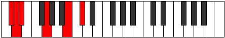
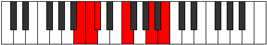

# Mode Phrythitonic

## Links

- [Documentation](index.md)
- [Scales Index](Scales.md)
- [Modes Index](Modes.md)
- [Chords Index](Chords.md)

## Parent Scale

[Zylitonic](ScaleZylitonic.md)

## Number

[1095](https://ianring.com/musictheory/scales/1095)

## Perfection

- 1 Perfect notes
- 4 Perfect notes

## Perfection Profile

[false false false true false]

## Permutations

| Tonic | Notes | Signature | Illustration | Audio |
|-------|-------|-----------|--------------|-------|
| [C](ModeCNaturalPhrythitonic.md) | **C**, **C#**, **D**, F#, **A#**, **C** | C |  | [midi](ModeCNaturalPhrythitonic.mid) [ogg](ModeCNaturalPhrythitonic.ogg) |
| [C#](ModeCSharpPhrythitonic.md) | **C#**, **D**, **D#**, G, **B**, **C#** | C |  | [midi](ModeCSharpPhrythitonic.mid) [ogg](ModeCSharpPhrythitonic.ogg) |
| [Db](ModeDFlatPhrythitonic.md) | **Db**, **D**, **Eb**, G, **B**, **Db** | C |  | [midi](ModeDFlatPhrythitonic.mid) [ogg](ModeDFlatPhrythitonic.ogg) |
| [D](ModeDNaturalPhrythitonic.md) | **D**, **D#**, **E**, G#, **C**, **D** | C |  | [midi](ModeDNaturalPhrythitonic.mid) [ogg](ModeDNaturalPhrythitonic.ogg) |
| [D#](ModeDSharpPhrythitonic.md) | **D#**, **E**, **F**, A, **C#**, **D#** | C |  | [midi](ModeDSharpPhrythitonic.mid) [ogg](ModeDSharpPhrythitonic.ogg) |
| [Eb](ModeEFlatPhrythitonic.md) | **Eb**, **E**, **F**, A, **Db**, **Eb** | C |  | [midi](ModeEFlatPhrythitonic.mid) [ogg](ModeEFlatPhrythitonic.ogg) |
| [E](ModeENaturalPhrythitonic.md) | **E**, **F**, **F#**, A#, **D**, **E** | C |  | [midi](ModeENaturalPhrythitonic.mid) [ogg](ModeENaturalPhrythitonic.ogg) |
| [F](ModeFNaturalPhrythitonic.md) | **F**, **F#**, **G**, B, **D#**, **F** | C |  | [midi](ModeFNaturalPhrythitonic.mid) [ogg](ModeFNaturalPhrythitonic.ogg) |
| [F#](ModeFSharpPhrythitonic.md) | **F#**, **G**, **G#**, C, **E**, **F#** | C |  | [midi](ModeFSharpPhrythitonic.mid) [ogg](ModeFSharpPhrythitonic.ogg) |
| [Gb](ModeGFlatPhrythitonic.md) | **Gb**, **G**, **Ab**, C, **E**, **Gb** | C |  | [midi](ModeGFlatPhrythitonic.mid) [ogg](ModeGFlatPhrythitonic.ogg) |
| [G](ModeGNaturalPhrythitonic.md) | **G**, **G#**, **A**, C#, **F**, **G** | C |  | [midi](ModeGNaturalPhrythitonic.mid) [ogg](ModeGNaturalPhrythitonic.ogg) |
| [G#](ModeGSharpPhrythitonic.md) | **G#**, **A**, **A#**, D, **F#**, **G#** | C |  | [midi](ModeGSharpPhrythitonic.mid) [ogg](ModeGSharpPhrythitonic.ogg) |
| [Ab](ModeAFlatPhrythitonic.md) | **Ab**, **A**, **Bb**, D, **Gb**, **Ab** | C |  | [midi](ModeAFlatPhrythitonic.mid) [ogg](ModeAFlatPhrythitonic.ogg) |
| [A](ModeANaturalPhrythitonic.md) | **A**, **A#**, **B**, D#, **G**, **A** | C |  | [midi](ModeANaturalPhrythitonic.mid) [ogg](ModeANaturalPhrythitonic.ogg) |
| [A#](ModeASharpPhrythitonic.md) | **A#**, **B**, **C**, E, **G#**, **A#** | C |  | [midi](ModeASharpPhrythitonic.mid) [ogg](ModeASharpPhrythitonic.ogg) |
| [Bb](ModeBFlatPhrythitonic.md) | **Bb**, **B**, **C**, E, **Ab**, **Bb** | C |  | [midi](ModeBFlatPhrythitonic.mid) [ogg](ModeBFlatPhrythitonic.ogg) |
| [B](ModeBNaturalPhrythitonic.md) | **B**, **C**, **C#**, F, **A**, **B** | C |  | [midi](ModeBNaturalPhrythitonic.mid) [ogg](ModeBNaturalPhrythitonic.ogg) |
