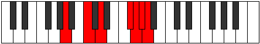
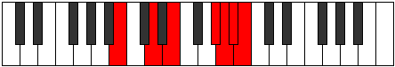

# Mode Podimic

## Links

- [Documentation](README.md)
- [Scales Index](Scales.md)
- [Modes Index](Modes.md)
- [Chords Index](Chords.md)

## Parent Scale

[Pynimic](ScalePynimic.md)

## Number

[3625](https://ianring.com/musictheory/scales/3625)

## Transposition

3, 2, 4, 1, 1, 1

## Chord Pattern

iv⁰b3

## Perfection

- 3 Perfect notes
- 3 Perfect notes

## Perfection Profile

false, true, true, false, true, false

## Permutations

| Tonic | Notes | Signature | Illustration | Audio |
|-------|-------|-----------|--------------|-------|
| [C](ModeCNaturalPodimic.md) | **C**, D#, E#, **Cbbb**, Cbb, **Dbbb**, **C** | C |  | [midi](https://github.com/edipermadi/music/blob/main/docs/ModeCNaturalPodimic.mid?raw=true) |
| [C#](ModeCSharpPodimic.md) | **C#**, D##, E##, **Cbb**, Dbbb, **Dbb**, **C#** | C |  | [midi](https://github.com/edipermadi/music/blob/main/docs/ModeCSharpPodimic.mid?raw=true) |
| [Db](ModeDFlatPodimic.md) | **Db**, E, F#, **G###**, A##, **B#**, **Db** | C |  | [midi](https://github.com/edipermadi/music/blob/main/docs/ModeDFlatPodimic.mid?raw=true) |
| [D](ModeDNaturalPodimic.md) | **D**, E#, F##, **Cb**, Dbb, **Ebbb**, **D** | C |  | [midi](https://github.com/edipermadi/music/blob/main/docs/ModeDNaturalPodimic.mid?raw=true) |
| [D#](ModeDSharpPodimic.md) | **D#**, E##, F###, **Dbb**, Ebbb, **Fbbb**, **D#** | C |  | [midi](https://github.com/edipermadi/music/blob/main/docs/ModeDSharpPodimic.mid?raw=true) |
| [Eb](ModeEFlatPodimic.md) | **Eb**, F#, G#, **A###**, B##, **C##**, **Eb** | C |  | [midi](https://github.com/edipermadi/music/blob/main/docs/ModeEFlatPodimic.mid?raw=true) |
| [E](ModeENaturalPodimic.md) | **E**, F##, G##, **Db**, Ebb, **Fbb**, **E** | C |  | [midi](https://github.com/edipermadi/music/blob/main/docs/ModeENaturalPodimic.mid?raw=true) |
| [F](ModeFNaturalPodimic.md) | **F**, G#, A#, **B###**, C###, **D##**, **F** | C |  | [midi](https://github.com/edipermadi/music/blob/main/docs/ModeFNaturalPodimic.mid?raw=true) |
| [F#](ModeFSharpPodimic.md) | **F#**, G##, A##, **C###**, D##, **E#**, **F#** | C |  | [midi](https://github.com/edipermadi/music/blob/main/docs/ModeFSharpPodimic.mid?raw=true) |
| [Gb](ModeGFlatPodimic.md) | **Gb**, A, B, **C###**, D##, **E#**, **Gb** | C |  | [midi](https://github.com/edipermadi/music/blob/main/docs/ModeGFlatPodimic.mid?raw=true) |
| [G](ModeGNaturalPodimic.md) | **G**, A#, B#, **D##**, E#, **F#**, **G** | C |  | [midi](https://github.com/edipermadi/music/blob/main/docs/ModeGNaturalPodimic.mid?raw=true) |
| [G#](ModeGSharpPodimic.md) | **G#**, A##, B##, **D###**, E##, **F##**, **G#** | C |  | [midi](https://github.com/edipermadi/music/blob/main/docs/ModeGSharpPodimic.mid?raw=true) |
| [Ab](ModeAFlatPodimic.md) | **Ab**, B, C#, **D###**, E##, **F##**, **Ab** | C |  | [midi](https://github.com/edipermadi/music/blob/main/docs/ModeAFlatPodimic.mid?raw=true) |
| [A](ModeANaturalPodimic.md) | **A**, B#, C##, **E##**, F##, **G#**, **A** | C |  | [midi](https://github.com/edipermadi/music/blob/main/docs/ModeANaturalPodimic.mid?raw=true) |
| [A#](ModeASharpPodimic.md) | **A#**, B##, C###, **E###**, F###, **G##**, **A#** | C |  | [midi](https://github.com/edipermadi/music/blob/main/docs/ModeASharpPodimic.mid?raw=true) |
| [Bb](ModeBFlatPodimic.md) | **Bb**, C#, D#, **E###**, F###, **G##**, **Bb** | C |  | [midi](https://github.com/edipermadi/music/blob/main/docs/ModeBFlatPodimic.mid?raw=true) |
| [B](ModeBNaturalPodimic.md) | **B**, C##, D##, **F###**, G##, **A#**, **B** | C |  | [midi](https://github.com/edipermadi/music/blob/main/docs/ModeBNaturalPodimic.mid?raw=true) |
