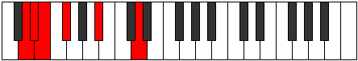
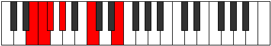

# Mode Poditonic

## Links

- [Documentation](README.md)
- [Scales Index](Scales.md)
- [Modes Index](Modes.md)
- [Chords Index](Chords.md)

## Parent Scale

[Ranitonic](ScaleRanitonic.md)

## Number

[279](https://ianring.com/musictheory/scales/279)

## Transposition

1, 1, 2, 4, 4

## Chord Pattern

## Perfection

- 1 Perfect notes
- 4 Perfect notes

## Perfection Profile

false, true, false, false, false

## Permutations

| Tonic | Notes | Signature | Illustration | Audio |
|-------|-------|-----------|--------------|-------|
| [C](ModeCNaturalPoditonic.md) | **C**, C#, **D**, **E**, **G#**, **C** | C |  | [midi](https://github.com/edipermadi/music/blob/main/docs/ModeCNaturalPoditonic.mid?raw=true) |
| [C#](ModeCSharpPoditonic.md) | **C#**, D, **D#**, **F**, **A**, **C#** | C |  | [midi](https://github.com/edipermadi/music/blob/main/docs/ModeCSharpPoditonic.mid?raw=true) |
| [Db](ModeDFlatPoditonic.md) | **Db**, D, **Eb**, **F**, **A**, **Db** | C |  | [midi](https://github.com/edipermadi/music/blob/main/docs/ModeDFlatPoditonic.mid?raw=true) |
| [D](ModeDNaturalPoditonic.md) | **D**, D#, **E**, **F#**, **A#**, **D** | C |  | [midi](https://github.com/edipermadi/music/blob/main/docs/ModeDNaturalPoditonic.mid?raw=true) |
| [D#](ModeDSharpPoditonic.md) | **D#**, E, **F**, **G**, **B**, **D#** | C |  | [midi](https://github.com/edipermadi/music/blob/main/docs/ModeDSharpPoditonic.mid?raw=true) |
| [Eb](ModeEFlatPoditonic.md) | **Eb**, E, **F**, **G**, **B**, **Eb** | C |  | [midi](https://github.com/edipermadi/music/blob/main/docs/ModeEFlatPoditonic.mid?raw=true) |
| [E](ModeENaturalPoditonic.md) | **E**, F, **F#**, **G#**, **C**, **E** | C |  | [midi](https://github.com/edipermadi/music/blob/main/docs/ModeENaturalPoditonic.mid?raw=true) |
| [F](ModeFNaturalPoditonic.md) | **F**, F#, **G**, **A**, **C#**, **F** | C |  | [midi](https://github.com/edipermadi/music/blob/main/docs/ModeFNaturalPoditonic.mid?raw=true) |
| [F#](ModeFSharpPoditonic.md) | **F#**, G, **G#**, **A#**, **D**, **F#** | C |  | [midi](https://github.com/edipermadi/music/blob/main/docs/ModeFSharpPoditonic.mid?raw=true) |
| [Gb](ModeGFlatPoditonic.md) | **Gb**, G, **Ab**, **Bb**, **D**, **Gb** | C |  | [midi](https://github.com/edipermadi/music/blob/main/docs/ModeGFlatPoditonic.mid?raw=true) |
| [G](ModeGNaturalPoditonic.md) | **G**, G#, **A**, **B**, **D#**, **G** | C |  | [midi](https://github.com/edipermadi/music/blob/main/docs/ModeGNaturalPoditonic.mid?raw=true) |
| [G#](ModeGSharpPoditonic.md) | **G#**, A, **A#**, **C**, **E**, **G#** | C |  | [midi](https://github.com/edipermadi/music/blob/main/docs/ModeGSharpPoditonic.mid?raw=true) |
| [Ab](ModeAFlatPoditonic.md) | **Ab**, A, **Bb**, **C**, **E**, **Ab** | C |  | [midi](https://github.com/edipermadi/music/blob/main/docs/ModeAFlatPoditonic.mid?raw=true) |
| [A](ModeANaturalPoditonic.md) | **A**, A#, **B**, **C#**, **F**, **A** | C |  | [midi](https://github.com/edipermadi/music/blob/main/docs/ModeANaturalPoditonic.mid?raw=true) |
| [A#](ModeASharpPoditonic.md) | **A#**, B, **C**, **D**, **F#**, **A#** | C |  | [midi](https://github.com/edipermadi/music/blob/main/docs/ModeASharpPoditonic.mid?raw=true) |
| [Bb](ModeBFlatPoditonic.md) | **Bb**, B, **C**, **D**, **Gb**, **Bb** | C |  | [midi](https://github.com/edipermadi/music/blob/main/docs/ModeBFlatPoditonic.mid?raw=true) |
| [B](ModeBNaturalPoditonic.md) | **B**, C, **C#**, **D#**, **G**, **B** | C |  | [midi](https://github.com/edipermadi/music/blob/main/docs/ModeBNaturalPoditonic.mid?raw=true) |
