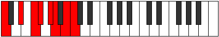
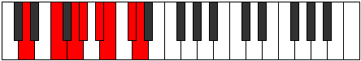

# Mode Pogian

## Links

- [Documentation](index.md)
- [Scales Index](Scales.md)
- [Modes Index](Modes.md)
- [Chords Index](Chords.md)

## Parent Scale

[Pogian](ScalePogian.md)

## Number

[2921](https://ianring.com/musictheory/scales/2921)

## Perfection

- 3 Perfect notes
- 4 Perfect notes

## Perfection Profile

[false false true false true false true]

## Permutations

| Tonic | Notes | Signature | Illustration | Audio |
|-------|-------|-----------|--------------|-------|
| [C](ModeCNaturalPogian.md) | **C**, **D#**, E#, **F#**, G#, **A**, B, **C** | C |  | [midi](ModeCNaturalPogian.mid) [ogg](ModeCNaturalPogian.ogg) |
| [C#](ModeCSharpPogian.md) | **C#**, **D##**, E##, **F##**, G##, **A#**, B#, **C#** | C |  | [midi](ModeCSharpPogian.mid) [ogg](ModeCSharpPogian.ogg) |
| [Db](ModeDFlatPogian.md) | **Db**, **E**, F#, **G**, A, **Bb**, C, **Db** | C |  | [midi](ModeDFlatPogian.mid) [ogg](ModeDFlatPogian.ogg) |
| [D](ModeDNaturalPogian.md) | **D**, **E#**, F##, **G#**, A#, **B**, C#, **D** | C |  | [midi](ModeDNaturalPogian.mid) [ogg](ModeDNaturalPogian.ogg) |
| [D#](ModeDSharpPogian.md) | **D#**, **E##**, F###, **G##**, A##, **B#**, C##, **D#** | C |  | [midi](ModeDSharpPogian.mid) [ogg](ModeDSharpPogian.ogg) |
| [Eb](ModeEFlatPogian.md) | **Eb**, **F#**, G#, **A**, B, **C**, D, **Eb** | C |  | [midi](ModeEFlatPogian.mid) [ogg](ModeEFlatPogian.ogg) |
| [E](ModeENaturalPogian.md) | **E**, **F##**, G##, **A#**, B#, **C#**, D#, **E** | C |  | [midi](ModeENaturalPogian.mid) [ogg](ModeENaturalPogian.ogg) |
| [F](ModeFNaturalPogian.md) | **F**, **G#**, A#, **B**, C#, **D**, E, **F** | C |  | [midi](ModeFNaturalPogian.mid) [ogg](ModeFNaturalPogian.ogg) |
| [F#](ModeFSharpPogian.md) | **F#**, **G##**, A##, **B#**, C##, **D#**, E#, **F#** | C |  | [midi](ModeFSharpPogian.mid) [ogg](ModeFSharpPogian.ogg) |
| [Gb](ModeGFlatPogian.md) | **Gb**, **A**, B, **C**, D, **Eb**, F, **Gb** | C |  | [midi](ModeGFlatPogian.mid) [ogg](ModeGFlatPogian.ogg) |
| [G](ModeGNaturalPogian.md) | **G**, **A#**, B#, **C#**, D#, **E**, F#, **G** | C |  | [midi](ModeGNaturalPogian.mid) [ogg](ModeGNaturalPogian.ogg) |
| [G#](ModeGSharpPogian.md) | **G#**, **A##**, B##, **C##**, D##, **E#**, F##, **G#** | C |  | [midi](ModeGSharpPogian.mid) [ogg](ModeGSharpPogian.ogg) |
| [Ab](ModeAFlatPogian.md) | **Ab**, **B**, C#, **D**, E, **F**, G, **Ab** | C |  | [midi](ModeAFlatPogian.mid) [ogg](ModeAFlatPogian.ogg) |
| [A](ModeANaturalPogian.md) | **A**, **B#**, C##, **D#**, E#, **F#**, G#, **A** | C |  | [midi](ModeANaturalPogian.mid) [ogg](ModeANaturalPogian.ogg) |
| [A#](ModeASharpPogian.md) | **A#**, **B##**, C###, **D##**, E##, **F##**, G##, **A#** | C |  | [midi](ModeASharpPogian.mid) [ogg](ModeASharpPogian.ogg) |
| [Bb](ModeBFlatPogian.md) | **Bb**, **C#**, D#, **E**, F#, **G**, A, **Bb** | C |  | [midi](ModeBFlatPogian.mid) [ogg](ModeBFlatPogian.ogg) |
| [B](ModeBNaturalPogian.md) | **B**, **C##**, D##, **E#**, F##, **G#**, A#, **B** | C |  | [midi](ModeBNaturalPogian.mid) [ogg](ModeBNaturalPogian.ogg) |
