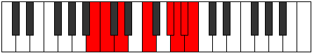

# Mode Polian

## Links

- [Documentation](README.md)
- [Scales Index](Scales.md)
- [Modes Index](Modes.md)
- [Chords Index](Chords.md)

## Parent Scale

[Katoptian](ScaleKatoptian.md)

## Number

[3659](https://ianring.com/musictheory/scales/3659)

## Transposition

1, 2, 3, 3, 1, 1, 1

## Chord Pattern

IVb5

## Perfection

- 3 Perfect notes
- 4 Perfect notes

## Perfection Profile

[false false true true false false true]

## Permutations

| Tonic | Notes | Signature | Illustration | Audio |
|-------|-------|-----------|--------------|-------|
| [C](ModeCNaturalPolian.md) | **C**, **Db**, Eb, F#, **G##**, **A#**, B, **C** | C |  | [midi](https://github.com/edipermadi/music/blob/main/docs/ModeCNaturalPolian.mid?raw=true) |
| [C#](ModeCSharpPolian.md) | **C#**, **D**, E, F##, **G###**, **A##**, B#, **C#** | C |  | [midi](https://github.com/edipermadi/music/blob/main/docs/ModeCSharpPolian.mid?raw=true) |
| [Db](ModeDFlatPolian.md) | **Db**, **Ebb**, Fb, G, **A#**, **B**, C, **Db** | C |  | [midi](https://github.com/edipermadi/music/blob/main/docs/ModeDFlatPolian.mid?raw=true) |
| [D](ModeDNaturalPolian.md) | **D**, **Eb**, F, G#, **A##**, **B#**, C#, **D** | C |  | [midi](https://github.com/edipermadi/music/blob/main/docs/ModeDNaturalPolian.mid?raw=true) |
| [D#](ModeDSharpPolian.md) | **D#**, **E**, F#, G##, **A###**, **B##**, C##, **D#** | C |  | [midi](https://github.com/edipermadi/music/blob/main/docs/ModeDSharpPolian.mid?raw=true) |
| [Eb](ModeEFlatPolian.md) | **Eb**, **Fb**, Gb, A, **B#**, **C#**, D, **Eb** | C |  | [midi](https://github.com/edipermadi/music/blob/main/docs/ModeEFlatPolian.mid?raw=true) |
| [E](ModeENaturalPolian.md) | **E**, **F**, G, A#, **B##**, **C##**, D#, **E** | C |  | [midi](https://github.com/edipermadi/music/blob/main/docs/ModeENaturalPolian.mid?raw=true) |
| [F](ModeFNaturalPolian.md) | **F**, **Gb**, Ab, B, **C##**, **D#**, E, **F** | C |  | [midi](https://github.com/edipermadi/music/blob/main/docs/ModeFNaturalPolian.mid?raw=true) |
| [F#](ModeFSharpPolian.md) | **F#**, **G**, A, B#, **C###**, **D##**, E#, **F#** | C |  | [midi](https://github.com/edipermadi/music/blob/main/docs/ModeFSharpPolian.mid?raw=true) |
| [Gb](ModeGFlatPolian.md) | **Gb**, **Abb**, Bbb, C, **D#**, **E**, F, **Gb** | C |  | [midi](https://github.com/edipermadi/music/blob/main/docs/ModeGFlatPolian.mid?raw=true) |
| [G](ModeGNaturalPolian.md) | **G**, **Ab**, Bb, C#, **D##**, **E#**, F#, **G** | C |  | [midi](https://github.com/edipermadi/music/blob/main/docs/ModeGNaturalPolian.mid?raw=true) |
| [G#](ModeGSharpPolian.md) | **G#**, **A**, B, C##, **D###**, **E##**, F##, **G#** | C |  | [midi](https://github.com/edipermadi/music/blob/main/docs/ModeGSharpPolian.mid?raw=true) |
| [Ab](ModeAFlatPolian.md) | **Ab**, **Bbb**, Cb, D, **E#**, **F#**, G, **Ab** | C |  | [midi](https://github.com/edipermadi/music/blob/main/docs/ModeAFlatPolian.mid?raw=true) |
| [A](ModeANaturalPolian.md) | **A**, **Bb**, C, D#, **E##**, **F##**, G#, **A** | C |  | [midi](https://github.com/edipermadi/music/blob/main/docs/ModeANaturalPolian.mid?raw=true) |
| [A#](ModeASharpPolian.md) | **A#**, **B**, C#, D##, **E###**, **F###**, G##, **A#** | C |  | [midi](https://github.com/edipermadi/music/blob/main/docs/ModeASharpPolian.mid?raw=true) |
| [Bb](ModeBFlatPolian.md) | **Bb**, **Cb**, Db, E, **F##**, **G#**, A, **Bb** | C |  | [midi](https://github.com/edipermadi/music/blob/main/docs/ModeBFlatPolian.mid?raw=true) |
| [B](ModeBNaturalPolian.md) | **B**, **C**, D, E#, **F###**, **G##**, A#, **B** | C |  | [midi](https://github.com/edipermadi/music/blob/main/docs/ModeBNaturalPolian.mid?raw=true) |
