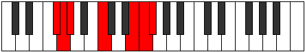
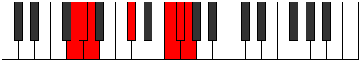
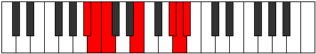

# Mode Polimic

## Links

- [Documentation](index.md)
- [Scales Index](Scales.md)
- [Modes Index](Modes.md)
- [Chords Index](Chords.md)

## Parent Scale

[Ponimic](ScalePonimic.md)

## Number

[3143](https://ianring.com/musictheory/scales/3143)

## Interval Pattern

1, 1, 4, 4, 1, 1

## Chord Pattern

## Perfection

- 2 Perfect notes
- 4 Perfect notes

## Perfection Profile

[false false false true false true]

## Permutations

| Tonic | Notes | Signature | Illustration | Audio |
|-------|-------|-----------|--------------|-------|
| [C](ModeCNaturalPolimic.md) | **C**, **Db**, **Ebb**, F#, **G###**, A##, **C** | C |  | [midi](https://github.com/edipermadi/music/blob/main/docs/ModeCNaturalPolimic.mid?raw=true) |
| [C#](ModeCSharpPolimic.md) | **C#**, **D**, **Eb**, F##, **Cb**, Dbb, **C#** | C |  | [midi](https://github.com/edipermadi/music/blob/main/docs/ModeCSharpPolimic.mid?raw=true) |
| [Db](ModeDFlatPolimic.md) | **Db**, **Ebb**, **Fbb**, G, **A##**, B#, **Db** | C |  | [midi](https://github.com/edipermadi/music/blob/main/docs/ModeDFlatPolimic.mid?raw=true) |
| [D](ModeDNaturalPolimic.md) | **D**, **Eb**, **Fb**, G#, **A###**, B##, **D** | C |  | [midi](https://github.com/edipermadi/music/blob/main/docs/ModeDNaturalPolimic.mid?raw=true) |
| [D#](ModeDSharpPolimic.md) | **D#**, **E**, **F**, G##, **Db**, Ebb, **D#** | C |  | [midi](https://github.com/edipermadi/music/blob/main/docs/ModeDSharpPolimic.mid?raw=true) |
| [Eb](ModeEFlatPolimic.md) | **Eb**, **Fb**, **Gbb**, A, **B##**, C##, **Eb** | C |  | [midi](https://github.com/edipermadi/music/blob/main/docs/ModeEFlatPolimic.mid?raw=true) |
| [E](ModeENaturalPolimic.md) | **E**, **F**, **Gb**, A#, **B###**, C###, **E** | C |  | [midi](https://github.com/edipermadi/music/blob/main/docs/ModeENaturalPolimic.mid?raw=true) |
| [F](ModeFNaturalPolimic.md) | **F**, **Gb**, **Abb**, B, **C###**, D##, **F** | C |  | [midi](https://github.com/edipermadi/music/blob/main/docs/ModeFNaturalPolimic.mid?raw=true) |
| [F#](ModeFSharpPolimic.md) | **F#**, **G**, **Ab**, B#, **D##**, E#, **F#** | C |  | [midi](https://github.com/edipermadi/music/blob/main/docs/ModeFSharpPolimic.mid?raw=true) |
| [Gb](ModeGFlatPolimic.md) | **Gb**, **Abb**, **Bbbb**, C, **D##**, E#, **Gb** | C |  | [midi](https://github.com/edipermadi/music/blob/main/docs/ModeGFlatPolimic.mid?raw=true) |
| [G](ModeGNaturalPolimic.md) | **G**, **Ab**, **Bbb**, C#, **D###**, E##, **G** | C |  | [midi](https://github.com/edipermadi/music/blob/main/docs/ModeGNaturalPolimic.mid?raw=true) |
| [G#](ModeGSharpPolimic.md) | **G#**, **A**, **Bb**, C##, **E##**, F##, **G#** | C |  | [midi](https://github.com/edipermadi/music/blob/main/docs/ModeGSharpPolimic.mid?raw=true) |
| [Ab](ModeAFlatPolimic.md) | **Ab**, **Bbb**, **Cbb**, D, **E##**, F##, **Ab** | C |  | [midi](https://github.com/edipermadi/music/blob/main/docs/ModeAFlatPolimic.mid?raw=true) |
| [A](ModeANaturalPolimic.md) | **A**, **Bb**, **Cb**, D#, **E###**, F###, **A** | C |  | [midi](https://github.com/edipermadi/music/blob/main/docs/ModeANaturalPolimic.mid?raw=true) |
| [A#](ModeASharpPolimic.md) | **A#**, **B**, **C**, D##, **F###**, G##, **A#** | C |  | [midi](https://github.com/edipermadi/music/blob/main/docs/ModeASharpPolimic.mid?raw=true) |
| [Bb](ModeBFlatPolimic.md) | **Bb**, **Cb**, **Dbb**, E, **F###**, G##, **Bb** | C |  | [midi](https://github.com/edipermadi/music/blob/main/docs/ModeBFlatPolimic.mid?raw=true) |
| [B](ModeBNaturalPolimic.md) | **B**, **C**, **Db**, E#, **Cbbb**, Cbb, **B** | C |  | [midi](https://github.com/edipermadi/music/blob/main/docs/ModeBNaturalPolimic.mid?raw=true) |
