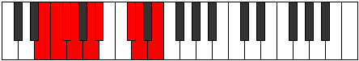

# Mode Polyllic

## Links

- [Documentation](README.md)
- [Scales Index](Scales.md)
- [Modes Index](Modes.md)
- [Chords Index](Chords.md)

## Parent Scale

[Doptyllic](ScaleDoptyllic.md)

## Number

[1647](https://ianring.com/musictheory/scales/1647)

## Transposition

1, 1, 1, 2, 1, 3, 1, 2

## Chord Pattern

iii, iv, V, VI

## Perfection

- 5 Perfect notes
- 3 Perfect notes

## Perfection Profile

[false false true true true true false true]

## Permutations

| Tonic | Notes | Signature | Illustration | Audio |
|-------|-------|-----------|--------------|-------|
| [C](ModeCNaturalPolyllic.md) | **C**, **C#**, D, D#, F, F#, **A**, A#, **C** | C |  | [midi](https://github.com/edipermadi/music/blob/main/docs/ModeCNaturalPolyllic.mid?raw=true) |
| [C#](ModeCSharpPolyllic.md) | **C#**, **D**, D#, E, F#, G, **A#**, B, **C#** | C |  | [midi](https://github.com/edipermadi/music/blob/main/docs/ModeCSharpPolyllic.mid?raw=true) |
| [Db](ModeDFlatPolyllic.md) | **Db**, **D**, Eb, E, Gb, G, **Bb**, B, **Db** | C |  | [midi](https://github.com/edipermadi/music/blob/main/docs/ModeDFlatPolyllic.mid?raw=true) |
| [D](ModeDNaturalPolyllic.md) | **D**, **D#**, E, F, G, G#, **B**, C, **D** | C |  | [midi](https://github.com/edipermadi/music/blob/main/docs/ModeDNaturalPolyllic.mid?raw=true) |
| [D#](ModeDSharpPolyllic.md) | **D#**, **E**, F, F#, G#, A, **C**, C#, **D#** | C |  | [midi](https://github.com/edipermadi/music/blob/main/docs/ModeDSharpPolyllic.mid?raw=true) |
| [Eb](ModeEFlatPolyllic.md) | **Eb**, **E**, F, Gb, Ab, A, **C**, Db, **Eb** | C |  | [midi](https://github.com/edipermadi/music/blob/main/docs/ModeEFlatPolyllic.mid?raw=true) |
| [E](ModeENaturalPolyllic.md) | **E**, **F**, F#, G, A, A#, **C#**, D, **E** | C |  | [midi](https://github.com/edipermadi/music/blob/main/docs/ModeENaturalPolyllic.mid?raw=true) |
| [F](ModeFNaturalPolyllic.md) | **F**, **F#**, G, G#, A#, B, **D**, D#, **F** | C |  | [midi](https://github.com/edipermadi/music/blob/main/docs/ModeFNaturalPolyllic.mid?raw=true) |
| [F#](ModeFSharpPolyllic.md) | **F#**, **G**, G#, A, B, C, **D#**, E, **F#** | C |  | [midi](https://github.com/edipermadi/music/blob/main/docs/ModeFSharpPolyllic.mid?raw=true) |
| [Gb](ModeGFlatPolyllic.md) | **Gb**, **G**, Ab, A, B, C, **Eb**, E, **Gb** | C |  | [midi](https://github.com/edipermadi/music/blob/main/docs/ModeGFlatPolyllic.mid?raw=true) |
| [G](ModeGNaturalPolyllic.md) | **G**, **G#**, A, A#, C, C#, **E**, F, **G** | C |  | [midi](https://github.com/edipermadi/music/blob/main/docs/ModeGNaturalPolyllic.mid?raw=true) |
| [G#](ModeGSharpPolyllic.md) | **G#**, **A**, A#, B, C#, D, **F**, F#, **G#** | C |  | [midi](https://github.com/edipermadi/music/blob/main/docs/ModeGSharpPolyllic.mid?raw=true) |
| [Ab](ModeAFlatPolyllic.md) | **Ab**, **A**, Bb, B, Db, D, **F**, Gb, **Ab** | C |  | [midi](https://github.com/edipermadi/music/blob/main/docs/ModeAFlatPolyllic.mid?raw=true) |
| [A](ModeANaturalPolyllic.md) | **A**, **A#**, B, C, D, D#, **F#**, G, **A** | C |  | [midi](https://github.com/edipermadi/music/blob/main/docs/ModeANaturalPolyllic.mid?raw=true) |
| [A#](ModeASharpPolyllic.md) | **A#**, **B**, C, C#, D#, E, **G**, G#, **A#** | C |  | [midi](https://github.com/edipermadi/music/blob/main/docs/ModeASharpPolyllic.mid?raw=true) |
| [Bb](ModeBFlatPolyllic.md) | **Bb**, **B**, C, Db, Eb, E, **G**, Ab, **Bb** | C |  | [midi](https://github.com/edipermadi/music/blob/main/docs/ModeBFlatPolyllic.mid?raw=true) |
| [B](ModeBNaturalPolyllic.md) | **B**, **C**, C#, D, E, F, **G#**, A, **B** | C |  | [midi](https://github.com/edipermadi/music/blob/main/docs/ModeBNaturalPolyllic.mid?raw=true) |
