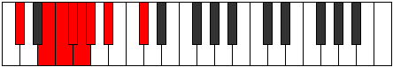
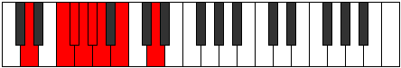

# Mode Ponian

## Links

- [Documentation](index.md)
- [Scales Index](Scales.md)
- [Modes Index](Modes.md)
- [Chords Index](Chords.md)

## Parent Scale

[Katoptian](ScaleKatoptian.md)

## Number

[761](https://ianring.com/musictheory/scales/761)

## Perfection

- 3 Perfect notes
- 4 Perfect notes

## Perfection Profile

[true false false true false false true]

## Permutations

| Tonic | Notes | Signature | Illustration | Audio |
|-------|-------|-----------|--------------|-------|
| [C](ModeCNaturalPonian.md) | C, **D#**, **E**, F, **Gb**, **Abb**, Bbb, C | C |  | [midi](https://github.com/edipermadi/music/blob/main/docs/ModeCNaturalPonian.mid?raw=true) |
| [C#](ModeCSharpPonian.md) | C#, **D##**, **E#**, F#, **G**, **Ab**, Bb, C# | C |  | [midi](https://github.com/edipermadi/music/blob/main/docs/ModeCSharpPonian.mid?raw=true) |
| [Db](ModeDFlatPonian.md) | Db, **E**, **F**, Gb, **Abb**, **Bbbb**, Cbb, Db | C |  | [midi](https://github.com/edipermadi/music/blob/main/docs/ModeDFlatPonian.mid?raw=true) |
| [D](ModeDNaturalPonian.md) | D, **E#**, **F#**, G, **Ab**, **Bbb**, Cb, D | C |  | [midi](https://github.com/edipermadi/music/blob/main/docs/ModeDNaturalPonian.mid?raw=true) |
| [D#](ModeDSharpPonian.md) | D#, **E##**, **F##**, G#, **A**, **Bb**, C, D# | C |  | [midi](https://github.com/edipermadi/music/blob/main/docs/ModeDSharpPonian.mid?raw=true) |
| [Eb](ModeEFlatPonian.md) | Eb, **F#**, **G**, Ab, **Bbb**, **Cbb**, Dbb, Eb | C |  | [midi](https://github.com/edipermadi/music/blob/main/docs/ModeEFlatPonian.mid?raw=true) |
| [E](ModeENaturalPonian.md) | E, **F##**, **G#**, A, **Bb**, **Cb**, Db, E | C |  | [midi](https://github.com/edipermadi/music/blob/main/docs/ModeENaturalPonian.mid?raw=true) |
| [F](ModeFNaturalPonian.md) | F, **G#**, **A**, Bb, **Cb**, **Dbb**, Ebb, F | C |  | [midi](https://github.com/edipermadi/music/blob/main/docs/ModeFNaturalPonian.mid?raw=true) |
| [F#](ModeFSharpPonian.md) | F#, **G##**, **A#**, B, **C**, **Db**, Eb, F# | C |  | [midi](https://github.com/edipermadi/music/blob/main/docs/ModeFSharpPonian.mid?raw=true) |
| [Gb](ModeGFlatPonian.md) | Gb, **A**, **Bb**, Cb, **Dbb**, **Ebbb**, Fbb, Gb | C |  | [midi](https://github.com/edipermadi/music/blob/main/docs/ModeGFlatPonian.mid?raw=true) |
| [G](ModeGNaturalPonian.md) | G, **A#**, **B**, C, **Db**, **Ebb**, Fb, G | C |  | [midi](https://github.com/edipermadi/music/blob/main/docs/ModeGNaturalPonian.mid?raw=true) |
| [G#](ModeGSharpPonian.md) | G#, **A##**, **B#**, C#, **D**, **Eb**, F, G# | C |  | [midi](https://github.com/edipermadi/music/blob/main/docs/ModeGSharpPonian.mid?raw=true) |
| [Ab](ModeAFlatPonian.md) | Ab, **B**, **C**, Db, **Ebb**, **Fbb**, Gbb, Ab | C |  | [midi](https://github.com/edipermadi/music/blob/main/docs/ModeAFlatPonian.mid?raw=true) |
| [A](ModeANaturalPonian.md) | A, **B#**, **C#**, D, **Eb**, **Fb**, Gb, A | C |  | [midi](https://github.com/edipermadi/music/blob/main/docs/ModeANaturalPonian.mid?raw=true) |
| [A#](ModeASharpPonian.md) | A#, **B##**, **C##**, D#, **E**, **F**, G, A# | C |  | [midi](https://github.com/edipermadi/music/blob/main/docs/ModeASharpPonian.mid?raw=true) |
| [Bb](ModeBFlatPonian.md) | Bb, **C#**, **D**, Eb, **Fb**, **Gbb**, Abb, Bb | C |  | [midi](https://github.com/edipermadi/music/blob/main/docs/ModeBFlatPonian.mid?raw=true) |
| [B](ModeBNaturalPonian.md) | B, **C##**, **D#**, E, **F**, **Gb**, Ab, B | C |  | [midi](https://github.com/edipermadi/music/blob/main/docs/ModeBNaturalPonian.mid?raw=true) |
