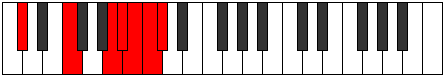
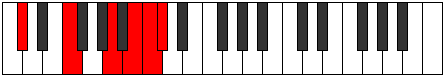
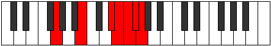
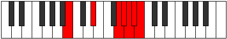

# Mode Ponimic

## Links

- [Documentation](README.md)
- [Scales Index](Scales.md)
- [Modes Index](Modes.md)
- [Chords Index](Chords.md)

## Parent Scale

[Ponimic](ScalePonimic.md)

## Number

[3857](https://ianring.com/musictheory/scales/3857)

## Transposition

4, 4, 1, 1, 1, 1

## Chord Pattern

## Perfection

- 2 Perfect notes
- 4 Perfect notes

## Perfection Profile

false, true, false, true, false, false

## Permutations

| Tonic | Notes | Signature | Illustration | Audio |
|-------|-------|-----------|--------------|-------|
| [C](ModeCNaturalPonimic.md) | **C**, D##, **F###**, G##, **A#**, **B**, **C** | C |  | [midi](https://github.com/edipermadi/music/blob/main/docs/ModeCNaturalPonimic.mid?raw=true) |
| [C#](ModeCSharpPonimic.md) | **C#**, D###, **Cbbb**, Cbb, **Dbbb**, **Dbb**, **C#** | C |  | [midi](https://github.com/edipermadi/music/blob/main/docs/ModeCSharpPonimic.mid?raw=true) |
| [Db](ModeDFlatPonimic.md) | **Db**, E#, **Cbbb**, Cbb, **Dbbb**, **Dbb**, **Db** | C |  | [midi](https://github.com/edipermadi/music/blob/main/docs/ModeDFlatPonimic.mid?raw=true) |
| [D](ModeDNaturalPonimic.md) | **D**, E##, **Cbb**, Dbbb, **Dbb**, **Ebbb**, **D** | C |  | [midi](https://github.com/edipermadi/music/blob/main/docs/ModeDNaturalPonimic.mid?raw=true) |
| [D#](ModeDSharpPonimic.md) | **D#**, E###, **Cb**, Dbb, **Ebbb**, **Fbbb**, **D#** | C |  | [midi](https://github.com/edipermadi/music/blob/main/docs/ModeDSharpPonimic.mid?raw=true) |
| [Eb](ModeEFlatPonimic.md) | **Eb**, F##, **Cb**, Dbb, **Ebbb**, **Fbbb**, **Eb** | C |  | [midi](https://github.com/edipermadi/music/blob/main/docs/ModeEFlatPonimic.mid?raw=true) |
| [E](ModeENaturalPonimic.md) | **E**, F###, **Dbb**, Ebbb, **Fbbb**, **C###**, **E** | C |  | [midi](https://github.com/edipermadi/music/blob/main/docs/ModeENaturalPonimic.mid?raw=true) |
| [F](ModeFNaturalPonimic.md) | **F**, G##, **Db**, Ebb, **Fbb**, **Gbbb**, **F** | C |  | [midi](https://github.com/edipermadi/music/blob/main/docs/ModeFNaturalPonimic.mid?raw=true) |
| [F#](ModeFSharpPonimic.md) | **F#**, G###, **C##**, D#, **E**, **F**, **F#** | C |  | [midi](https://github.com/edipermadi/music/blob/main/docs/ModeFSharpPonimic.mid?raw=true) |
| [Gb](ModeGFlatPonimic.md) | **Gb**, A#, **B###**, C###, **D##**, **E#**, **Gb** | C |  | [midi](https://github.com/edipermadi/music/blob/main/docs/ModeGFlatPonimic.mid?raw=true) |
| [G](ModeGNaturalPonimic.md) | **G**, A##, **C###**, D##, **E#**, **F#**, **G** | C |  | [midi](https://github.com/edipermadi/music/blob/main/docs/ModeGNaturalPonimic.mid?raw=true) |
| [G#](ModeGSharpPonimic.md) | **G#**, A###, **D##**, E#, **F#**, **G**, **G#** | C |  | [midi](https://github.com/edipermadi/music/blob/main/docs/ModeGSharpPonimic.mid?raw=true) |
| [Ab](ModeAFlatPonimic.md) | **Ab**, B#, **D##**, E#, **F#**, **G**, **Ab** | C |  | [midi](https://github.com/edipermadi/music/blob/main/docs/ModeAFlatPonimic.mid?raw=true) |
| [A](ModeANaturalPonimic.md) | **A**, B##, **D###**, E##, **F##**, **G#**, **A** | C |  | [midi](https://github.com/edipermadi/music/blob/main/docs/ModeANaturalPonimic.mid?raw=true) |
| [A#](ModeASharpPonimic.md) | **A#**, B###, **E##**, F##, **G#**, **A**, **A#** | C |  | [midi](https://github.com/edipermadi/music/blob/main/docs/ModeASharpPonimic.mid?raw=true) |
| [Bb](ModeBFlatPonimic.md) | **Bb**, C##, **E##**, F##, **G#**, **A**, **Bb** | C |  | [midi](https://github.com/edipermadi/music/blob/main/docs/ModeBFlatPonimic.mid?raw=true) |
| [B](ModeBNaturalPonimic.md) | **B**, C###, **E###**, F###, **G##**, **A#**, **B** | C |  | [midi](https://github.com/edipermadi/music/blob/main/docs/ModeBNaturalPonimic.mid?raw=true) |
