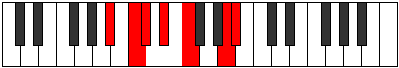

# Mode Poptimic

## Links

- [Documentation](index.md)
- [Scales Index](Scales.md)
- [Modes Index](Modes.md)
- [Chords Index](Chords.md)

## Parent Scale

[Modimic](ScaleModimic.md)

## Number

[2221](https://ianring.com/musictheory/scales/2221)

## Interval Pattern

2, 1, 2, 2, 4, 1

## Chord Pattern

i, III⁺, V, V⁺, vi⁰, VI⁺

## Perfection

- 3 Perfect notes
- 3 Perfect notes

## Perfection Profile

[true false false true true false]

## Permutations

| Tonic | Notes | Signature | Illustration | Audio |
|-------|-------|-----------|--------------|-------|
| [C](ModeCNaturalPoptimic.md) | C, **D**, **Eb**, F, G, **A##**, C | C |  | [midi](https://github.com/edipermadi/music/blob/main/docs/ModeCNaturalPoptimic.mid?raw=true) |
| [C#](ModeCSharpPoptimic.md) | C#, **D#**, **E**, F#, G#, **A###**, C# | C |  | [midi](https://github.com/edipermadi/music/blob/main/docs/ModeCSharpPoptimic.mid?raw=true) |
| [Db](ModeDFlatPoptimic.md) | Db, **Eb**, **Fb**, Gb, Ab, **B#**, Db | C |  | [midi](https://github.com/edipermadi/music/blob/main/docs/ModeDFlatPoptimic.mid?raw=true) |
| [D](ModeDNaturalPoptimic.md) | D, **E**, **F**, G, A, **B##**, D | C |  | [midi](https://github.com/edipermadi/music/blob/main/docs/ModeDNaturalPoptimic.mid?raw=true) |
| [D#](ModeDSharpPoptimic.md) | D#, **E#**, **F#**, G#, A#, **B###**, D# | C |  | [midi](https://github.com/edipermadi/music/blob/main/docs/ModeDSharpPoptimic.mid?raw=true) |
| [Eb](ModeEFlatPoptimic.md) | Eb, **F**, **Gb**, Ab, Bb, **C##**, Eb | C |  | [midi](https://github.com/edipermadi/music/blob/main/docs/ModeEFlatPoptimic.mid?raw=true) |
| [E](ModeENaturalPoptimic.md) | E, **F#**, **G**, A, B, **C###**, E | C |  | [midi](https://github.com/edipermadi/music/blob/main/docs/ModeENaturalPoptimic.mid?raw=true) |
| [F](ModeFNaturalPoptimic.md) | F, **G**, **Ab**, Bb, C, **D##**, F | C |  | [midi](https://github.com/edipermadi/music/blob/main/docs/ModeFNaturalPoptimic.mid?raw=true) |
| [F#](ModeFSharpPoptimic.md) | F#, **G#**, **A**, B, C#, **D###**, F# | C |  | [midi](https://github.com/edipermadi/music/blob/main/docs/ModeFSharpPoptimic.mid?raw=true) |
| [Gb](ModeGFlatPoptimic.md) | Gb, **Ab**, **Bbb**, Cb, Db, **E#**, Gb | C |  | [midi](https://github.com/edipermadi/music/blob/main/docs/ModeGFlatPoptimic.mid?raw=true) |
| [G](ModeGNaturalPoptimic.md) | G, **A**, **Bb**, C, D, **E##**, G | C |  | [midi](https://github.com/edipermadi/music/blob/main/docs/ModeGNaturalPoptimic.mid?raw=true) |
| [G#](ModeGSharpPoptimic.md) | G#, **A#**, **B**, C#, D#, **E###**, G# | C |  | [midi](https://github.com/edipermadi/music/blob/main/docs/ModeGSharpPoptimic.mid?raw=true) |
| [Ab](ModeAFlatPoptimic.md) | Ab, **Bb**, **Cb**, Db, Eb, **F##**, Ab | C |  | [midi](https://github.com/edipermadi/music/blob/main/docs/ModeAFlatPoptimic.mid?raw=true) |
| [A](ModeANaturalPoptimic.md) | A, **B**, **C**, D, E, **F###**, A | C |  | [midi](https://github.com/edipermadi/music/blob/main/docs/ModeANaturalPoptimic.mid?raw=true) |
| [A#](ModeASharpPoptimic.md) | A#, **B#**, **C#**, D#, E#, **Cbbb**, A# | C |  | [midi](https://github.com/edipermadi/music/blob/main/docs/ModeASharpPoptimic.mid?raw=true) |
| [Bb](ModeBFlatPoptimic.md) | Bb, **C**, **Db**, Eb, F, **G##**, Bb | C |  | [midi](https://github.com/edipermadi/music/blob/main/docs/ModeBFlatPoptimic.mid?raw=true) |
| [B](ModeBNaturalPoptimic.md) | B, **C#**, **D**, E, F#, **G###**, B | C |  | [midi](https://github.com/edipermadi/music/blob/main/docs/ModeBNaturalPoptimic.mid?raw=true) |
