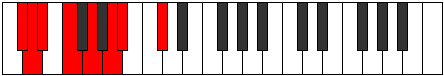

# Mode Porian

## Links

- [Documentation](index.md)
- [Scales Index](Scales.md)
- [Modes Index](Modes.md)
- [Chords Index](Chords.md)

## Parent Scale

[Dolian](ScaleDolian.md)

## Number

[855](https://ianring.com/musictheory/scales/855)

## Interval Pattern

1, 1, 2, 2, 2, 1, 3

## Chord Pattern

I⁺, ii, III, IV⁺, v⁰, v, VI⁺, vii, VII

## Perfection

- 4 Perfect notes
- 3 Perfect notes

## Perfection Profile

[false true true false true false true]

## Permutations

| Tonic | Notes | Signature | Illustration | Audio |
|-------|-------|-----------|--------------|-------|
| [C](ModeCNaturalPorian.md) | **C**, Db, Ebb, **Fb**, Gb, **Ab**, Bbb, **C** | C |  | [midi](https://github.com/edipermadi/music/blob/main/docs/ModeCNaturalPorian.mid?raw=true) |
| [C#](ModeCSharpPorian.md) | **C#**, D, Eb, **F**, G, **A**, Bb, **C#** | C |  | [midi](https://github.com/edipermadi/music/blob/main/docs/ModeCSharpPorian.mid?raw=true) |
| [Db](ModeDFlatPorian.md) | **Db**, Ebb, Fbb, **Gbb**, Abb, **Bbb**, Cbb, **Db** | C |  | [midi](https://github.com/edipermadi/music/blob/main/docs/ModeDFlatPorian.mid?raw=true) |
| [D](ModeDNaturalPorian.md) | **D**, Eb, Fb, **Gb**, Ab, **Bb**, Cb, **D** | C |  | [midi](https://github.com/edipermadi/music/blob/main/docs/ModeDNaturalPorian.mid?raw=true) |
| [D#](ModeDSharpPorian.md) | **D#**, E, F, **G**, A, **B**, C, **D#** | C |  | [midi](https://github.com/edipermadi/music/blob/main/docs/ModeDSharpPorian.mid?raw=true) |
| [Eb](ModeEFlatPorian.md) | **Eb**, Fb, Gbb, **Abb**, Bbb, **Cb**, Dbb, **Eb** | C |  | [midi](https://github.com/edipermadi/music/blob/main/docs/ModeEFlatPorian.mid?raw=true) |
| [E](ModeENaturalPorian.md) | **E**, F, Gb, **Ab**, Bb, **C**, Db, **E** | C |  | [midi](https://github.com/edipermadi/music/blob/main/docs/ModeENaturalPorian.mid?raw=true) |
| [F](ModeFNaturalPorian.md) | **F**, Gb, Abb, **Bbb**, Cb, **Db**, Ebb, **F** | C |  | [midi](https://github.com/edipermadi/music/blob/main/docs/ModeFNaturalPorian.mid?raw=true) |
| [F#](ModeFSharpPorian.md) | **F#**, G, Ab, **Bb**, C, **D**, Eb, **F#** | C |  | [midi](https://github.com/edipermadi/music/blob/main/docs/ModeFSharpPorian.mid?raw=true) |
| [Gb](ModeGFlatPorian.md) | **Gb**, Abb, Bbbb, **Cbb**, Dbb, **Ebb**, Fbb, **Gb** | C |  | [midi](https://github.com/edipermadi/music/blob/main/docs/ModeGFlatPorian.mid?raw=true) |
| [G](ModeGNaturalPorian.md) | **G**, Ab, Bbb, **Cb**, Db, **Eb**, Fb, **G** | C |  | [midi](https://github.com/edipermadi/music/blob/main/docs/ModeGNaturalPorian.mid?raw=true) |
| [G#](ModeGSharpPorian.md) | **G#**, A, Bb, **C**, D, **E**, F, **G#** | C |  | [midi](https://github.com/edipermadi/music/blob/main/docs/ModeGSharpPorian.mid?raw=true) |
| [Ab](ModeAFlatPorian.md) | **Ab**, Bbb, Cbb, **Dbb**, Ebb, **Fb**, Gbb, **Ab** | C |  | [midi](https://github.com/edipermadi/music/blob/main/docs/ModeAFlatPorian.mid?raw=true) |
| [A](ModeANaturalPorian.md) | **A**, Bb, Cb, **Db**, Eb, **F**, Gb, **A** | C |  | [midi](https://github.com/edipermadi/music/blob/main/docs/ModeANaturalPorian.mid?raw=true) |
| [A#](ModeASharpPorian.md) | **A#**, B, C, **D**, E, **F#**, G, **A#** | C |  | [midi](https://github.com/edipermadi/music/blob/main/docs/ModeASharpPorian.mid?raw=true) |
| [Bb](ModeBFlatPorian.md) | **Bb**, Cb, Dbb, **Ebb**, Fb, **Gb**, Abb, **Bb** | C |  | [midi](https://github.com/edipermadi/music/blob/main/docs/ModeBFlatPorian.mid?raw=true) |
| [B](ModeBNaturalPorian.md) | **B**, C, Db, **Eb**, F, **G**, Ab, **B** | C |  | [midi](https://github.com/edipermadi/music/blob/main/docs/ModeBNaturalPorian.mid?raw=true) |
