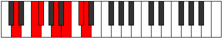
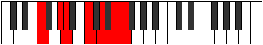

# Mode Porimic

## Links

- [Documentation](index.md)
- [Scales Index](Scales.md)
- [Modes Index](Modes.md)
- [Chords Index](Chords.md)

## Parent Scale

[Mothimic](ScaleMothimic.md)

## Number

[2713](https://ianring.com/musictheory/scales/2713)

## Perfection

- 3 Perfect notes
- 3 Perfect notes

## Perfection Profile

[true false true false true false]

## Permutations

| Tonic | Notes | Signature | Illustration | Audio |
|-------|-------|-----------|--------------|-------|
| [C](ModeCNaturalPorimic.md) | C, **D#**, E, **F##**, G##, **A##**, C | C |  | [midi](ModeCNaturalPorimic.mid) [ogg](ModeCNaturalPorimic.ogg) |
| [C#](ModeCSharpPorimic.md) | C#, **D##**, E#, **F###**, G###, **A###**, C# | C |  | [midi](ModeCSharpPorimic.mid) [ogg](ModeCSharpPorimic.ogg) |
| [Db](ModeDFlatPorimic.md) | Db, **E**, F, **G#**, A#, **B#**, Db | C |  | [midi](ModeDFlatPorimic.mid) [ogg](ModeDFlatPorimic.ogg) |
| [D](ModeDNaturalPorimic.md) | D, **E#**, F#, **G##**, A##, **B##**, D | C |  | [midi](ModeDNaturalPorimic.mid) [ogg](ModeDNaturalPorimic.ogg) |
| [D#](ModeDSharpPorimic.md) | D#, **E##**, F##, **G###**, A###, **B###**, D# | C |  | [midi](ModeDSharpPorimic.mid) [ogg](ModeDSharpPorimic.ogg) |
| [Eb](ModeEFlatPorimic.md) | Eb, **F#**, G, **A#**, B#, **C##**, Eb | C |  | [midi](ModeEFlatPorimic.mid) [ogg](ModeEFlatPorimic.ogg) |
| [E](ModeENaturalPorimic.md) | E, **F##**, G#, **A##**, B##, **C###**, E | C |  | [midi](ModeENaturalPorimic.mid) [ogg](ModeENaturalPorimic.ogg) |
| [F](ModeFNaturalPorimic.md) | F, **G#**, A, **B#**, C##, **D##**, F | C |  | [midi](ModeFNaturalPorimic.mid) [ogg](ModeFNaturalPorimic.ogg) |
| [F#](ModeFSharpPorimic.md) | F#, **G##**, A#, **B##**, C###, **D###**, F# | C |  | [midi](ModeFSharpPorimic.mid) [ogg](ModeFSharpPorimic.ogg) |
| [Gb](ModeGFlatPorimic.md) | Gb, **A**, Bb, **C#**, D#, **E#**, Gb | C |  | [midi](ModeGFlatPorimic.mid) [ogg](ModeGFlatPorimic.ogg) |
| [G](ModeGNaturalPorimic.md) | G, **A#**, B, **C##**, D##, **E##**, G | C |  | [midi](ModeGNaturalPorimic.mid) [ogg](ModeGNaturalPorimic.ogg) |
| [G#](ModeGSharpPorimic.md) | G#, **A##**, B#, **C###**, D###, **E###**, G# | C |  | [midi](ModeGSharpPorimic.mid) [ogg](ModeGSharpPorimic.ogg) |
| [Ab](ModeAFlatPorimic.md) | Ab, **B**, C, **D#**, E#, **F##**, Ab | C |  | [midi](ModeAFlatPorimic.mid) [ogg](ModeAFlatPorimic.ogg) |
| [A](ModeANaturalPorimic.md) | A, **B#**, C#, **D##**, E##, **F###**, A | C |  | [midi](ModeANaturalPorimic.mid) [ogg](ModeANaturalPorimic.ogg) |
| [A#](ModeASharpPorimic.md) | A#, **B##**, C##, **D###**, E###, **Cbbb**, A# | C |  | [midi](ModeASharpPorimic.mid) [ogg](ModeASharpPorimic.ogg) |
| [Bb](ModeBFlatPorimic.md) | Bb, **C#**, D, **E#**, F##, **G##**, Bb | C |  | [midi](ModeBFlatPorimic.mid) [ogg](ModeBFlatPorimic.ogg) |
| [B](ModeBNaturalPorimic.md) | B, **C##**, D#, **E##**, F###, **G###**, B | C |  | [midi](ModeBNaturalPorimic.mid) [ogg](ModeBNaturalPorimic.ogg) |
