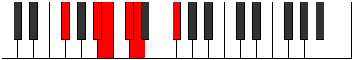
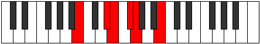

# Mode Poritonic

## Links

- [Documentation](README.md)
- [Scales Index](Scales.md)
- [Modes Index](Modes.md)
- [Chords Index](Chords.md)

## Parent Scale

[Dolitonic](ScaleDolitonic.md)

## Number

[433](https://ianring.com/musictheory/scales/433)

## Luminosity

4

## Transposition

4, 1, 2, 1, 4

## Chord Pattern

## Perfection

- 2 Perfect notes
- 3 Perfect notes

## Perfection Profile

true, false, true, false, false

## Permutations

| Tonic | Notes | Signature | Illustration | Audio |
|-------|-------|-----------|--------------|-------|
| [C](ModeCNaturalPoritonic.md) | C, **E**, F, **G**, **G#**, C | C |  | [midi](https://github.com/edipermadi/music/blob/main/docs/ModeCNaturalPoritonic.mid?raw=true) |
| [C#](ModeCSharpPoritonic.md) | C#, **F**, F#, **G#**, **A**, C# | C |  | [midi](https://github.com/edipermadi/music/blob/main/docs/ModeCSharpPoritonic.mid?raw=true) |
| [Db](ModeDFlatPoritonic.md) | Db, **F**, Gb, **Ab**, **A**, Db | C |  | [midi](https://github.com/edipermadi/music/blob/main/docs/ModeDFlatPoritonic.mid?raw=true) |
| [D](ModeDNaturalPoritonic.md) | D, **F#**, G, **A**, **A#**, D | C |  | [midi](https://github.com/edipermadi/music/blob/main/docs/ModeDNaturalPoritonic.mid?raw=true) |
| [D#](ModeDSharpPoritonic.md) | D#, **G**, G#, **A#**, **B**, D# | C |  | [midi](https://github.com/edipermadi/music/blob/main/docs/ModeDSharpPoritonic.mid?raw=true) |
| [Eb](ModeEFlatPoritonic.md) | Eb, **G**, Ab, **Bb**, **B**, Eb | C |  | [midi](https://github.com/edipermadi/music/blob/main/docs/ModeEFlatPoritonic.mid?raw=true) |
| [E](ModeENaturalPoritonic.md) | E, **G#**, A, **B**, **C**, E | C |  | [midi](https://github.com/edipermadi/music/blob/main/docs/ModeENaturalPoritonic.mid?raw=true) |
| [F](ModeFNaturalPoritonic.md) | F, **A**, A#, **C**, **C#**, F | C |  | [midi](https://github.com/edipermadi/music/blob/main/docs/ModeFNaturalPoritonic.mid?raw=true) |
| [F#](ModeFSharpPoritonic.md) | F#, **A#**, B, **C#**, **D**, F# | C |  | [midi](https://github.com/edipermadi/music/blob/main/docs/ModeFSharpPoritonic.mid?raw=true) |
| [Gb](ModeGFlatPoritonic.md) | Gb, **Bb**, B, **Db**, **D**, Gb | C |  | [midi](https://github.com/edipermadi/music/blob/main/docs/ModeGFlatPoritonic.mid?raw=true) |
| [G](ModeGNaturalPoritonic.md) | G, **B**, C, **D**, **D#**, G | C |  | [midi](https://github.com/edipermadi/music/blob/main/docs/ModeGNaturalPoritonic.mid?raw=true) |
| [G#](ModeGSharpPoritonic.md) | G#, **C**, C#, **D#**, **E**, G# | C |  | [midi](https://github.com/edipermadi/music/blob/main/docs/ModeGSharpPoritonic.mid?raw=true) |
| [Ab](ModeAFlatPoritonic.md) | Ab, **C**, Db, **Eb**, **E**, Ab | C |  | [midi](https://github.com/edipermadi/music/blob/main/docs/ModeAFlatPoritonic.mid?raw=true) |
| [A](ModeANaturalPoritonic.md) | A, **C#**, D, **E**, **F**, A | C |  | [midi](https://github.com/edipermadi/music/blob/main/docs/ModeANaturalPoritonic.mid?raw=true) |
| [A#](ModeASharpPoritonic.md) | A#, **D**, D#, **F**, **F#**, A# | C |  | [midi](https://github.com/edipermadi/music/blob/main/docs/ModeASharpPoritonic.mid?raw=true) |
| [Bb](ModeBFlatPoritonic.md) | Bb, **D**, Eb, **F**, **Gb**, Bb | C |  | [midi](https://github.com/edipermadi/music/blob/main/docs/ModeBFlatPoritonic.mid?raw=true) |
| [B](ModeBNaturalPoritonic.md) | B, **D#**, E, **F#**, **G**, B | C |  | [midi](https://github.com/edipermadi/music/blob/main/docs/ModeBNaturalPoritonic.mid?raw=true) |
