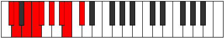

# Mode Poryllic

## Links

- [Documentation](index.md)
- [Scales Index](Scales.md)
- [Modes Index](Modes.md)
- [Chords Index](Chords.md)

## Parent Scale

[Stogyllic](ScaleStogyllic.md)

## Number

[1723](https://ianring.com/musictheory/scales/1723)

## Perfection

- 5 Perfect notes
- 3 Perfect notes

## Perfection Profile

[true false true false true false true true]

## Permutations

| Tonic | Notes | Signature | Illustration | Audio |
|-------|-------|-----------|--------------|-------|
| [C](ModeCNaturalPoryllic.md) | C, **C#**, D#, **E**, F, **G**, A, A#, C | C |  | [midi](ModeCNaturalPoryllic.mid) [ogg](ModeCNaturalPoryllic.ogg) |
| [C#](ModeCSharpPoryllic.md) | C#, **D**, E, **F**, F#, **G#**, A#, B, C# | C |  | [midi](ModeCSharpPoryllic.mid) [ogg](ModeCSharpPoryllic.ogg) |
| [Db](ModeDFlatPoryllic.md) | Db, **D**, E, **F**, Gb, **Ab**, Bb, B, Db | C |  | [midi](ModeDFlatPoryllic.mid) [ogg](ModeDFlatPoryllic.ogg) |
| [D](ModeDNaturalPoryllic.md) | D, **D#**, F, **F#**, G, **A**, B, C, D | C |  | [midi](ModeDNaturalPoryllic.mid) [ogg](ModeDNaturalPoryllic.ogg) |
| [D#](ModeDSharpPoryllic.md) | D#, **E**, F#, **G**, G#, **A#**, C, C#, D# | C |  | [midi](ModeDSharpPoryllic.mid) [ogg](ModeDSharpPoryllic.ogg) |
| [Eb](ModeEFlatPoryllic.md) | Eb, **E**, Gb, **G**, Ab, **Bb**, C, Db, Eb | C |  | [midi](ModeEFlatPoryllic.mid) [ogg](ModeEFlatPoryllic.ogg) |
| [E](ModeENaturalPoryllic.md) | E, **F**, G, **G#**, A, **B**, C#, D, E | C |  | [midi](ModeENaturalPoryllic.mid) [ogg](ModeENaturalPoryllic.ogg) |
| [F](ModeFNaturalPoryllic.md) | F, **F#**, G#, **A**, A#, **C**, D, D#, F | C |  | [midi](ModeFNaturalPoryllic.mid) [ogg](ModeFNaturalPoryllic.ogg) |
| [F#](ModeFSharpPoryllic.md) | F#, **G**, A, **A#**, B, **C#**, D#, E, F# | C |  | [midi](ModeFSharpPoryllic.mid) [ogg](ModeFSharpPoryllic.ogg) |
| [Gb](ModeGFlatPoryllic.md) | Gb, **G**, A, **Bb**, B, **Db**, Eb, E, Gb | C |  | [midi](ModeGFlatPoryllic.mid) [ogg](ModeGFlatPoryllic.ogg) |
| [G](ModeGNaturalPoryllic.md) | G, **G#**, A#, **B**, C, **D**, E, F, G | C |  | [midi](ModeGNaturalPoryllic.mid) [ogg](ModeGNaturalPoryllic.ogg) |
| [G#](ModeGSharpPoryllic.md) | G#, **A**, B, **C**, C#, **D#**, F, F#, G# | C |  | [midi](ModeGSharpPoryllic.mid) [ogg](ModeGSharpPoryllic.ogg) |
| [Ab](ModeAFlatPoryllic.md) | Ab, **A**, B, **C**, Db, **Eb**, F, Gb, Ab | C |  | [midi](ModeAFlatPoryllic.mid) [ogg](ModeAFlatPoryllic.ogg) |
| [A](ModeANaturalPoryllic.md) | A, **A#**, C, **C#**, D, **E**, F#, G, A | C |  | [midi](ModeANaturalPoryllic.mid) [ogg](ModeANaturalPoryllic.ogg) |
| [A#](ModeASharpPoryllic.md) | A#, **B**, C#, **D**, D#, **F**, G, G#, A# | C |  | [midi](ModeASharpPoryllic.mid) [ogg](ModeASharpPoryllic.ogg) |
| [Bb](ModeBFlatPoryllic.md) | Bb, **B**, Db, **D**, Eb, **F**, G, Ab, Bb | C |  | [midi](ModeBFlatPoryllic.mid) [ogg](ModeBFlatPoryllic.ogg) |
| [B](ModeBNaturalPoryllic.md) | B, **C**, D, **D#**, E, **F#**, G#, A, B | C |  | [midi](ModeBNaturalPoryllic.mid) [ogg](ModeBNaturalPoryllic.ogg) |
