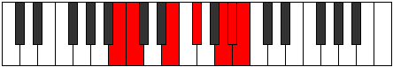

# Mode Pothimic

## Links

- [Documentation](README.md)
- [Scales Index](Scales.md)
- [Modes Index](Modes.md)
- [Chords Index](Chords.md)

## Parent Scale

[Stalimic](ScaleStalimic.md)

## Number

[3235](https://ianring.com/musictheory/scales/3235)

## Interval Pattern

1, 4, 2, 3, 1, 1

## Chord Pattern

IVb5

## Perfection

- 3 Perfect notes
- 3 Perfect notes

## Perfection Profile

[true false true false true false]

## Permutations

| Tonic | Notes | Signature | Illustration | Audio |
|-------|-------|-----------|--------------|-------|
| [C](ModeCNaturalPothimic.md) | C, **Db**, E#, **F##**, G###, **A##**, C | C |  | [midi](https://github.com/edipermadi/music/blob/main/docs/ModeCNaturalPothimic.mid?raw=true) |
| [C#](ModeCSharpPothimic.md) | C#, **D**, E##, **F###**, Cb, **Dbb**, C# | C |  | [midi](https://github.com/edipermadi/music/blob/main/docs/ModeCSharpPothimic.mid?raw=true) |
| [Db](ModeDFlatPothimic.md) | Db, **Ebb**, F#, **G#**, A##, **B#**, Db | C |  | [midi](https://github.com/edipermadi/music/blob/main/docs/ModeDFlatPothimic.mid?raw=true) |
| [D](ModeDNaturalPothimic.md) | D, **Eb**, F##, **G##**, A###, **B##**, D | C |  | [midi](https://github.com/edipermadi/music/blob/main/docs/ModeDNaturalPothimic.mid?raw=true) |
| [D#](ModeDSharpPothimic.md) | D#, **E**, F###, **G###**, Db, **Ebb**, D# | C |  | [midi](https://github.com/edipermadi/music/blob/main/docs/ModeDSharpPothimic.mid?raw=true) |
| [Eb](ModeEFlatPothimic.md) | Eb, **Fb**, G#, **A#**, B##, **C##**, Eb | C |  | [midi](https://github.com/edipermadi/music/blob/main/docs/ModeEFlatPothimic.mid?raw=true) |
| [E](ModeENaturalPothimic.md) | E, **F**, G##, **A##**, B###, **C###**, E | C |  | [midi](https://github.com/edipermadi/music/blob/main/docs/ModeENaturalPothimic.mid?raw=true) |
| [F](ModeFNaturalPothimic.md) | F, **Gb**, A#, **B#**, C###, **D##**, F | C |  | [midi](https://github.com/edipermadi/music/blob/main/docs/ModeFNaturalPothimic.mid?raw=true) |
| [F#](ModeFSharpPothimic.md) | F#, **G**, A##, **B##**, D##, **E#**, F# | C |  | [midi](https://github.com/edipermadi/music/blob/main/docs/ModeFSharpPothimic.mid?raw=true) |
| [Gb](ModeGFlatPothimic.md) | Gb, **Abb**, B, **C#**, D##, **E#**, Gb | C |  | [midi](https://github.com/edipermadi/music/blob/main/docs/ModeGFlatPothimic.mid?raw=true) |
| [G](ModeGNaturalPothimic.md) | G, **Ab**, B#, **C##**, D###, **E##**, G | C |  | [midi](https://github.com/edipermadi/music/blob/main/docs/ModeGNaturalPothimic.mid?raw=true) |
| [G#](ModeGSharpPothimic.md) | G#, **A**, B##, **C###**, E##, **F##**, G# | C |  | [midi](https://github.com/edipermadi/music/blob/main/docs/ModeGSharpPothimic.mid?raw=true) |
| [Ab](ModeAFlatPothimic.md) | Ab, **Bbb**, C#, **D#**, E##, **F##**, Ab | C |  | [midi](https://github.com/edipermadi/music/blob/main/docs/ModeAFlatPothimic.mid?raw=true) |
| [A](ModeANaturalPothimic.md) | A, **Bb**, C##, **D##**, E###, **F###**, A | C |  | [midi](https://github.com/edipermadi/music/blob/main/docs/ModeANaturalPothimic.mid?raw=true) |
| [A#](ModeASharpPothimic.md) | A#, **B**, C###, **D###**, F###, **G##**, A# | C |  | [midi](https://github.com/edipermadi/music/blob/main/docs/ModeASharpPothimic.mid?raw=true) |
| [Bb](ModeBFlatPothimic.md) | Bb, **Cb**, D#, **E#**, F###, **G##**, Bb | C |  | [midi](https://github.com/edipermadi/music/blob/main/docs/ModeBFlatPothimic.mid?raw=true) |
| [B](ModeBNaturalPothimic.md) | B, **C**, D##, **E##**, Cbbb, **Cbb**, B | C |  | [midi](https://github.com/edipermadi/music/blob/main/docs/ModeBNaturalPothimic.mid?raw=true) |
