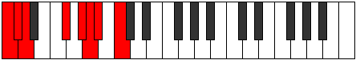

# Mode Pycrian

## Links

- [Documentation](index.md)
- [Scales Index](Scales.md)
- [Modes Index](Modes.md)
- [Chords Index](Chords.md)

## Parent Scale

[Katogian](ScaleKatogian.md)

## Number

[1863](https://ianring.com/musictheory/scales/1863)

## Interval Pattern

1, 1, 4, 2, 1, 1, 2

## Chord Pattern

iv⁰

## Perfection

- 3 Perfect notes
- 4 Perfect notes

## Perfection Profile

[false true true true false false false]

## Permutations

| Tonic | Notes | Signature | Illustration | Audio |
|-------|-------|-----------|--------------|-------|
| [C](ModeCNaturalPycrian.md) | **C**, Db, Ebb, F#, **G#**, **A**, **Bb**, **C** | C |  | [midi](https://github.com/edipermadi/music/blob/main/docs/ModeCNaturalPycrian.mid?raw=true) |
| [C#](ModeCSharpPycrian.md) | **C#**, D, Eb, F##, **G##**, **A#**, **B**, **C#** | C |  | [midi](https://github.com/edipermadi/music/blob/main/docs/ModeCSharpPycrian.mid?raw=true) |
| [Db](ModeDFlatPycrian.md) | **Db**, Ebb, Fbb, G, **A**, **Bb**, **Cb**, **Db** | C |  | [midi](https://github.com/edipermadi/music/blob/main/docs/ModeDFlatPycrian.mid?raw=true) |
| [D](ModeDNaturalPycrian.md) | **D**, Eb, Fb, G#, **A#**, **B**, **C**, **D** | C |  | [midi](https://github.com/edipermadi/music/blob/main/docs/ModeDNaturalPycrian.mid?raw=true) |
| [D#](ModeDSharpPycrian.md) | **D#**, E, F, G##, **A##**, **B#**, **C#**, **D#** | C |  | [midi](https://github.com/edipermadi/music/blob/main/docs/ModeDSharpPycrian.mid?raw=true) |
| [Eb](ModeEFlatPycrian.md) | **Eb**, Fb, Gbb, A, **B**, **C**, **Db**, **Eb** | C |  | [midi](https://github.com/edipermadi/music/blob/main/docs/ModeEFlatPycrian.mid?raw=true) |
| [E](ModeENaturalPycrian.md) | **E**, F, Gb, A#, **B#**, **C#**, **D**, **E** | C |  | [midi](https://github.com/edipermadi/music/blob/main/docs/ModeENaturalPycrian.mid?raw=true) |
| [F](ModeFNaturalPycrian.md) | **F**, Gb, Abb, B, **C#**, **D**, **Eb**, **F** | C |  | [midi](https://github.com/edipermadi/music/blob/main/docs/ModeFNaturalPycrian.mid?raw=true) |
| [F#](ModeFSharpPycrian.md) | **F#**, G, Ab, B#, **C##**, **D#**, **E**, **F#** | C |  | [midi](https://github.com/edipermadi/music/blob/main/docs/ModeFSharpPycrian.mid?raw=true) |
| [Gb](ModeGFlatPycrian.md) | **Gb**, Abb, Bbbb, C, **D**, **Eb**, **Fb**, **Gb** | C |  | [midi](https://github.com/edipermadi/music/blob/main/docs/ModeGFlatPycrian.mid?raw=true) |
| [G](ModeGNaturalPycrian.md) | **G**, Ab, Bbb, C#, **D#**, **E**, **F**, **G** | C |  | [midi](https://github.com/edipermadi/music/blob/main/docs/ModeGNaturalPycrian.mid?raw=true) |
| [G#](ModeGSharpPycrian.md) | **G#**, A, Bb, C##, **D##**, **E#**, **F#**, **G#** | C |  | [midi](https://github.com/edipermadi/music/blob/main/docs/ModeGSharpPycrian.mid?raw=true) |
| [Ab](ModeAFlatPycrian.md) | **Ab**, Bbb, Cbb, D, **E**, **F**, **Gb**, **Ab** | C |  | [midi](https://github.com/edipermadi/music/blob/main/docs/ModeAFlatPycrian.mid?raw=true) |
| [A](ModeANaturalPycrian.md) | **A**, Bb, Cb, D#, **E#**, **F#**, **G**, **A** | C |  | [midi](https://github.com/edipermadi/music/blob/main/docs/ModeANaturalPycrian.mid?raw=true) |
| [A#](ModeASharpPycrian.md) | **A#**, B, C, D##, **E##**, **F##**, **G#**, **A#** | C |  | [midi](https://github.com/edipermadi/music/blob/main/docs/ModeASharpPycrian.mid?raw=true) |
| [Bb](ModeBFlatPycrian.md) | **Bb**, Cb, Dbb, E, **F#**, **G**, **Ab**, **Bb** | C |  | [midi](https://github.com/edipermadi/music/blob/main/docs/ModeBFlatPycrian.mid?raw=true) |
| [B](ModeBNaturalPycrian.md) | **B**, C, Db, E#, **F##**, **G#**, **A**, **B** | C |  | [midi](https://github.com/edipermadi/music/blob/main/docs/ModeBNaturalPycrian.mid?raw=true) |
