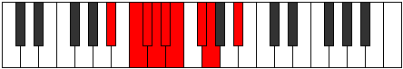

# Mode Pycryllic

## Links

- [Documentation](index.md)
- [Scales Index](Scales.md)
- [Modes Index](Modes.md)
- [Chords Index](Chords.md)

## Parent Scale

[Aeronyllic](ScaleAeronyllic.md)

## Number

[893](https://ianring.com/musictheory/scales/893)

## Perfection

- 4 Perfect notes
- 4 Perfect notes

## Perfection Profile

[false true false false true false true true]

## Permutations

| Tonic | Notes | Signature | Illustration | Audio |
|-------|-------|-----------|--------------|-------|
| [C](ModeCNaturalPycryllic.md) | **C**, D, **D#**, **E**, F, **F#**, G#, A, **C** | C |  | [midi](ModeCNaturalPycryllic.mid) [ogg](ModeCNaturalPycryllic.ogg) |
| [C#](ModeCSharpPycryllic.md) | **C#**, D#, **E**, **F**, F#, **G**, A, A#, **C#** | C |  | [midi](ModeCSharpPycryllic.mid) [ogg](ModeCSharpPycryllic.ogg) |
| [Db](ModeDFlatPycryllic.md) | **Db**, Eb, **E**, **F**, Gb, **G**, A, Bb, **Db** | C |  | [midi](ModeDFlatPycryllic.mid) [ogg](ModeDFlatPycryllic.ogg) |
| [D](ModeDNaturalPycryllic.md) | **D**, E, **F**, **F#**, G, **G#**, A#, B, **D** | C |  | [midi](ModeDNaturalPycryllic.mid) [ogg](ModeDNaturalPycryllic.ogg) |
| [D#](ModeDSharpPycryllic.md) | **D#**, F, **F#**, **G**, G#, **A**, B, C, **D#** | C |  | [midi](ModeDSharpPycryllic.mid) [ogg](ModeDSharpPycryllic.ogg) |
| [Eb](ModeEFlatPycryllic.md) | **Eb**, F, **Gb**, **G**, Ab, **A**, B, C, **Eb** | C |  | [midi](ModeEFlatPycryllic.mid) [ogg](ModeEFlatPycryllic.ogg) |
| [E](ModeENaturalPycryllic.md) | **E**, F#, **G**, **G#**, A, **A#**, C, C#, **E** | C |  | [midi](ModeENaturalPycryllic.mid) [ogg](ModeENaturalPycryllic.ogg) |
| [F](ModeFNaturalPycryllic.md) | **F**, G, **G#**, **A**, A#, **B**, C#, D, **F** | C |  | [midi](ModeFNaturalPycryllic.mid) [ogg](ModeFNaturalPycryllic.ogg) |
| [F#](ModeFSharpPycryllic.md) | **F#**, G#, **A**, **A#**, B, **C**, D, D#, **F#** | C |  | [midi](ModeFSharpPycryllic.mid) [ogg](ModeFSharpPycryllic.ogg) |
| [Gb](ModeGFlatPycryllic.md) | **Gb**, Ab, **A**, **Bb**, B, **C**, D, Eb, **Gb** | C |  | [midi](ModeGFlatPycryllic.mid) [ogg](ModeGFlatPycryllic.ogg) |
| [G](ModeGNaturalPycryllic.md) | **G**, A, **A#**, **B**, C, **C#**, D#, E, **G** | C |  | [midi](ModeGNaturalPycryllic.mid) [ogg](ModeGNaturalPycryllic.ogg) |
| [G#](ModeGSharpPycryllic.md) | **G#**, A#, **B**, **C**, C#, **D**, E, F, **G#** | C |  | [midi](ModeGSharpPycryllic.mid) [ogg](ModeGSharpPycryllic.ogg) |
| [Ab](ModeAFlatPycryllic.md) | **Ab**, Bb, **B**, **C**, Db, **D**, E, F, **Ab** | C |  | [midi](ModeAFlatPycryllic.mid) [ogg](ModeAFlatPycryllic.ogg) |
| [A](ModeANaturalPycryllic.md) | **A**, B, **C**, **C#**, D, **D#**, F, F#, **A** | C |  | [midi](ModeANaturalPycryllic.mid) [ogg](ModeANaturalPycryllic.ogg) |
| [A#](ModeASharpPycryllic.md) | **A#**, C, **C#**, **D**, D#, **E**, F#, G, **A#** | C |  | [midi](ModeASharpPycryllic.mid) [ogg](ModeASharpPycryllic.ogg) |
| [Bb](ModeBFlatPycryllic.md) | **Bb**, C, **Db**, **D**, Eb, **E**, Gb, G, **Bb** | C |  | [midi](ModeBFlatPycryllic.mid) [ogg](ModeBFlatPycryllic.ogg) |
| [B](ModeBNaturalPycryllic.md) | **B**, C#, **D**, **D#**, E, **F**, G, G#, **B** | C |  | [midi](ModeBNaturalPycryllic.mid) [ogg](ModeBNaturalPycryllic.ogg) |
