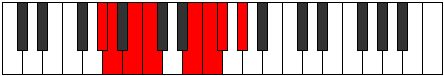

# Mode Pydian

## Links

- [Documentation](README.md)
- [Scales Index](Scales.md)
- [Modes Index](Modes.md)
- [Chords Index](Chords.md)

## Parent Scale

[Aeolathian](ScaleAeolathian.md)

## Number

[1819](https://ianring.com/musictheory/scales/1819)

## Transposition

1, 2, 1, 4, 1, 1, 2

## Chord Pattern

vi⁰, vii⁰

## Perfection

- 4 Perfect notes
- 3 Perfect notes

## Perfection Profile

false, true, true, false, true, true, false

## Permutations

| Tonic | Notes | Signature | Illustration | Audio |
|-------|-------|-----------|--------------|-------|
| [C](ModeCNaturalPydian.md) | **C**, Db, Eb, **Fb**, G#, A, **Bb**, **C** | C |  | [midi](https://github.com/edipermadi/music/blob/main/docs/ModeCNaturalPydian.mid?raw=true) |
| [C#](ModeCSharpPydian.md) | **C#**, D, E, **F**, G##, A#, **B**, **C#** | C |  | [midi](https://github.com/edipermadi/music/blob/main/docs/ModeCSharpPydian.mid?raw=true) |
| [Db](ModeDFlatPydian.md) | **Db**, Ebb, Fb, **Gbb**, A, Bb, **Cb**, **Db** | C |  | [midi](https://github.com/edipermadi/music/blob/main/docs/ModeDFlatPydian.mid?raw=true) |
| [D](ModeDNaturalPydian.md) | **D**, Eb, F, **Gb**, A#, B, **C**, **D** | C |  | [midi](https://github.com/edipermadi/music/blob/main/docs/ModeDNaturalPydian.mid?raw=true) |
| [D#](ModeDSharpPydian.md) | **D#**, E, F#, **G**, A##, B#, **C#**, **D#** | C |  | [midi](https://github.com/edipermadi/music/blob/main/docs/ModeDSharpPydian.mid?raw=true) |
| [Eb](ModeEFlatPydian.md) | **Eb**, Fb, Gb, **Abb**, B, C, **Db**, **Eb** | C |  | [midi](https://github.com/edipermadi/music/blob/main/docs/ModeEFlatPydian.mid?raw=true) |
| [E](ModeENaturalPydian.md) | **E**, F, G, **Ab**, B#, C#, **D**, **E** | C |  | [midi](https://github.com/edipermadi/music/blob/main/docs/ModeENaturalPydian.mid?raw=true) |
| [F](ModeFNaturalPydian.md) | **F**, Gb, Ab, **Bbb**, C#, D, **Eb**, **F** | C |  | [midi](https://github.com/edipermadi/music/blob/main/docs/ModeFNaturalPydian.mid?raw=true) |
| [F#](ModeFSharpPydian.md) | **F#**, G, A, **Bb**, C##, D#, **E**, **F#** | C |  | [midi](https://github.com/edipermadi/music/blob/main/docs/ModeFSharpPydian.mid?raw=true) |
| [Gb](ModeGFlatPydian.md) | **Gb**, Abb, Bbb, **Cbb**, D, Eb, **Fb**, **Gb** | C |  | [midi](https://github.com/edipermadi/music/blob/main/docs/ModeGFlatPydian.mid?raw=true) |
| [G](ModeGNaturalPydian.md) | **G**, Ab, Bb, **Cb**, D#, E, **F**, **G** | C |  | [midi](https://github.com/edipermadi/music/blob/main/docs/ModeGNaturalPydian.mid?raw=true) |
| [G#](ModeGSharpPydian.md) | **G#**, A, B, **C**, D##, E#, **F#**, **G#** | C |  | [midi](https://github.com/edipermadi/music/blob/main/docs/ModeGSharpPydian.mid?raw=true) |
| [Ab](ModeAFlatPydian.md) | **Ab**, Bbb, Cb, **Dbb**, E, F, **Gb**, **Ab** | C |  | [midi](https://github.com/edipermadi/music/blob/main/docs/ModeAFlatPydian.mid?raw=true) |
| [A](ModeANaturalPydian.md) | **A**, Bb, C, **Db**, E#, F#, **G**, **A** | C |  | [midi](https://github.com/edipermadi/music/blob/main/docs/ModeANaturalPydian.mid?raw=true) |
| [A#](ModeASharpPydian.md) | **A#**, B, C#, **D**, E##, F##, **G#**, **A#** | C |  | [midi](https://github.com/edipermadi/music/blob/main/docs/ModeASharpPydian.mid?raw=true) |
| [Bb](ModeBFlatPydian.md) | **Bb**, Cb, Db, **Ebb**, F#, G, **Ab**, **Bb** | C |  | [midi](https://github.com/edipermadi/music/blob/main/docs/ModeBFlatPydian.mid?raw=true) |
| [B](ModeBNaturalPydian.md) | **B**, C, D, **Eb**, F##, G#, **A**, **B** | C |  | [midi](https://github.com/edipermadi/music/blob/main/docs/ModeBNaturalPydian.mid?raw=true) |
