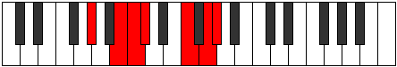

# Mode Pylimic

## Links

- [Documentation](index.md)
- [Scales Index](Scales.md)
- [Modes Index](Modes.md)
- [Chords Index](Chords.md)

## Parent Scale

[Katythimic](ScaleKatythimic.md)

## Number

[2617](https://ianring.com/musictheory/scales/2617)

## Perfection

- 3 Perfect notes
- 3 Perfect notes

## Perfection Profile

[false false true true true false]

## Permutations

| Tonic | Notes | Signature | Illustration | Audio |
|-------|-------|-----------|--------------|-------|
| [C](ModeCNaturalPylimic.md) | **C**, **D#**, E, F, G##, **A##**, **C** | C |  | [midi](ModeCNaturalPylimic.mid) [ogg](ModeCNaturalPylimic.ogg) |
| [C#](ModeCSharpPylimic.md) | **C#**, **D##**, E#, F#, G###, **A###**, **C#** | C |  | [midi](ModeCSharpPylimic.mid) [ogg](ModeCSharpPylimic.ogg) |
| [Db](ModeDFlatPylimic.md) | **Db**, **E**, F, Gb, A#, **B#**, **Db** | C |  | [midi](ModeDFlatPylimic.mid) [ogg](ModeDFlatPylimic.ogg) |
| [D](ModeDNaturalPylimic.md) | **D**, **E#**, F#, G, A##, **B##**, **D** | C |  | [midi](ModeDNaturalPylimic.mid) [ogg](ModeDNaturalPylimic.ogg) |
| [D#](ModeDSharpPylimic.md) | **D#**, **E##**, F##, G#, A###, **B###**, **D#** | C |  | [midi](ModeDSharpPylimic.mid) [ogg](ModeDSharpPylimic.ogg) |
| [Eb](ModeEFlatPylimic.md) | **Eb**, **F#**, G, Ab, B#, **C##**, **Eb** | C |  | [midi](ModeEFlatPylimic.mid) [ogg](ModeEFlatPylimic.ogg) |
| [E](ModeENaturalPylimic.md) | **E**, **F##**, G#, A, B##, **C###**, **E** | C |  | [midi](ModeENaturalPylimic.mid) [ogg](ModeENaturalPylimic.ogg) |
| [F](ModeFNaturalPylimic.md) | **F**, **G#**, A, Bb, C##, **D##**, **F** | C |  | [midi](ModeFNaturalPylimic.mid) [ogg](ModeFNaturalPylimic.ogg) |
| [F#](ModeFSharpPylimic.md) | **F#**, **G##**, A#, B, C###, **D###**, **F#** | C |  | [midi](ModeFSharpPylimic.mid) [ogg](ModeFSharpPylimic.ogg) |
| [Gb](ModeGFlatPylimic.md) | **Gb**, **A**, Bb, Cb, D#, **E#**, **Gb** | C |  | [midi](ModeGFlatPylimic.mid) [ogg](ModeGFlatPylimic.ogg) |
| [G](ModeGNaturalPylimic.md) | **G**, **A#**, B, C, D##, **E##**, **G** | C |  | [midi](ModeGNaturalPylimic.mid) [ogg](ModeGNaturalPylimic.ogg) |
| [G#](ModeGSharpPylimic.md) | **G#**, **A##**, B#, C#, D###, **E###**, **G#** | C |  | [midi](ModeGSharpPylimic.mid) [ogg](ModeGSharpPylimic.ogg) |
| [Ab](ModeAFlatPylimic.md) | **Ab**, **B**, C, Db, E#, **F##**, **Ab** | C |  | [midi](ModeAFlatPylimic.mid) [ogg](ModeAFlatPylimic.ogg) |
| [A](ModeANaturalPylimic.md) | **A**, **B#**, C#, D, E##, **F###**, **A** | C |  | [midi](ModeANaturalPylimic.mid) [ogg](ModeANaturalPylimic.ogg) |
| [A#](ModeASharpPylimic.md) | **A#**, **B##**, C##, D#, E###, **Cbbb**, **A#** | C |  | [midi](ModeASharpPylimic.mid) [ogg](ModeASharpPylimic.ogg) |
| [Bb](ModeBFlatPylimic.md) | **Bb**, **C#**, D, Eb, F##, **G##**, **Bb** | C |  | [midi](ModeBFlatPylimic.mid) [ogg](ModeBFlatPylimic.ogg) |
| [B](ModeBNaturalPylimic.md) | **B**, **C##**, D#, E, F###, **G###**, **B** | C |  | [midi](ModeBNaturalPylimic.mid) [ogg](ModeBNaturalPylimic.ogg) |
