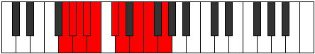

# Mode Pylygic

## Links

- [Documentation](index.md)
- [Scales Index](Scales.md)
- [Modes Index](Modes.md)
- [Chords Index](Chords.md)

## Parent Scale

[Koptygic](ScaleKoptygic.md)

## Number

[1759](https://ianring.com/musictheory/scales/1759)

## Perfection

- 6 Perfect notes
- 3 Perfect notes

## Perfection Profile

[true false true true false true true true false]

## Permutations

| Tonic | Notes | Signature | Illustration | Audio |
|-------|-------|-----------|--------------|-------|
| [C](ModeCNaturalPylygic.md) | C, **C#**, D, D#, **E**, F#, G, A, **A#**, C | C |  | [midi](ModeCNaturalPylygic.mid) [ogg](ModeCNaturalPylygic.ogg) |
| [C#](ModeCSharpPylygic.md) | C#, **D**, D#, E, **F**, G, G#, A#, **B**, C# | C |  | [midi](ModeCSharpPylygic.mid) [ogg](ModeCSharpPylygic.ogg) |
| [Db](ModeDFlatPylygic.md) | Db, **D**, Eb, E, **F**, G, Ab, Bb, **B**, Db | C |  | [midi](ModeDFlatPylygic.mid) [ogg](ModeDFlatPylygic.ogg) |
| [D](ModeDNaturalPylygic.md) | D, **D#**, E, F, **F#**, G#, A, B, **C**, D | C |  | [midi](ModeDNaturalPylygic.mid) [ogg](ModeDNaturalPylygic.ogg) |
| [D#](ModeDSharpPylygic.md) | D#, **E**, F, F#, **G**, A, A#, C, **C#**, D# | C |  | [midi](ModeDSharpPylygic.mid) [ogg](ModeDSharpPylygic.ogg) |
| [Eb](ModeEFlatPylygic.md) | Eb, **E**, F, Gb, **G**, A, Bb, C, **Db**, Eb | C |  | [midi](ModeEFlatPylygic.mid) [ogg](ModeEFlatPylygic.ogg) |
| [E](ModeENaturalPylygic.md) | E, **F**, F#, G, **G#**, A#, B, C#, **D**, E | C |  | [midi](ModeENaturalPylygic.mid) [ogg](ModeENaturalPylygic.ogg) |
| [F](ModeFNaturalPylygic.md) | F, **F#**, G, G#, **A**, B, C, D, **D#**, F | C |  | [midi](ModeFNaturalPylygic.mid) [ogg](ModeFNaturalPylygic.ogg) |
| [F#](ModeFSharpPylygic.md) | F#, **G**, G#, A, **A#**, C, C#, D#, **E**, F# | C |  | [midi](ModeFSharpPylygic.mid) [ogg](ModeFSharpPylygic.ogg) |
| [Gb](ModeGFlatPylygic.md) | Gb, **G**, Ab, A, **Bb**, C, Db, Eb, **E**, Gb | C |  | [midi](ModeGFlatPylygic.mid) [ogg](ModeGFlatPylygic.ogg) |
| [G](ModeGNaturalPylygic.md) | G, **G#**, A, A#, **B**, C#, D, E, **F**, G | C |  | [midi](ModeGNaturalPylygic.mid) [ogg](ModeGNaturalPylygic.ogg) |
| [G#](ModeGSharpPylygic.md) | G#, **A**, A#, B, **C**, D, D#, F, **F#**, G# | C |  | [midi](ModeGSharpPylygic.mid) [ogg](ModeGSharpPylygic.ogg) |
| [Ab](ModeAFlatPylygic.md) | Ab, **A**, Bb, B, **C**, D, Eb, F, **Gb**, Ab | C |  | [midi](ModeAFlatPylygic.mid) [ogg](ModeAFlatPylygic.ogg) |
| [A](ModeANaturalPylygic.md) | A, **A#**, B, C, **C#**, D#, E, F#, **G**, A | C |  | [midi](ModeANaturalPylygic.mid) [ogg](ModeANaturalPylygic.ogg) |
| [A#](ModeASharpPylygic.md) | A#, **B**, C, C#, **D**, E, F, G, **G#**, A# | C |  | [midi](ModeASharpPylygic.mid) [ogg](ModeASharpPylygic.ogg) |
| [Bb](ModeBFlatPylygic.md) | Bb, **B**, C, Db, **D**, E, F, G, **Ab**, Bb | C |  | [midi](ModeBFlatPylygic.mid) [ogg](ModeBFlatPylygic.ogg) |
| [B](ModeBNaturalPylygic.md) | B, **C**, C#, D, **D#**, F, F#, G#, **A**, B | C |  | [midi](ModeBNaturalPylygic.mid) [ogg](ModeBNaturalPylygic.ogg) |
