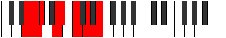

# Mode Pynian

## Links

- [Documentation](index.md)
- [Scales Index](Scales.md)
- [Modes Index](Modes.md)
- [Chords Index](Chords.md)

## Parent Scale

[Golian](ScaleGolian.md)

## Number

[1383](https://ianring.com/musictheory/scales/1383)

## Perfection

- 4 Perfect notes
- 3 Perfect notes

## Interval Pattern

1, 1, 3, 1, 2, 2, 2

## Perfection Profile

[false true false true true false true]

## Permutations

| Tonic | Notes | Signature | Illustration | Audio |
|-------|-------|-----------|--------------|-------|
| [C](ModeCNaturalPynian.md) | **C**, Db, **Ebb**, F, Gb, **Ab**, Bb, **C** | C |  | [midi](https://github.com/edipermadi/music/blob/main/docs/ModeCNaturalPynian.mid?raw=true) |
| [C#](ModeCSharpPynian.md) | **C#**, D, **Eb**, F#, G, **A**, B, **C#** | C |  | [midi](https://github.com/edipermadi/music/blob/main/docs/ModeCSharpPynian.mid?raw=true) |
| [Db](ModeDFlatPynian.md) | **Db**, Ebb, **Fbb**, Gb, Abb, **Bbb**, Cb, **Db** | C |  | [midi](https://github.com/edipermadi/music/blob/main/docs/ModeDFlatPynian.mid?raw=true) |
| [D](ModeDNaturalPynian.md) | **D**, Eb, **Fb**, G, Ab, **Bb**, C, **D** | C |  | [midi](https://github.com/edipermadi/music/blob/main/docs/ModeDNaturalPynian.mid?raw=true) |
| [D#](ModeDSharpPynian.md) | **D#**, E, **F**, G#, A, **B**, C#, **D#** | C |  | [midi](https://github.com/edipermadi/music/blob/main/docs/ModeDSharpPynian.mid?raw=true) |
| [Eb](ModeEFlatPynian.md) | **Eb**, Fb, **Gbb**, Ab, Bbb, **Cb**, Db, **Eb** | C |  | [midi](https://github.com/edipermadi/music/blob/main/docs/ModeEFlatPynian.mid?raw=true) |
| [E](ModeENaturalPynian.md) | **E**, F, **Gb**, A, Bb, **C**, D, **E** | C |  | [midi](https://github.com/edipermadi/music/blob/main/docs/ModeENaturalPynian.mid?raw=true) |
| [F](ModeFNaturalPynian.md) | **F**, Gb, **Abb**, Bb, Cb, **Db**, Eb, **F** | C |  | [midi](https://github.com/edipermadi/music/blob/main/docs/ModeFNaturalPynian.mid?raw=true) |
| [F#](ModeFSharpPynian.md) | **F#**, G, **Ab**, B, C, **D**, E, **F#** | C |  | [midi](https://github.com/edipermadi/music/blob/main/docs/ModeFSharpPynian.mid?raw=true) |
| [Gb](ModeGFlatPynian.md) | **Gb**, Abb, **Bbbb**, Cb, Dbb, **Ebb**, Fb, **Gb** | C |  | [midi](https://github.com/edipermadi/music/blob/main/docs/ModeGFlatPynian.mid?raw=true) |
| [G](ModeGNaturalPynian.md) | **G**, Ab, **Bbb**, C, Db, **Eb**, F, **G** | C |  | [midi](https://github.com/edipermadi/music/blob/main/docs/ModeGNaturalPynian.mid?raw=true) |
| [G#](ModeGSharpPynian.md) | **G#**, A, **Bb**, C#, D, **E**, F#, **G#** | C |  | [midi](https://github.com/edipermadi/music/blob/main/docs/ModeGSharpPynian.mid?raw=true) |
| [Ab](ModeAFlatPynian.md) | **Ab**, Bbb, **Cbb**, Db, Ebb, **Fb**, Gb, **Ab** | C |  | [midi](https://github.com/edipermadi/music/blob/main/docs/ModeAFlatPynian.mid?raw=true) |
| [A](ModeANaturalPynian.md) | **A**, Bb, **Cb**, D, Eb, **F**, G, **A** | C |  | [midi](https://github.com/edipermadi/music/blob/main/docs/ModeANaturalPynian.mid?raw=true) |
| [A#](ModeASharpPynian.md) | **A#**, B, **C**, D#, E, **F#**, G#, **A#** | C |  | [midi](https://github.com/edipermadi/music/blob/main/docs/ModeASharpPynian.mid?raw=true) |
| [Bb](ModeBFlatPynian.md) | **Bb**, Cb, **Dbb**, Eb, Fb, **Gb**, Ab, **Bb** | C |  | [midi](https://github.com/edipermadi/music/blob/main/docs/ModeBFlatPynian.mid?raw=true) |
| [B](ModeBNaturalPynian.md) | **B**, C, **Db**, E, F, **G**, A, **B** | C |  | [midi](https://github.com/edipermadi/music/blob/main/docs/ModeBNaturalPynian.mid?raw=true) |
