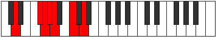
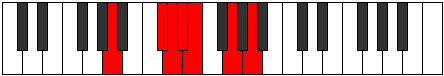

# Mode Pynimic

## Links

- [Documentation](index.md)
- [Scales Index](Scales.md)
- [Modes Index](Modes.md)
- [Chords Index](Chords.md)

## Parent Scale

[Pynimic](ScalePynimic.md)

## Number

[1265](https://ianring.com/musictheory/scales/1265)

## Perfection

- 3 Perfect notes
- 3 Perfect notes

## Perfection Profile

[true false true false false true]

## Permutations

| Tonic | Notes | Signature | Illustration | Audio |
|-------|-------|-----------|--------------|-------|
| [C](ModeCNaturalPynimic.md) | C, **D##**, E#, **F#**, **G**, A#, C | C |  | [midi](ModeCNaturalPynimic.mid) [ogg](ModeCNaturalPynimic.ogg) |
| [C#](ModeCSharpPynimic.md) | C#, **D###**, E##, **F##**, **G#**, A##, C# | C |  | [midi](ModeCSharpPynimic.mid) [ogg](ModeCSharpPynimic.ogg) |
| [Db](ModeDFlatPynimic.md) | Db, **E#**, F#, **G**, **Ab**, B, Db | C |  | [midi](ModeDFlatPynimic.mid) [ogg](ModeDFlatPynimic.ogg) |
| [D](ModeDNaturalPynimic.md) | D, **E##**, F##, **G#**, **A**, B#, D | C |  | [midi](ModeDNaturalPynimic.mid) [ogg](ModeDNaturalPynimic.ogg) |
| [D#](ModeDSharpPynimic.md) | D#, **E###**, F###, **G##**, **A#**, B##, D# | C |  | [midi](ModeDSharpPynimic.mid) [ogg](ModeDSharpPynimic.ogg) |
| [Eb](ModeEFlatPynimic.md) | Eb, **F##**, G#, **A**, **Bb**, C#, Eb | C |  | [midi](ModeEFlatPynimic.mid) [ogg](ModeEFlatPynimic.ogg) |
| [E](ModeENaturalPynimic.md) | E, **F###**, G##, **A#**, **B**, C##, E | C |  | [midi](ModeENaturalPynimic.mid) [ogg](ModeENaturalPynimic.ogg) |
| [F](ModeFNaturalPynimic.md) | F, **G##**, A#, **B**, **C**, D#, F | C |  | [midi](ModeFNaturalPynimic.mid) [ogg](ModeFNaturalPynimic.ogg) |
| [F#](ModeFSharpPynimic.md) | F#, **G###**, A##, **B#**, **C#**, D##, F# | C |  | [midi](ModeFSharpPynimic.mid) [ogg](ModeFSharpPynimic.ogg) |
| [Gb](ModeGFlatPynimic.md) | Gb, **A#**, B, **C**, **Db**, E, Gb | C |  | [midi](ModeGFlatPynimic.mid) [ogg](ModeGFlatPynimic.ogg) |
| [G](ModeGNaturalPynimic.md) | G, **A##**, B#, **C#**, **D**, E#, G | C |  | [midi](ModeGNaturalPynimic.mid) [ogg](ModeGNaturalPynimic.ogg) |
| [G#](ModeGSharpPynimic.md) | G#, **A###**, B##, **C##**, **D#**, E##, G# | C |  | [midi](ModeGSharpPynimic.mid) [ogg](ModeGSharpPynimic.ogg) |
| [Ab](ModeAFlatPynimic.md) | Ab, **B#**, C#, **D**, **Eb**, F#, Ab | C |  | [midi](ModeAFlatPynimic.mid) [ogg](ModeAFlatPynimic.ogg) |
| [A](ModeANaturalPynimic.md) | A, **B##**, C##, **D#**, **E**, F##, A | C |  | [midi](ModeANaturalPynimic.mid) [ogg](ModeANaturalPynimic.ogg) |
| [A#](ModeASharpPynimic.md) | A#, **B###**, C###, **D##**, **E#**, F###, A# | C |  | [midi](ModeASharpPynimic.mid) [ogg](ModeASharpPynimic.ogg) |
| [Bb](ModeBFlatPynimic.md) | Bb, **C##**, D#, **E**, **F**, G#, Bb | C |  | [midi](ModeBFlatPynimic.mid) [ogg](ModeBFlatPynimic.ogg) |
| [B](ModeBNaturalPynimic.md) | B, **C###**, D##, **E#**, **F#**, G##, B | C |  | [midi](ModeBNaturalPynimic.mid) [ogg](ModeBNaturalPynimic.ogg) |
