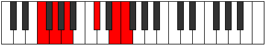

# Mode Pynitonic

## Links

- [Documentation](index.md)
- [Scales Index](Scales.md)
- [Modes Index](Modes.md)
- [Chords Index](Chords.md)

## Parent Scale

[Ryphitonic](ScaleRyphitonic.md)

## Number

[2325](https://ianring.com/musictheory/scales/2325)

## Perfection

- 1 Perfect notes
- 4 Perfect notes

## Perfection Profile

[false false true false false]

## Permutations

| Tonic | Notes | Signature | Illustration | Audio |
|-------|-------|-----------|--------------|-------|
| [C](ModeCNaturalPynitonic.md) | **C**, **D**, E, **G#**, **B**, **C** | C |  | [midi](ModeCNaturalPynitonic.mid) [ogg](ModeCNaturalPynitonic.ogg) |
| [C#](ModeCSharpPynitonic.md) | **C#**, **D#**, F, **A**, **C**, **C#** | C |  | [midi](ModeCSharpPynitonic.mid) [ogg](ModeCSharpPynitonic.ogg) |
| [Db](ModeDFlatPynitonic.md) | **Db**, **Eb**, F, **A**, **C**, **Db** | C |  | [midi](ModeDFlatPynitonic.mid) [ogg](ModeDFlatPynitonic.ogg) |
| [D](ModeDNaturalPynitonic.md) | **D**, **E**, F#, **A#**, **C#**, **D** | C |  | [midi](ModeDNaturalPynitonic.mid) [ogg](ModeDNaturalPynitonic.ogg) |
| [D#](ModeDSharpPynitonic.md) | **D#**, **F**, G, **B**, **D**, **D#** | C |  | [midi](ModeDSharpPynitonic.mid) [ogg](ModeDSharpPynitonic.ogg) |
| [Eb](ModeEFlatPynitonic.md) | **Eb**, **F**, G, **B**, **D**, **Eb** | C |  | [midi](ModeEFlatPynitonic.mid) [ogg](ModeEFlatPynitonic.ogg) |
| [E](ModeENaturalPynitonic.md) | **E**, **F#**, G#, **C**, **D#**, **E** | C |  | [midi](ModeENaturalPynitonic.mid) [ogg](ModeENaturalPynitonic.ogg) |
| [F](ModeFNaturalPynitonic.md) | **F**, **G**, A, **C#**, **E**, **F** | C |  | [midi](ModeFNaturalPynitonic.mid) [ogg](ModeFNaturalPynitonic.ogg) |
| [F#](ModeFSharpPynitonic.md) | **F#**, **G#**, A#, **D**, **F**, **F#** | C |  | [midi](ModeFSharpPynitonic.mid) [ogg](ModeFSharpPynitonic.ogg) |
| [Gb](ModeGFlatPynitonic.md) | **Gb**, **Ab**, Bb, **D**, **F**, **Gb** | C |  | [midi](ModeGFlatPynitonic.mid) [ogg](ModeGFlatPynitonic.ogg) |
| [G](ModeGNaturalPynitonic.md) | **G**, **A**, B, **D#**, **F#**, **G** | C |  | [midi](ModeGNaturalPynitonic.mid) [ogg](ModeGNaturalPynitonic.ogg) |
| [G#](ModeGSharpPynitonic.md) | **G#**, **A#**, C, **E**, **G**, **G#** | C |  | [midi](ModeGSharpPynitonic.mid) [ogg](ModeGSharpPynitonic.ogg) |
| [Ab](ModeAFlatPynitonic.md) | **Ab**, **Bb**, C, **E**, **G**, **Ab** | C |  | [midi](ModeAFlatPynitonic.mid) [ogg](ModeAFlatPynitonic.ogg) |
| [A](ModeANaturalPynitonic.md) | **A**, **B**, C#, **F**, **G#**, **A** | C |  | [midi](ModeANaturalPynitonic.mid) [ogg](ModeANaturalPynitonic.ogg) |
| [A#](ModeASharpPynitonic.md) | **A#**, **C**, D, **F#**, **A**, **A#** | C |  | [midi](ModeASharpPynitonic.mid) [ogg](ModeASharpPynitonic.ogg) |
| [Bb](ModeBFlatPynitonic.md) | **Bb**, **C**, D, **Gb**, **A**, **Bb** | C |  | [midi](ModeBFlatPynitonic.mid) [ogg](ModeBFlatPynitonic.ogg) |
| [B](ModeBNaturalPynitonic.md) | **B**, **C#**, D#, **G**, **A#**, **B** | C |  | [midi](ModeBNaturalPynitonic.mid) [ogg](ModeBNaturalPynitonic.ogg) |
