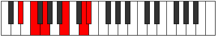
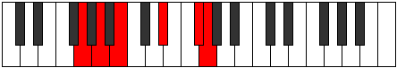

# Mode Pynitonic

## Links

- [Documentation](README.md)
- [Scales Index](Scales.md)
- [Modes Index](Modes.md)
- [Chords Index](Chords.md)

## Parent Scale

[Ryphitonic](ScaleRyphitonic.md)

## Number

[2325](https://ianring.com/musictheory/scales/2325)

## Transposition

2, 2, 4, 3, 1

## Chord Pattern

IV⁺, IV⁺

## Perfection

- 1 Perfect notes
- 4 Perfect notes

## Perfection Profile

[false false true false false]

## Permutations

| Tonic | Notes | Signature | Illustration | Audio |
|-------|-------|-----------|--------------|-------|
| [C](ModeCNaturalPynitonic.md) | **C**, **D**, E, **G#**, **B**, **C** | C |  | [midi](https://github.com/edipermadi/music/blob/main/docs/ModeCNaturalPynitonic.mid?raw=true) |
| [C#](ModeCSharpPynitonic.md) | **C#**, **D#**, F, **A**, **C**, **C#** | C |  | [midi](https://github.com/edipermadi/music/blob/main/docs/ModeCSharpPynitonic.mid?raw=true) |
| [Db](ModeDFlatPynitonic.md) | **Db**, **Eb**, F, **A**, **C**, **Db** | C |  | [midi](https://github.com/edipermadi/music/blob/main/docs/ModeDFlatPynitonic.mid?raw=true) |
| [D](ModeDNaturalPynitonic.md) | **D**, **E**, F#, **A#**, **C#**, **D** | C |  | [midi](https://github.com/edipermadi/music/blob/main/docs/ModeDNaturalPynitonic.mid?raw=true) |
| [D#](ModeDSharpPynitonic.md) | **D#**, **F**, G, **B**, **D**, **D#** | C |  | [midi](https://github.com/edipermadi/music/blob/main/docs/ModeDSharpPynitonic.mid?raw=true) |
| [Eb](ModeEFlatPynitonic.md) | **Eb**, **F**, G, **B**, **D**, **Eb** | C |  | [midi](https://github.com/edipermadi/music/blob/main/docs/ModeEFlatPynitonic.mid?raw=true) |
| [E](ModeENaturalPynitonic.md) | **E**, **F#**, G#, **C**, **D#**, **E** | C |  | [midi](https://github.com/edipermadi/music/blob/main/docs/ModeENaturalPynitonic.mid?raw=true) |
| [F](ModeFNaturalPynitonic.md) | **F**, **G**, A, **C#**, **E**, **F** | C |  | [midi](https://github.com/edipermadi/music/blob/main/docs/ModeFNaturalPynitonic.mid?raw=true) |
| [F#](ModeFSharpPynitonic.md) | **F#**, **G#**, A#, **D**, **F**, **F#** | C |  | [midi](https://github.com/edipermadi/music/blob/main/docs/ModeFSharpPynitonic.mid?raw=true) |
| [Gb](ModeGFlatPynitonic.md) | **Gb**, **Ab**, Bb, **D**, **F**, **Gb** | C |  | [midi](https://github.com/edipermadi/music/blob/main/docs/ModeGFlatPynitonic.mid?raw=true) |
| [G](ModeGNaturalPynitonic.md) | **G**, **A**, B, **D#**, **F#**, **G** | C |  | [midi](https://github.com/edipermadi/music/blob/main/docs/ModeGNaturalPynitonic.mid?raw=true) |
| [G#](ModeGSharpPynitonic.md) | **G#**, **A#**, C, **E**, **G**, **G#** | C |  | [midi](https://github.com/edipermadi/music/blob/main/docs/ModeGSharpPynitonic.mid?raw=true) |
| [Ab](ModeAFlatPynitonic.md) | **Ab**, **Bb**, C, **E**, **G**, **Ab** | C |  | [midi](https://github.com/edipermadi/music/blob/main/docs/ModeAFlatPynitonic.mid?raw=true) |
| [A](ModeANaturalPynitonic.md) | **A**, **B**, C#, **F**, **G#**, **A** | C |  | [midi](https://github.com/edipermadi/music/blob/main/docs/ModeANaturalPynitonic.mid?raw=true) |
| [A#](ModeASharpPynitonic.md) | **A#**, **C**, D, **F#**, **A**, **A#** | C |  | [midi](https://github.com/edipermadi/music/blob/main/docs/ModeASharpPynitonic.mid?raw=true) |
| [Bb](ModeBFlatPynitonic.md) | **Bb**, **C**, D, **Gb**, **A**, **Bb** | C |  | [midi](https://github.com/edipermadi/music/blob/main/docs/ModeBFlatPynitonic.mid?raw=true) |
| [B](ModeBNaturalPynitonic.md) | **B**, **C#**, D#, **G**, **A#**, **B** | C |  | [midi](https://github.com/edipermadi/music/blob/main/docs/ModeBNaturalPynitonic.mid?raw=true) |
