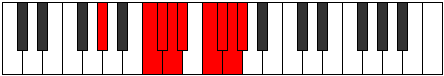

# Mode Pynyllic

## Links

- [Documentation](index.md)
- [Scales Index](Scales.md)
- [Modes Index](Modes.md)
- [Chords Index](Chords.md)

## Parent Scale

[Pynyllic](ScalePynyllic.md)

## Number

[3825](https://ianring.com/musictheory/scales/3825)

## Perfection

- 6 Perfect notes
- 2 Perfect notes

## Perfection Profile

[true true true false false true true true]

## Permutations

| Tonic | Notes | Signature | Illustration | Audio |
|-------|-------|-----------|--------------|-------|
| [C](ModeCNaturalPynyllic.md) | C, E, F, **F#**, **G**, A, A#, B, C | C |  | [midi](ModeCNaturalPynyllic.mid) [ogg](ModeCNaturalPynyllic.ogg) |
| [C#](ModeCSharpPynyllic.md) | C#, F, F#, **G**, **G#**, A#, B, C, C# | C |  | [midi](ModeCSharpPynyllic.mid) [ogg](ModeCSharpPynyllic.ogg) |
| [Db](ModeDFlatPynyllic.md) | Db, F, Gb, **G**, **Ab**, Bb, B, C, Db | C |  | [midi](ModeDFlatPynyllic.mid) [ogg](ModeDFlatPynyllic.ogg) |
| [D](ModeDNaturalPynyllic.md) | D, F#, G, **G#**, **A**, B, C, C#, D | C |  | [midi](ModeDNaturalPynyllic.mid) [ogg](ModeDNaturalPynyllic.ogg) |
| [D#](ModeDSharpPynyllic.md) | D#, G, G#, **A**, **A#**, C, C#, D, D# | C |  | [midi](ModeDSharpPynyllic.mid) [ogg](ModeDSharpPynyllic.ogg) |
| [Eb](ModeEFlatPynyllic.md) | Eb, G, Ab, **A**, **Bb**, C, Db, D, Eb | C |  | [midi](ModeEFlatPynyllic.mid) [ogg](ModeEFlatPynyllic.ogg) |
| [E](ModeENaturalPynyllic.md) | E, G#, A, **A#**, **B**, C#, D, D#, E | C |  | [midi](ModeENaturalPynyllic.mid) [ogg](ModeENaturalPynyllic.ogg) |
| [F](ModeFNaturalPynyllic.md) | F, A, A#, **B**, **C**, D, D#, E, F | C |  | [midi](ModeFNaturalPynyllic.mid) [ogg](ModeFNaturalPynyllic.ogg) |
| [F#](ModeFSharpPynyllic.md) | F#, A#, B, **C**, **C#**, D#, E, F, F# | C |  | [midi](ModeFSharpPynyllic.mid) [ogg](ModeFSharpPynyllic.ogg) |
| [Gb](ModeGFlatPynyllic.md) | Gb, Bb, B, **C**, **Db**, Eb, E, F, Gb | C |  | [midi](ModeGFlatPynyllic.mid) [ogg](ModeGFlatPynyllic.ogg) |
| [G](ModeGNaturalPynyllic.md) | G, B, C, **C#**, **D**, E, F, F#, G | C |  | [midi](ModeGNaturalPynyllic.mid) [ogg](ModeGNaturalPynyllic.ogg) |
| [G#](ModeGSharpPynyllic.md) | G#, C, C#, **D**, **D#**, F, F#, G, G# | C |  | [midi](ModeGSharpPynyllic.mid) [ogg](ModeGSharpPynyllic.ogg) |
| [Ab](ModeAFlatPynyllic.md) | Ab, C, Db, **D**, **Eb**, F, Gb, G, Ab | C |  | [midi](ModeAFlatPynyllic.mid) [ogg](ModeAFlatPynyllic.ogg) |
| [A](ModeANaturalPynyllic.md) | A, C#, D, **D#**, **E**, F#, G, G#, A | C |  | [midi](ModeANaturalPynyllic.mid) [ogg](ModeANaturalPynyllic.ogg) |
| [A#](ModeASharpPynyllic.md) | A#, D, D#, **E**, **F**, G, G#, A, A# | C |  | [midi](ModeASharpPynyllic.mid) [ogg](ModeASharpPynyllic.ogg) |
| [Bb](ModeBFlatPynyllic.md) | Bb, D, Eb, **E**, **F**, G, Ab, A, Bb | C |  | [midi](ModeBFlatPynyllic.mid) [ogg](ModeBFlatPynyllic.ogg) |
| [B](ModeBNaturalPynyllic.md) | B, D#, E, **F**, **F#**, G#, A, A#, B | C |  | [midi](ModeBNaturalPynyllic.mid) [ogg](ModeBNaturalPynyllic.ogg) |
