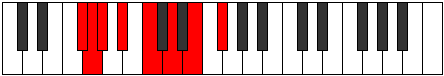

# Mode Pyptian

## Links

- [Documentation](README.md)
- [Scales Index](Scales.md)
- [Modes Index](Modes.md)
- [Chords Index](Chords.md)

## Parent Scale

[Aeolynian](ScaleAeolynian.md)

## Number

[1367](https://ianring.com/musictheory/scales/1367)

## Luminosity

-1

## Transposition

1, 1, 2, 2, 2, 2, 2

## Chord Pattern

i⁰b3, ii, III⁺, IV⁺, V, VIb5, vii⁰

## Perfection

- 2 Perfect notes
- 5 Perfect notes

## Perfection Profile

false, true, false, false, true, false, false

## Permutations

| Tonic | Notes | Signature | Illustration | Audio |
|-------|-------|-----------|--------------|-------|
| [C](ModeCNaturalPyptian.md) | **C**, Db, **Ebb**, **Fb**, Gb, **Ab**, **Bb**, **C** | C |  | [midi](https://github.com/edipermadi/music/blob/main/docs/ModeCNaturalPyptian.mid?raw=true) |
| [C#](ModeCSharpPyptian.md) | **C#**, D, **Eb**, **F**, G, **A**, **B**, **C#** | C |  | [midi](https://github.com/edipermadi/music/blob/main/docs/ModeCSharpPyptian.mid?raw=true) |
| [Db](ModeDFlatPyptian.md) | **Db**, Ebb, **Fbb**, **Gbb**, Abb, **Bbb**, **Cb**, **Db** | C |  | [midi](https://github.com/edipermadi/music/blob/main/docs/ModeDFlatPyptian.mid?raw=true) |
| [D](ModeDNaturalPyptian.md) | **D**, Eb, **Fb**, **Gb**, Ab, **Bb**, **C**, **D** | C |  | [midi](https://github.com/edipermadi/music/blob/main/docs/ModeDNaturalPyptian.mid?raw=true) |
| [D#](ModeDSharpPyptian.md) | **D#**, E, **F**, **G**, A, **B**, **C#**, **D#** | C |  | [midi](https://github.com/edipermadi/music/blob/main/docs/ModeDSharpPyptian.mid?raw=true) |
| [Eb](ModeEFlatPyptian.md) | **Eb**, Fb, **Gbb**, **Abb**, Bbb, **Cb**, **Db**, **Eb** | C |  | [midi](https://github.com/edipermadi/music/blob/main/docs/ModeEFlatPyptian.mid?raw=true) |
| [E](ModeENaturalPyptian.md) | **E**, F, **Gb**, **Ab**, Bb, **C**, **D**, **E** | C |  | [midi](https://github.com/edipermadi/music/blob/main/docs/ModeENaturalPyptian.mid?raw=true) |
| [F](ModeFNaturalPyptian.md) | **F**, Gb, **Abb**, **Bbb**, Cb, **Db**, **Eb**, **F** | C |  | [midi](https://github.com/edipermadi/music/blob/main/docs/ModeFNaturalPyptian.mid?raw=true) |
| [F#](ModeFSharpPyptian.md) | **F#**, G, **Ab**, **Bb**, C, **D**, **E**, **F#** | C |  | [midi](https://github.com/edipermadi/music/blob/main/docs/ModeFSharpPyptian.mid?raw=true) |
| [Gb](ModeGFlatPyptian.md) | **Gb**, Abb, **Bbbb**, **Cbb**, Dbb, **Ebb**, **Fb**, **Gb** | C |  | [midi](https://github.com/edipermadi/music/blob/main/docs/ModeGFlatPyptian.mid?raw=true) |
| [G](ModeGNaturalPyptian.md) | **G**, Ab, **Bbb**, **Cb**, Db, **Eb**, **F**, **G** | C |  | [midi](https://github.com/edipermadi/music/blob/main/docs/ModeGNaturalPyptian.mid?raw=true) |
| [G#](ModeGSharpPyptian.md) | **G#**, A, **Bb**, **C**, D, **E**, **F#**, **G#** | C |  | [midi](https://github.com/edipermadi/music/blob/main/docs/ModeGSharpPyptian.mid?raw=true) |
| [Ab](ModeAFlatPyptian.md) | **Ab**, Bbb, **Cbb**, **Dbb**, Ebb, **Fb**, **Gb**, **Ab** | C |  | [midi](https://github.com/edipermadi/music/blob/main/docs/ModeAFlatPyptian.mid?raw=true) |
| [A](ModeANaturalPyptian.md) | **A**, Bb, **Cb**, **Db**, Eb, **F**, **G**, **A** | C |  | [midi](https://github.com/edipermadi/music/blob/main/docs/ModeANaturalPyptian.mid?raw=true) |
| [A#](ModeASharpPyptian.md) | **A#**, B, **C**, **D**, E, **F#**, **G#**, **A#** | C |  | [midi](https://github.com/edipermadi/music/blob/main/docs/ModeASharpPyptian.mid?raw=true) |
| [Bb](ModeBFlatPyptian.md) | **Bb**, Cb, **Dbb**, **Ebb**, Fb, **Gb**, **Ab**, **Bb** | C |  | [midi](https://github.com/edipermadi/music/blob/main/docs/ModeBFlatPyptian.mid?raw=true) |
| [B](ModeBNaturalPyptian.md) | **B**, C, **Db**, **Eb**, F, **G**, **A**, **B** | C |  | [midi](https://github.com/edipermadi/music/blob/main/docs/ModeBNaturalPyptian.mid?raw=true) |
