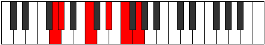
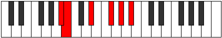

# Mode Pyritonic

## Links

- [Documentation](index.md)
- [Scales Index](Scales.md)
- [Modes Index](Modes.md)
- [Chords Index](Chords.md)

## Parent Scale

[Magitonic](ScaleMagitonic.md)

## Number

[1315](https://ianring.com/musictheory/scales/1315)

## Perfection

- 3 Perfect notes
- 2 Perfect notes

## Perfection Profile

[false true true false true]

## Permutations

| Tonic | Notes | Signature | Illustration | Audio |
|-------|-------|-----------|--------------|-------|
| [C](ModeCNaturalPyritonic.md) | **C**, C#, F, **G#**, A#, **C** | C |  | [midi](ModeCNaturalPyritonic.mid) [ogg](ModeCNaturalPyritonic.ogg) |
| [C#](ModeCSharpPyritonic.md) | **C#**, D, F#, **A**, B, **C#** | C |  | [midi](ModeCSharpPyritonic.mid) [ogg](ModeCSharpPyritonic.ogg) |
| [Db](ModeDFlatPyritonic.md) | **Db**, D, Gb, **A**, B, **Db** | C |  | [midi](ModeDFlatPyritonic.mid) [ogg](ModeDFlatPyritonic.ogg) |
| [D](ModeDNaturalPyritonic.md) | **D**, D#, G, **A#**, C, **D** | C |  | [midi](ModeDNaturalPyritonic.mid) [ogg](ModeDNaturalPyritonic.ogg) |
| [D#](ModeDSharpPyritonic.md) | **D#**, E, G#, **B**, C#, **D#** | C |  | [midi](ModeDSharpPyritonic.mid) [ogg](ModeDSharpPyritonic.ogg) |
| [Eb](ModeEFlatPyritonic.md) | **Eb**, E, Ab, **B**, Db, **Eb** | C |  | [midi](ModeEFlatPyritonic.mid) [ogg](ModeEFlatPyritonic.ogg) |
| [E](ModeENaturalPyritonic.md) | **E**, F, A, **C**, D, **E** | C |  | [midi](ModeENaturalPyritonic.mid) [ogg](ModeENaturalPyritonic.ogg) |
| [F](ModeFNaturalPyritonic.md) | **F**, F#, A#, **C#**, D#, **F** | C |  | [midi](ModeFNaturalPyritonic.mid) [ogg](ModeFNaturalPyritonic.ogg) |
| [F#](ModeFSharpPyritonic.md) | **F#**, G, B, **D**, E, **F#** | C |  | [midi](ModeFSharpPyritonic.mid) [ogg](ModeFSharpPyritonic.ogg) |
| [Gb](ModeGFlatPyritonic.md) | **Gb**, G, B, **D**, E, **Gb** | C |  | [midi](ModeGFlatPyritonic.mid) [ogg](ModeGFlatPyritonic.ogg) |
| [G](ModeGNaturalPyritonic.md) | **G**, G#, C, **D#**, F, **G** | C |  | [midi](ModeGNaturalPyritonic.mid) [ogg](ModeGNaturalPyritonic.ogg) |
| [G#](ModeGSharpPyritonic.md) | **G#**, A, C#, **E**, F#, **G#** | C |  | [midi](ModeGSharpPyritonic.mid) [ogg](ModeGSharpPyritonic.ogg) |
| [Ab](ModeAFlatPyritonic.md) | **Ab**, A, Db, **E**, Gb, **Ab** | C |  | [midi](ModeAFlatPyritonic.mid) [ogg](ModeAFlatPyritonic.ogg) |
| [A](ModeANaturalPyritonic.md) | **A**, A#, D, **F**, G, **A** | C |  | [midi](ModeANaturalPyritonic.mid) [ogg](ModeANaturalPyritonic.ogg) |
| [A#](ModeASharpPyritonic.md) | **A#**, B, D#, **F#**, G#, **A#** | C |  | [midi](ModeASharpPyritonic.mid) [ogg](ModeASharpPyritonic.ogg) |
| [Bb](ModeBFlatPyritonic.md) | **Bb**, B, Eb, **Gb**, Ab, **Bb** | C |  | [midi](ModeBFlatPyritonic.mid) [ogg](ModeBFlatPyritonic.ogg) |
| [B](ModeBNaturalPyritonic.md) | **B**, C, E, **G**, A, **B** | C |  | [midi](ModeBNaturalPyritonic.mid) [ogg](ModeBNaturalPyritonic.ogg) |
