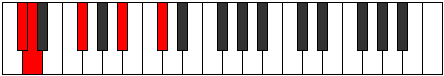
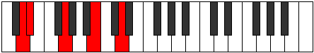
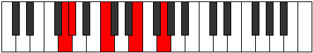

# Mode Pyrric

## Links

- [Documentation](README.md)
- [Scales Index](Scales.md)
- [Modes Index](Modes.md)
- [Chords Index](Chords.md)

## Parent Scale

[Zyphic](ScaleZyphic.md)

## Number

[547](https://ianring.com/musictheory/scales/547)

## Transposition

1, 4, 4, 3

## Chord Pattern

## Perfection

- 1 Perfect notes
- 3 Perfect notes

## Perfection Profile

false, false, true, false

## Permutations

| Tonic | Notes | Signature | Illustration | Audio |
|-------|-------|-----------|--------------|-------|
| [C](ModeCNaturalPyrric.md) | **C**, **C#**, F, **A**, **C** | C |  | [midi](https://github.com/edipermadi/music/blob/main/docs/ModeCNaturalPyrric.mid?raw=true) |
| [C#](ModeCSharpPyrric.md) | **C#**, **D**, F#, **A#**, **C#** | C |  | [midi](https://github.com/edipermadi/music/blob/main/docs/ModeCSharpPyrric.mid?raw=true) |
| [Db](ModeDFlatPyrric.md) | **Db**, **D**, Gb, **Bb**, **Db** | C |  | [midi](https://github.com/edipermadi/music/blob/main/docs/ModeDFlatPyrric.mid?raw=true) |
| [D](ModeDNaturalPyrric.md) | **D**, **D#**, G, **B**, **D** | C |  | [midi](https://github.com/edipermadi/music/blob/main/docs/ModeDNaturalPyrric.mid?raw=true) |
| [D#](ModeDSharpPyrric.md) | **D#**, **E**, G#, **C**, **D#** | C |  | [midi](https://github.com/edipermadi/music/blob/main/docs/ModeDSharpPyrric.mid?raw=true) |
| [Eb](ModeEFlatPyrric.md) | **Eb**, **E**, Ab, **C**, **Eb** | C |  | [midi](https://github.com/edipermadi/music/blob/main/docs/ModeEFlatPyrric.mid?raw=true) |
| [E](ModeENaturalPyrric.md) | **E**, **F**, A, **C#**, **E** | C |  | [midi](https://github.com/edipermadi/music/blob/main/docs/ModeENaturalPyrric.mid?raw=true) |
| [F](ModeFNaturalPyrric.md) | **F**, **F#**, A#, **D**, **F** | C |  | [midi](https://github.com/edipermadi/music/blob/main/docs/ModeFNaturalPyrric.mid?raw=true) |
| [F#](ModeFSharpPyrric.md) | **F#**, **G**, B, **D#**, **F#** | C |  | [midi](https://github.com/edipermadi/music/blob/main/docs/ModeFSharpPyrric.mid?raw=true) |
| [Gb](ModeGFlatPyrric.md) | **Gb**, **G**, B, **Eb**, **Gb** | C |  | [midi](https://github.com/edipermadi/music/blob/main/docs/ModeGFlatPyrric.mid?raw=true) |
| [G](ModeGNaturalPyrric.md) | **G**, **G#**, C, **E**, **G** | C |  | [midi](https://github.com/edipermadi/music/blob/main/docs/ModeGNaturalPyrric.mid?raw=true) |
| [G#](ModeGSharpPyrric.md) | **G#**, **A**, C#, **F**, **G#** | C |  | [midi](https://github.com/edipermadi/music/blob/main/docs/ModeGSharpPyrric.mid?raw=true) |
| [Ab](ModeAFlatPyrric.md) | **Ab**, **A**, Db, **F**, **Ab** | C |  | [midi](https://github.com/edipermadi/music/blob/main/docs/ModeAFlatPyrric.mid?raw=true) |
| [A](ModeANaturalPyrric.md) | **A**, **A#**, D, **F#**, **A** | C |  | [midi](https://github.com/edipermadi/music/blob/main/docs/ModeANaturalPyrric.mid?raw=true) |
| [A#](ModeASharpPyrric.md) | **A#**, **B**, D#, **G**, **A#** | C |  | [midi](https://github.com/edipermadi/music/blob/main/docs/ModeASharpPyrric.mid?raw=true) |
| [Bb](ModeBFlatPyrric.md) | **Bb**, **B**, Eb, **G**, **Bb** | C |  | [midi](https://github.com/edipermadi/music/blob/main/docs/ModeBFlatPyrric.mid?raw=true) |
| [B](ModeBNaturalPyrric.md) | **B**, **C**, E, **G#**, **B** | C |  | [midi](https://github.com/edipermadi/music/blob/main/docs/ModeBNaturalPyrric.mid?raw=true) |
