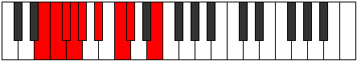

# Mode Pyryllic

## Links

- [Documentation](index.md)
- [Scales Index](Scales.md)
- [Modes Index](Modes.md)
- [Chords Index](Chords.md)

## Parent Scale

[Gythyllic](ScaleGythyllic.md)

## Number

[863](https://ianring.com/musictheory/scales/863)

## Perfection

- 5 Perfect notes
- 3 Perfect notes

## Interval Pattern

1, 1, 1, 1, 2, 2, 1, 3

## Perfection Profile

[false true true false false true true true]

## Permutations

| Tonic | Notes | Signature | Illustration | Audio |
|-------|-------|-----------|--------------|-------|
| [C](ModeCNaturalPyryllic.md) | **C**, C#, D, **D#**, **E**, F#, G#, A, **C** | C |  | [midi](https://github.com/edipermadi/music/blob/main/docs/ModeCNaturalPyryllic.mid?raw=true) |
| [C#](ModeCSharpPyryllic.md) | **C#**, D, D#, **E**, **F**, G, A, A#, **C#** | C |  | [midi](https://github.com/edipermadi/music/blob/main/docs/ModeCSharpPyryllic.mid?raw=true) |
| [Db](ModeDFlatPyryllic.md) | **Db**, D, Eb, **E**, **F**, G, A, Bb, **Db** | C |  | [midi](https://github.com/edipermadi/music/blob/main/docs/ModeDFlatPyryllic.mid?raw=true) |
| [D](ModeDNaturalPyryllic.md) | **D**, D#, E, **F**, **F#**, G#, A#, B, **D** | C |  | [midi](https://github.com/edipermadi/music/blob/main/docs/ModeDNaturalPyryllic.mid?raw=true) |
| [D#](ModeDSharpPyryllic.md) | **D#**, E, F, **F#**, **G**, A, B, C, **D#** | C |  | [midi](https://github.com/edipermadi/music/blob/main/docs/ModeDSharpPyryllic.mid?raw=true) |
| [Eb](ModeEFlatPyryllic.md) | **Eb**, E, F, **Gb**, **G**, A, B, C, **Eb** | C |  | [midi](https://github.com/edipermadi/music/blob/main/docs/ModeEFlatPyryllic.mid?raw=true) |
| [E](ModeENaturalPyryllic.md) | **E**, F, F#, **G**, **G#**, A#, C, C#, **E** | C |  | [midi](https://github.com/edipermadi/music/blob/main/docs/ModeENaturalPyryllic.mid?raw=true) |
| [F](ModeFNaturalPyryllic.md) | **F**, F#, G, **G#**, **A**, B, C#, D, **F** | C |  | [midi](https://github.com/edipermadi/music/blob/main/docs/ModeFNaturalPyryllic.mid?raw=true) |
| [F#](ModeFSharpPyryllic.md) | **F#**, G, G#, **A**, **A#**, C, D, D#, **F#** | C |  | [midi](https://github.com/edipermadi/music/blob/main/docs/ModeFSharpPyryllic.mid?raw=true) |
| [Gb](ModeGFlatPyryllic.md) | **Gb**, G, Ab, **A**, **Bb**, C, D, Eb, **Gb** | C |  | [midi](https://github.com/edipermadi/music/blob/main/docs/ModeGFlatPyryllic.mid?raw=true) |
| [G](ModeGNaturalPyryllic.md) | **G**, G#, A, **A#**, **B**, C#, D#, E, **G** | C |  | [midi](https://github.com/edipermadi/music/blob/main/docs/ModeGNaturalPyryllic.mid?raw=true) |
| [G#](ModeGSharpPyryllic.md) | **G#**, A, A#, **B**, **C**, D, E, F, **G#** | C |  | [midi](https://github.com/edipermadi/music/blob/main/docs/ModeGSharpPyryllic.mid?raw=true) |
| [Ab](ModeAFlatPyryllic.md) | **Ab**, A, Bb, **B**, **C**, D, E, F, **Ab** | C |  | [midi](https://github.com/edipermadi/music/blob/main/docs/ModeAFlatPyryllic.mid?raw=true) |
| [A](ModeANaturalPyryllic.md) | **A**, A#, B, **C**, **C#**, D#, F, F#, **A** | C |  | [midi](https://github.com/edipermadi/music/blob/main/docs/ModeANaturalPyryllic.mid?raw=true) |
| [A#](ModeASharpPyryllic.md) | **A#**, B, C, **C#**, **D**, E, F#, G, **A#** | C |  | [midi](https://github.com/edipermadi/music/blob/main/docs/ModeASharpPyryllic.mid?raw=true) |
| [Bb](ModeBFlatPyryllic.md) | **Bb**, B, C, **Db**, **D**, E, Gb, G, **Bb** | C |  | [midi](https://github.com/edipermadi/music/blob/main/docs/ModeBFlatPyryllic.mid?raw=true) |
| [B](ModeBNaturalPyryllic.md) | **B**, C, C#, **D**, **D#**, F, G, G#, **B** | C |  | [midi](https://github.com/edipermadi/music/blob/main/docs/ModeBNaturalPyryllic.mid?raw=true) |
