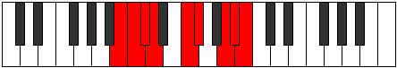

# Mode Pythyllic

## Links

- [Documentation](index.md)
- [Scales Index](Scales.md)
- [Modes Index](Modes.md)
- [Chords Index](Chords.md)

## Parent Scale

[Ioniptyllic](ScaleIoniptyllic.md)

## Number

[3279](https://ianring.com/musictheory/scales/3279)

## Perfection

- 5 Perfect notes
- 3 Perfect notes

## Perfection Profile

[true false false true true true false true]

## Permutations

| Tonic | Notes | Signature | Illustration | Audio |
|-------|-------|-----------|--------------|-------|
| [C](ModeCNaturalPythyllic.md) | C, **C#**, **D**, D#, F#, G, **A#**, B, C | C |  | [midi](ModeCNaturalPythyllic.mid) [ogg](ModeCNaturalPythyllic.ogg) |
| [C#](ModeCSharpPythyllic.md) | C#, **D**, **D#**, E, G, G#, **B**, C, C# | C |  | [midi](ModeCSharpPythyllic.mid) [ogg](ModeCSharpPythyllic.ogg) |
| [Db](ModeDFlatPythyllic.md) | Db, **D**, **Eb**, E, G, Ab, **B**, C, Db | C |  | [midi](ModeDFlatPythyllic.mid) [ogg](ModeDFlatPythyllic.ogg) |
| [D](ModeDNaturalPythyllic.md) | D, **D#**, **E**, F, G#, A, **C**, C#, D | C |  | [midi](ModeDNaturalPythyllic.mid) [ogg](ModeDNaturalPythyllic.ogg) |
| [D#](ModeDSharpPythyllic.md) | D#, **E**, **F**, F#, A, A#, **C#**, D, D# | C |  | [midi](ModeDSharpPythyllic.mid) [ogg](ModeDSharpPythyllic.ogg) |
| [Eb](ModeEFlatPythyllic.md) | Eb, **E**, **F**, Gb, A, Bb, **Db**, D, Eb | C |  | [midi](ModeEFlatPythyllic.mid) [ogg](ModeEFlatPythyllic.ogg) |
| [E](ModeENaturalPythyllic.md) | E, **F**, **F#**, G, A#, B, **D**, D#, E | C |  | [midi](ModeENaturalPythyllic.mid) [ogg](ModeENaturalPythyllic.ogg) |
| [F](ModeFNaturalPythyllic.md) | F, **F#**, **G**, G#, B, C, **D#**, E, F | C |  | [midi](ModeFNaturalPythyllic.mid) [ogg](ModeFNaturalPythyllic.ogg) |
| [F#](ModeFSharpPythyllic.md) | F#, **G**, **G#**, A, C, C#, **E**, F, F# | C |  | [midi](ModeFSharpPythyllic.mid) [ogg](ModeFSharpPythyllic.ogg) |
| [Gb](ModeGFlatPythyllic.md) | Gb, **G**, **Ab**, A, C, Db, **E**, F, Gb | C |  | [midi](ModeGFlatPythyllic.mid) [ogg](ModeGFlatPythyllic.ogg) |
| [G](ModeGNaturalPythyllic.md) | G, **G#**, **A**, A#, C#, D, **F**, F#, G | C |  | [midi](ModeGNaturalPythyllic.mid) [ogg](ModeGNaturalPythyllic.ogg) |
| [G#](ModeGSharpPythyllic.md) | G#, **A**, **A#**, B, D, D#, **F#**, G, G# | C |  | [midi](ModeGSharpPythyllic.mid) [ogg](ModeGSharpPythyllic.ogg) |
| [Ab](ModeAFlatPythyllic.md) | Ab, **A**, **Bb**, B, D, Eb, **Gb**, G, Ab | C |  | [midi](ModeAFlatPythyllic.mid) [ogg](ModeAFlatPythyllic.ogg) |
| [A](ModeANaturalPythyllic.md) | A, **A#**, **B**, C, D#, E, **G**, G#, A | C |  | [midi](ModeANaturalPythyllic.mid) [ogg](ModeANaturalPythyllic.ogg) |
| [A#](ModeASharpPythyllic.md) | A#, **B**, **C**, C#, E, F, **G#**, A, A# | C |  | [midi](ModeASharpPythyllic.mid) [ogg](ModeASharpPythyllic.ogg) |
| [Bb](ModeBFlatPythyllic.md) | Bb, **B**, **C**, Db, E, F, **Ab**, A, Bb | C |  | [midi](ModeBFlatPythyllic.mid) [ogg](ModeBFlatPythyllic.ogg) |
| [B](ModeBNaturalPythyllic.md) | B, **C**, **C#**, D, F, F#, **A**, A#, B | C |  | [midi](ModeBNaturalPythyllic.mid) [ogg](ModeBNaturalPythyllic.ogg) |
