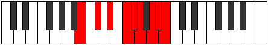

# Mode Racryllic

## Links

- [Documentation](index.md)
- [Scales Index](Scales.md)
- [Modes Index](Modes.md)
- [Chords Index](Chords.md)

## Parent Scale

[Racryllic](ScaleRacryllic.md)

## Number

[3541](https://ianring.com/musictheory/scales/3541)

## Perfection

- 4 Perfect notes
- 4 Perfect notes

## Perfection Profile

[true false true false true false false true]

## Permutations

| Tonic | Notes | Signature | Illustration | Audio |
|-------|-------|-----------|--------------|-------|
| [C](ModeCNaturalRacryllic.md) | C, **D**, E, **F#**, G, **G#**, **A#**, B, C | C |  | [midi](ModeCNaturalRacryllic.mid) [ogg](ModeCNaturalRacryllic.ogg) |
| [C#](ModeCSharpRacryllic.md) | C#, **D#**, F, **G**, G#, **A**, **B**, C, C# | C |  | [midi](ModeCSharpRacryllic.mid) [ogg](ModeCSharpRacryllic.ogg) |
| [Db](ModeDFlatRacryllic.md) | Db, **Eb**, F, **G**, Ab, **A**, **B**, C, Db | C |  | [midi](ModeDFlatRacryllic.mid) [ogg](ModeDFlatRacryllic.ogg) |
| [D](ModeDNaturalRacryllic.md) | D, **E**, F#, **G#**, A, **A#**, **C**, C#, D | C |  | [midi](ModeDNaturalRacryllic.mid) [ogg](ModeDNaturalRacryllic.ogg) |
| [D#](ModeDSharpRacryllic.md) | D#, **F**, G, **A**, A#, **B**, **C#**, D, D# | C |  | [midi](ModeDSharpRacryllic.mid) [ogg](ModeDSharpRacryllic.ogg) |
| [Eb](ModeEFlatRacryllic.md) | Eb, **F**, G, **A**, Bb, **B**, **Db**, D, Eb | C |  | [midi](ModeEFlatRacryllic.mid) [ogg](ModeEFlatRacryllic.ogg) |
| [E](ModeENaturalRacryllic.md) | E, **F#**, G#, **A#**, B, **C**, **D**, D#, E | C |  | [midi](ModeENaturalRacryllic.mid) [ogg](ModeENaturalRacryllic.ogg) |
| [F](ModeFNaturalRacryllic.md) | F, **G**, A, **B**, C, **C#**, **D#**, E, F | C |  | [midi](ModeFNaturalRacryllic.mid) [ogg](ModeFNaturalRacryllic.ogg) |
| [F#](ModeFSharpRacryllic.md) | F#, **G#**, A#, **C**, C#, **D**, **E**, F, F# | C |  | [midi](ModeFSharpRacryllic.mid) [ogg](ModeFSharpRacryllic.ogg) |
| [Gb](ModeGFlatRacryllic.md) | Gb, **Ab**, Bb, **C**, Db, **D**, **E**, F, Gb | C |  | [midi](ModeGFlatRacryllic.mid) [ogg](ModeGFlatRacryllic.ogg) |
| [G](ModeGNaturalRacryllic.md) | G, **A**, B, **C#**, D, **D#**, **F**, F#, G | C |  | [midi](ModeGNaturalRacryllic.mid) [ogg](ModeGNaturalRacryllic.ogg) |
| [G#](ModeGSharpRacryllic.md) | G#, **A#**, C, **D**, D#, **E**, **F#**, G, G# | C |  | [midi](ModeGSharpRacryllic.mid) [ogg](ModeGSharpRacryllic.ogg) |
| [Ab](ModeAFlatRacryllic.md) | Ab, **Bb**, C, **D**, Eb, **E**, **Gb**, G, Ab | C |  | [midi](ModeAFlatRacryllic.mid) [ogg](ModeAFlatRacryllic.ogg) |
| [A](ModeANaturalRacryllic.md) | A, **B**, C#, **D#**, E, **F**, **G**, G#, A | C |  | [midi](ModeANaturalRacryllic.mid) [ogg](ModeANaturalRacryllic.ogg) |
| [A#](ModeASharpRacryllic.md) | A#, **C**, D, **E**, F, **F#**, **G#**, A, A# | C |  | [midi](ModeASharpRacryllic.mid) [ogg](ModeASharpRacryllic.ogg) |
| [Bb](ModeBFlatRacryllic.md) | Bb, **C**, D, **E**, F, **Gb**, **Ab**, A, Bb | C |  | [midi](ModeBFlatRacryllic.mid) [ogg](ModeBFlatRacryllic.ogg) |
| [B](ModeBNaturalRacryllic.md) | B, **C#**, D#, **F**, F#, **G**, **A**, A#, B | C |  | [midi](ModeBNaturalRacryllic.mid) [ogg](ModeBNaturalRacryllic.ogg) |
