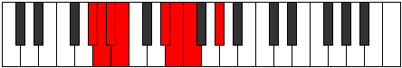

# Mode Radian

## Links

- [Documentation](index.md)
- [Scales Index](Scales.md)
- [Modes Index](Modes.md)
- [Chords Index](Chords.md)

## Parent Scale

[Ionarian](ScaleIonarian.md)

## Number

[911](https://ianring.com/musictheory/scales/911)

## Perfection

- 5 Perfect notes
- 2 Perfect notes

## Perfection Profile

[true true true false true true false]

## Permutations

| Tonic | Notes | Signature | Illustration | Audio |
|-------|-------|-----------|--------------|-------|
| [C](ModeCNaturalRadian.md) | C, Db, Ebb, **Fbb**, G, Ab, **Bbb**, C | C |  | [midi](ModeCNaturalRadian.mid) [ogg](ModeCNaturalRadian.ogg) |
| [C#](ModeCSharpRadian.md) | C#, D, Eb, **Fb**, G#, A, **Bb**, C# | C |  | [midi](ModeCSharpRadian.mid) [ogg](ModeCSharpRadian.ogg) |
| [Db](ModeDFlatRadian.md) | Db, Ebb, Fbb, **Gbbb**, Ab, Bbb, **Cbb**, Db | C |  | [midi](ModeDFlatRadian.mid) [ogg](ModeDFlatRadian.ogg) |
| [D](ModeDNaturalRadian.md) | D, Eb, Fb, **Gbb**, A, Bb, **Cb**, D | C |  | [midi](ModeDNaturalRadian.mid) [ogg](ModeDNaturalRadian.ogg) |
| [D#](ModeDSharpRadian.md) | D#, E, F, **Gb**, A#, B, **C**, D# | C |  | [midi](ModeDSharpRadian.mid) [ogg](ModeDSharpRadian.ogg) |
| [Eb](ModeEFlatRadian.md) | Eb, Fb, Gbb, **Abbb**, Bb, Cb, **Dbb**, Eb | C |  | [midi](ModeEFlatRadian.mid) [ogg](ModeEFlatRadian.ogg) |
| [E](ModeENaturalRadian.md) | E, F, Gb, **Abb**, B, C, **Db**, E | C |  | [midi](ModeENaturalRadian.mid) [ogg](ModeENaturalRadian.ogg) |
| [F](ModeFNaturalRadian.md) | F, Gb, Abb, **Bbbb**, C, Db, **Ebb**, F | C |  | [midi](ModeFNaturalRadian.mid) [ogg](ModeFNaturalRadian.ogg) |
| [F#](ModeFSharpRadian.md) | F#, G, Ab, **Bbb**, C#, D, **Eb**, F# | C |  | [midi](ModeFSharpRadian.mid) [ogg](ModeFSharpRadian.ogg) |
| [Gb](ModeGFlatRadian.md) | Gb, Abb, Bbbb, **Cbbb**, Db, Ebb, **Fbb**, Gb | C |  | [midi](ModeGFlatRadian.mid) [ogg](ModeGFlatRadian.ogg) |
| [G](ModeGNaturalRadian.md) | G, Ab, Bbb, **Cbb**, D, Eb, **Fb**, G | C |  | [midi](ModeGNaturalRadian.mid) [ogg](ModeGNaturalRadian.ogg) |
| [G#](ModeGSharpRadian.md) | G#, A, Bb, **Cb**, D#, E, **F**, G# | C |  | [midi](ModeGSharpRadian.mid) [ogg](ModeGSharpRadian.ogg) |
| [Ab](ModeAFlatRadian.md) | Ab, Bbb, Cbb, **Dbbb**, Eb, Fb, **Gbb**, Ab | C |  | [midi](ModeAFlatRadian.mid) [ogg](ModeAFlatRadian.ogg) |
| [A](ModeANaturalRadian.md) | A, Bb, Cb, **Dbb**, E, F, **Gb**, A | C |  | [midi](ModeANaturalRadian.mid) [ogg](ModeANaturalRadian.ogg) |
| [A#](ModeASharpRadian.md) | A#, B, C, **Db**, E#, F#, **G**, A# | C |  | [midi](ModeASharpRadian.mid) [ogg](ModeASharpRadian.ogg) |
| [Bb](ModeBFlatRadian.md) | Bb, Cb, Dbb, **Ebbb**, F, Gb, **Abb**, Bb | C |  | [midi](ModeBFlatRadian.mid) [ogg](ModeBFlatRadian.ogg) |
| [B](ModeBNaturalRadian.md) | B, C, Db, **Ebb**, F#, G, **Ab**, B | C |  | [midi](ModeBNaturalRadian.mid) [ogg](ModeBNaturalRadian.ogg) |
