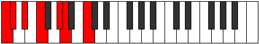
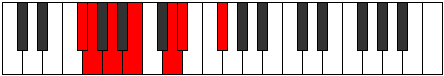

# Mode Radimic

## Links

- [Documentation](index.md)
- [Scales Index](Scales.md)
- [Modes Index](Modes.md)
- [Chords Index](Chords.md)

## Parent Scale

[Dynimic](ScaleDynimic.md)

## Number

[811](https://ianring.com/musictheory/scales/811)

## Perfection

- 3 Perfect notes
- 3 Perfect notes

## Perfection Profile

[false true false true true false]

## Permutations

| Tonic | Notes | Signature | Illustration | Audio |
|-------|-------|-----------|--------------|-------|
| [C](ModeCNaturalRadimic.md) | **C**, Db, **Eb**, F, G#, **A**, **C** | C |  | [midi](ModeCNaturalRadimic.mid) [ogg](ModeCNaturalRadimic.ogg) |
| [C#](ModeCSharpRadimic.md) | **C#**, D, **E**, F#, G##, **A#**, **C#** | C |  | [midi](ModeCSharpRadimic.mid) [ogg](ModeCSharpRadimic.ogg) |
| [Db](ModeDFlatRadimic.md) | **Db**, Ebb, **Fb**, Gb, A, **Bb**, **Db** | C |  | [midi](ModeDFlatRadimic.mid) [ogg](ModeDFlatRadimic.ogg) |
| [D](ModeDNaturalRadimic.md) | **D**, Eb, **F**, G, A#, **B**, **D** | C |  | [midi](ModeDNaturalRadimic.mid) [ogg](ModeDNaturalRadimic.ogg) |
| [D#](ModeDSharpRadimic.md) | **D#**, E, **F#**, G#, A##, **B#**, **D#** | C |  | [midi](ModeDSharpRadimic.mid) [ogg](ModeDSharpRadimic.ogg) |
| [Eb](ModeEFlatRadimic.md) | **Eb**, Fb, **Gb**, Ab, B, **C**, **Eb** | C |  | [midi](ModeEFlatRadimic.mid) [ogg](ModeEFlatRadimic.ogg) |
| [E](ModeENaturalRadimic.md) | **E**, F, **G**, A, B#, **C#**, **E** | C |  | [midi](ModeENaturalRadimic.mid) [ogg](ModeENaturalRadimic.ogg) |
| [F](ModeFNaturalRadimic.md) | **F**, Gb, **Ab**, Bb, C#, **D**, **F** | C |  | [midi](ModeFNaturalRadimic.mid) [ogg](ModeFNaturalRadimic.ogg) |
| [F#](ModeFSharpRadimic.md) | **F#**, G, **A**, B, C##, **D#**, **F#** | C |  | [midi](ModeFSharpRadimic.mid) [ogg](ModeFSharpRadimic.ogg) |
| [Gb](ModeGFlatRadimic.md) | **Gb**, Abb, **Bbb**, Cb, D, **Eb**, **Gb** | C |  | [midi](ModeGFlatRadimic.mid) [ogg](ModeGFlatRadimic.ogg) |
| [G](ModeGNaturalRadimic.md) | **G**, Ab, **Bb**, C, D#, **E**, **G** | C |  | [midi](ModeGNaturalRadimic.mid) [ogg](ModeGNaturalRadimic.ogg) |
| [G#](ModeGSharpRadimic.md) | **G#**, A, **B**, C#, D##, **E#**, **G#** | C |  | [midi](ModeGSharpRadimic.mid) [ogg](ModeGSharpRadimic.ogg) |
| [Ab](ModeAFlatRadimic.md) | **Ab**, Bbb, **Cb**, Db, E, **F**, **Ab** | C |  | [midi](ModeAFlatRadimic.mid) [ogg](ModeAFlatRadimic.ogg) |
| [A](ModeANaturalRadimic.md) | **A**, Bb, **C**, D, E#, **F#**, **A** | C |  | [midi](ModeANaturalRadimic.mid) [ogg](ModeANaturalRadimic.ogg) |
| [A#](ModeASharpRadimic.md) | **A#**, B, **C#**, D#, E##, **F##**, **A#** | C |  | [midi](ModeASharpRadimic.mid) [ogg](ModeASharpRadimic.ogg) |
| [Bb](ModeBFlatRadimic.md) | **Bb**, Cb, **Db**, Eb, F#, **G**, **Bb** | C |  | [midi](ModeBFlatRadimic.mid) [ogg](ModeBFlatRadimic.ogg) |
| [B](ModeBNaturalRadimic.md) | **B**, C, **D**, E, F##, **G#**, **B** | C |  | [midi](ModeBNaturalRadimic.mid) [ogg](ModeBNaturalRadimic.ogg) |
