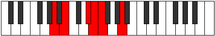

# Mode Raditonic

## Links

- [Documentation](index.md)
- [Scales Index](Scales.md)
- [Modes Index](Modes.md)
- [Chords Index](Chords.md)

## Parent Scale

[Zathitonic](ScaleZathitonic.md)

## Number

[453](https://ianring.com/musictheory/scales/453)

## Perfection

- 2 Perfect notes
- 3 Perfect notes

## Perfection Profile

[true false false true false]

## Permutations

| Tonic | Notes | Signature | Illustration | Audio |
|-------|-------|-----------|--------------|-------|
| [C](ModeCNaturalRaditonic.md) | C, **D**, **F#**, G, **G#**, C | C |  | [midi](ModeCNaturalRaditonic.mid) [ogg](ModeCNaturalRaditonic.ogg) |
| [C#](ModeCSharpRaditonic.md) | C#, **D#**, **G**, G#, **A**, C# | C |  | [midi](ModeCSharpRaditonic.mid) [ogg](ModeCSharpRaditonic.ogg) |
| [Db](ModeDFlatRaditonic.md) | Db, **Eb**, **G**, Ab, **A**, Db | C |  | [midi](ModeDFlatRaditonic.mid) [ogg](ModeDFlatRaditonic.ogg) |
| [D](ModeDNaturalRaditonic.md) | D, **E**, **G#**, A, **A#**, D | C |  | [midi](ModeDNaturalRaditonic.mid) [ogg](ModeDNaturalRaditonic.ogg) |
| [D#](ModeDSharpRaditonic.md) | D#, **F**, **A**, A#, **B**, D# | C |  | [midi](ModeDSharpRaditonic.mid) [ogg](ModeDSharpRaditonic.ogg) |
| [Eb](ModeEFlatRaditonic.md) | Eb, **F**, **A**, Bb, **B**, Eb | C |  | [midi](ModeEFlatRaditonic.mid) [ogg](ModeEFlatRaditonic.ogg) |
| [E](ModeENaturalRaditonic.md) | E, **F#**, **A#**, B, **C**, E | C |  | [midi](ModeENaturalRaditonic.mid) [ogg](ModeENaturalRaditonic.ogg) |
| [F](ModeFNaturalRaditonic.md) | F, **G**, **B**, C, **C#**, F | C |  | [midi](ModeFNaturalRaditonic.mid) [ogg](ModeFNaturalRaditonic.ogg) |
| [F#](ModeFSharpRaditonic.md) | F#, **G#**, **C**, C#, **D**, F# | C |  | [midi](ModeFSharpRaditonic.mid) [ogg](ModeFSharpRaditonic.ogg) |
| [Gb](ModeGFlatRaditonic.md) | Gb, **Ab**, **C**, Db, **D**, Gb | C |  | [midi](ModeGFlatRaditonic.mid) [ogg](ModeGFlatRaditonic.ogg) |
| [G](ModeGNaturalRaditonic.md) | G, **A**, **C#**, D, **D#**, G | C |  | [midi](ModeGNaturalRaditonic.mid) [ogg](ModeGNaturalRaditonic.ogg) |
| [G#](ModeGSharpRaditonic.md) | G#, **A#**, **D**, D#, **E**, G# | C |  | [midi](ModeGSharpRaditonic.mid) [ogg](ModeGSharpRaditonic.ogg) |
| [Ab](ModeAFlatRaditonic.md) | Ab, **Bb**, **D**, Eb, **E**, Ab | C |  | [midi](ModeAFlatRaditonic.mid) [ogg](ModeAFlatRaditonic.ogg) |
| [A](ModeANaturalRaditonic.md) | A, **B**, **D#**, E, **F**, A | C |  | [midi](ModeANaturalRaditonic.mid) [ogg](ModeANaturalRaditonic.ogg) |
| [A#](ModeASharpRaditonic.md) | A#, **C**, **E**, F, **F#**, A# | C |  | [midi](ModeASharpRaditonic.mid) [ogg](ModeASharpRaditonic.ogg) |
| [Bb](ModeBFlatRaditonic.md) | Bb, **C**, **E**, F, **Gb**, Bb | C |  | [midi](ModeBFlatRaditonic.mid) [ogg](ModeBFlatRaditonic.ogg) |
| [B](ModeBNaturalRaditonic.md) | B, **C#**, **F**, F#, **G**, B | C |  | [midi](ModeBNaturalRaditonic.mid) [ogg](ModeBNaturalRaditonic.ogg) |
