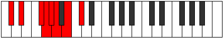
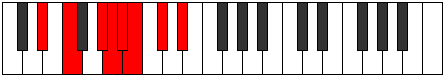
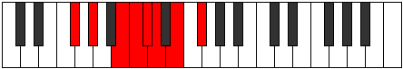

# Mode Ragian

## Links

- [Documentation](index.md)
- [Scales Index](Scales.md)
- [Modes Index](Modes.md)
- [Chords Index](Chords.md)

## Parent Scale

[Pagian](ScalePagian.md)

## Number

[1509](https://ianring.com/musictheory/scales/1509)

## Perfection

- 4 Perfect notes
- 3 Perfect notes

## Perfection Profile

[true false true false true false true]

## Permutations

| Tonic | Notes | Signature | Illustration | Audio |
|-------|-------|-----------|--------------|-------|
| [C](ModeCNaturalRagian.md) | C, **D**, E#, **F#**, G, **Ab**, Bb, C | C |  | [midi](ModeCNaturalRagian.mid) [ogg](ModeCNaturalRagian.ogg) |
| [C#](ModeCSharpRagian.md) | C#, **D#**, E##, **F##**, G#, **A**, B, C# | C |  | [midi](ModeCSharpRagian.mid) [ogg](ModeCSharpRagian.ogg) |
| [Db](ModeDFlatRagian.md) | Db, **Eb**, F#, **G**, Ab, **Bbb**, Cb, Db | C |  | [midi](ModeDFlatRagian.mid) [ogg](ModeDFlatRagian.ogg) |
| [D](ModeDNaturalRagian.md) | D, **E**, F##, **G#**, A, **Bb**, C, D | C |  | [midi](ModeDNaturalRagian.mid) [ogg](ModeDNaturalRagian.ogg) |
| [D#](ModeDSharpRagian.md) | D#, **E#**, F###, **G##**, A#, **B**, C#, D# | C |  | [midi](ModeDSharpRagian.mid) [ogg](ModeDSharpRagian.ogg) |
| [Eb](ModeEFlatRagian.md) | Eb, **F**, G#, **A**, Bb, **Cb**, Db, Eb | C |  | [midi](ModeEFlatRagian.mid) [ogg](ModeEFlatRagian.ogg) |
| [E](ModeENaturalRagian.md) | E, **F#**, G##, **A#**, B, **C**, D, E | C |  | [midi](ModeENaturalRagian.mid) [ogg](ModeENaturalRagian.ogg) |
| [F](ModeFNaturalRagian.md) | F, **G**, A#, **B**, C, **Db**, Eb, F | C |  | [midi](ModeFNaturalRagian.mid) [ogg](ModeFNaturalRagian.ogg) |
| [F#](ModeFSharpRagian.md) | F#, **G#**, A##, **B#**, C#, **D**, E, F# | C |  | [midi](ModeFSharpRagian.mid) [ogg](ModeFSharpRagian.ogg) |
| [Gb](ModeGFlatRagian.md) | Gb, **Ab**, B, **C**, Db, **Ebb**, Fb, Gb | C |  | [midi](ModeGFlatRagian.mid) [ogg](ModeGFlatRagian.ogg) |
| [G](ModeGNaturalRagian.md) | G, **A**, B#, **C#**, D, **Eb**, F, G | C |  | [midi](ModeGNaturalRagian.mid) [ogg](ModeGNaturalRagian.ogg) |
| [G#](ModeGSharpRagian.md) | G#, **A#**, B##, **C##**, D#, **E**, F#, G# | C |  | [midi](ModeGSharpRagian.mid) [ogg](ModeGSharpRagian.ogg) |
| [Ab](ModeAFlatRagian.md) | Ab, **Bb**, C#, **D**, Eb, **Fb**, Gb, Ab | C |  | [midi](ModeAFlatRagian.mid) [ogg](ModeAFlatRagian.ogg) |
| [A](ModeANaturalRagian.md) | A, **B**, C##, **D#**, E, **F**, G, A | C |  | [midi](ModeANaturalRagian.mid) [ogg](ModeANaturalRagian.ogg) |
| [A#](ModeASharpRagian.md) | A#, **B#**, C###, **D##**, E#, **F#**, G#, A# | C |  | [midi](ModeASharpRagian.mid) [ogg](ModeASharpRagian.ogg) |
| [Bb](ModeBFlatRagian.md) | Bb, **C**, D#, **E**, F, **Gb**, Ab, Bb | C |  | [midi](ModeBFlatRagian.mid) [ogg](ModeBFlatRagian.ogg) |
| [B](ModeBNaturalRagian.md) | B, **C#**, D##, **E#**, F#, **G**, A, B | C |  | [midi](ModeBNaturalRagian.mid) [ogg](ModeBNaturalRagian.ogg) |
