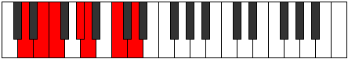
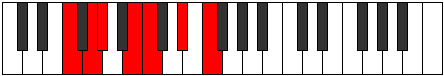

# Mode Ragimic

## Links

- [Documentation](index.md)
- [Scales Index](Scales.md)
- [Modes Index](Modes.md)
- [Chords Index](Chords.md)

## Parent Scale

[Mothimic](ScaleMothimic.md)

## Number

[1229](https://ianring.com/musictheory/scales/1229)

## Perfection

- 3 Perfect notes
- 3 Perfect notes

## Interval Pattern

2, 1, 3, 1, 3, 2

## Perfection Profile

[true false true false true false]

## Permutations

| Tonic | Notes | Signature | Illustration | Audio |
|-------|-------|-----------|--------------|-------|
| [C](ModeCNaturalRagimic.md) | C, **D**, Eb, **F#**, G, **A#**, C | C |  | [midi](https://github.com/edipermadi/music/blob/main/docs/ModeCNaturalRagimic.mid?raw=true) |
| [C#](ModeCSharpRagimic.md) | C#, **D#**, E, **F##**, G#, **A##**, C# | C |  | [midi](https://github.com/edipermadi/music/blob/main/docs/ModeCSharpRagimic.mid?raw=true) |
| [Db](ModeDFlatRagimic.md) | Db, **Eb**, Fb, **G**, Ab, **B**, Db | C |  | [midi](https://github.com/edipermadi/music/blob/main/docs/ModeDFlatRagimic.mid?raw=true) |
| [D](ModeDNaturalRagimic.md) | D, **E**, F, **G#**, A, **B#**, D | C |  | [midi](https://github.com/edipermadi/music/blob/main/docs/ModeDNaturalRagimic.mid?raw=true) |
| [D#](ModeDSharpRagimic.md) | D#, **E#**, F#, **G##**, A#, **B##**, D# | C |  | [midi](https://github.com/edipermadi/music/blob/main/docs/ModeDSharpRagimic.mid?raw=true) |
| [Eb](ModeEFlatRagimic.md) | Eb, **F**, Gb, **A**, Bb, **C#**, Eb | C |  | [midi](https://github.com/edipermadi/music/blob/main/docs/ModeEFlatRagimic.mid?raw=true) |
| [E](ModeENaturalRagimic.md) | E, **F#**, G, **A#**, B, **C##**, E | C |  | [midi](https://github.com/edipermadi/music/blob/main/docs/ModeENaturalRagimic.mid?raw=true) |
| [F](ModeFNaturalRagimic.md) | F, **G**, Ab, **B**, C, **D#**, F | C |  | [midi](https://github.com/edipermadi/music/blob/main/docs/ModeFNaturalRagimic.mid?raw=true) |
| [F#](ModeFSharpRagimic.md) | F#, **G#**, A, **B#**, C#, **D##**, F# | C |  | [midi](https://github.com/edipermadi/music/blob/main/docs/ModeFSharpRagimic.mid?raw=true) |
| [Gb](ModeGFlatRagimic.md) | Gb, **Ab**, Bbb, **C**, Db, **E**, Gb | C |  | [midi](https://github.com/edipermadi/music/blob/main/docs/ModeGFlatRagimic.mid?raw=true) |
| [G](ModeGNaturalRagimic.md) | G, **A**, Bb, **C#**, D, **E#**, G | C |  | [midi](https://github.com/edipermadi/music/blob/main/docs/ModeGNaturalRagimic.mid?raw=true) |
| [G#](ModeGSharpRagimic.md) | G#, **A#**, B, **C##**, D#, **E##**, G# | C |  | [midi](https://github.com/edipermadi/music/blob/main/docs/ModeGSharpRagimic.mid?raw=true) |
| [Ab](ModeAFlatRagimic.md) | Ab, **Bb**, Cb, **D**, Eb, **F#**, Ab | C |  | [midi](https://github.com/edipermadi/music/blob/main/docs/ModeAFlatRagimic.mid?raw=true) |
| [A](ModeANaturalRagimic.md) | A, **B**, C, **D#**, E, **F##**, A | C |  | [midi](https://github.com/edipermadi/music/blob/main/docs/ModeANaturalRagimic.mid?raw=true) |
| [A#](ModeASharpRagimic.md) | A#, **B#**, C#, **D##**, E#, **F###**, A# | C |  | [midi](https://github.com/edipermadi/music/blob/main/docs/ModeASharpRagimic.mid?raw=true) |
| [Bb](ModeBFlatRagimic.md) | Bb, **C**, Db, **E**, F, **G#**, Bb | C |  | [midi](https://github.com/edipermadi/music/blob/main/docs/ModeBFlatRagimic.mid?raw=true) |
| [B](ModeBNaturalRagimic.md) | B, **C#**, D, **E#**, F#, **G##**, B | C |  | [midi](https://github.com/edipermadi/music/blob/main/docs/ModeBNaturalRagimic.mid?raw=true) |
