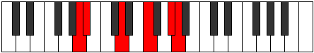

# Mode Ragitonic

## Links

- [Documentation](index.md)
- [Scales Index](Scales.md)
- [Modes Index](Modes.md)
- [Chords Index](Chords.md)

## Parent Scale

[Molitonic](ScaleMolitonic.md)

## Number

[2339](https://ianring.com/musictheory/scales/2339)

## Perfection

- 2 Perfect notes
- 3 Perfect notes

## Perfection Profile

[false true true false false]

## Permutations

| Tonic | Notes | Signature | Illustration | Audio |
|-------|-------|-----------|--------------|-------|
| [C](ModeCNaturalRagitonic.md) | **C**, C#, F, **G#**, **B**, **C** | C |  | [midi](ModeCNaturalRagitonic.mid) [ogg](ModeCNaturalRagitonic.ogg) |
| [C#](ModeCSharpRagitonic.md) | **C#**, D, F#, **A**, **C**, **C#** | C |  | [midi](ModeCSharpRagitonic.mid) [ogg](ModeCSharpRagitonic.ogg) |
| [Db](ModeDFlatRagitonic.md) | **Db**, D, Gb, **A**, **C**, **Db** | C |  | [midi](ModeDFlatRagitonic.mid) [ogg](ModeDFlatRagitonic.ogg) |
| [D](ModeDNaturalRagitonic.md) | **D**, D#, G, **A#**, **C#**, **D** | C |  | [midi](ModeDNaturalRagitonic.mid) [ogg](ModeDNaturalRagitonic.ogg) |
| [D#](ModeDSharpRagitonic.md) | **D#**, E, G#, **B**, **D**, **D#** | C |  | [midi](ModeDSharpRagitonic.mid) [ogg](ModeDSharpRagitonic.ogg) |
| [Eb](ModeEFlatRagitonic.md) | **Eb**, E, Ab, **B**, **D**, **Eb** | C |  | [midi](ModeEFlatRagitonic.mid) [ogg](ModeEFlatRagitonic.ogg) |
| [E](ModeENaturalRagitonic.md) | **E**, F, A, **C**, **D#**, **E** | C |  | [midi](ModeENaturalRagitonic.mid) [ogg](ModeENaturalRagitonic.ogg) |
| [F](ModeFNaturalRagitonic.md) | **F**, F#, A#, **C#**, **E**, **F** | C |  | [midi](ModeFNaturalRagitonic.mid) [ogg](ModeFNaturalRagitonic.ogg) |
| [F#](ModeFSharpRagitonic.md) | **F#**, G, B, **D**, **F**, **F#** | C |  | [midi](ModeFSharpRagitonic.mid) [ogg](ModeFSharpRagitonic.ogg) |
| [Gb](ModeGFlatRagitonic.md) | **Gb**, G, B, **D**, **F**, **Gb** | C |  | [midi](ModeGFlatRagitonic.mid) [ogg](ModeGFlatRagitonic.ogg) |
| [G](ModeGNaturalRagitonic.md) | **G**, G#, C, **D#**, **F#**, **G** | C |  | [midi](ModeGNaturalRagitonic.mid) [ogg](ModeGNaturalRagitonic.ogg) |
| [G#](ModeGSharpRagitonic.md) | **G#**, A, C#, **E**, **G**, **G#** | C |  | [midi](ModeGSharpRagitonic.mid) [ogg](ModeGSharpRagitonic.ogg) |
| [Ab](ModeAFlatRagitonic.md) | **Ab**, A, Db, **E**, **G**, **Ab** | C |  | [midi](ModeAFlatRagitonic.mid) [ogg](ModeAFlatRagitonic.ogg) |
| [A](ModeANaturalRagitonic.md) | **A**, A#, D, **F**, **G#**, **A** | C |  | [midi](ModeANaturalRagitonic.mid) [ogg](ModeANaturalRagitonic.ogg) |
| [A#](ModeASharpRagitonic.md) | **A#**, B, D#, **F#**, **A**, **A#** | C |  | [midi](ModeASharpRagitonic.mid) [ogg](ModeASharpRagitonic.ogg) |
| [Bb](ModeBFlatRagitonic.md) | **Bb**, B, Eb, **Gb**, **A**, **Bb** | C |  | [midi](ModeBFlatRagitonic.mid) [ogg](ModeBFlatRagitonic.ogg) |
| [B](ModeBNaturalRagitonic.md) | **B**, C, E, **G**, **A#**, **B** | C |  | [midi](ModeBNaturalRagitonic.mid) [ogg](ModeBNaturalRagitonic.ogg) |
