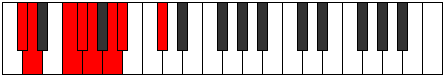
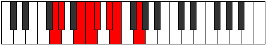

# Mode Ralian

## Links

- [Documentation](index.md)
- [Scales Index](Scales.md)
- [Modes Index](Modes.md)
- [Chords Index](Chords.md)

## Parent Scale

[Tholian](ScaleTholian.md)

## Number

[883](https://ianring.com/musictheory/scales/883)

## Perfection

- 4 Perfect notes
- 3 Perfect notes

## Perfection Profile

[false true false true true false true]

## Permutations

| Tonic | Notes | Signature | Illustration | Audio |
|-------|-------|-----------|--------------|-------|
| [C](ModeCNaturalRalian.md) | **C**, Db, **E**, F, Gb, **Ab**, Bbb, **C** | C |  | [midi](ModeCNaturalRalian.mid) [ogg](ModeCNaturalRalian.ogg) |
| [C#](ModeCSharpRalian.md) | **C#**, D, **E#**, F#, G, **A**, Bb, **C#** | C |  | [midi](ModeCSharpRalian.mid) [ogg](ModeCSharpRalian.ogg) |
| [Db](ModeDFlatRalian.md) | **Db**, Ebb, **F**, Gb, Abb, **Bbb**, Cbb, **Db** | C |  | [midi](ModeDFlatRalian.mid) [ogg](ModeDFlatRalian.ogg) |
| [D](ModeDNaturalRalian.md) | **D**, Eb, **F#**, G, Ab, **Bb**, Cb, **D** | C |  | [midi](ModeDNaturalRalian.mid) [ogg](ModeDNaturalRalian.ogg) |
| [D#](ModeDSharpRalian.md) | **D#**, E, **F##**, G#, A, **B**, C, **D#** | C |  | [midi](ModeDSharpRalian.mid) [ogg](ModeDSharpRalian.ogg) |
| [Eb](ModeEFlatRalian.md) | **Eb**, Fb, **G**, Ab, Bbb, **Cb**, Dbb, **Eb** | C |  | [midi](ModeEFlatRalian.mid) [ogg](ModeEFlatRalian.ogg) |
| [E](ModeENaturalRalian.md) | **E**, F, **G#**, A, Bb, **C**, Db, **E** | C |  | [midi](ModeENaturalRalian.mid) [ogg](ModeENaturalRalian.ogg) |
| [F](ModeFNaturalRalian.md) | **F**, Gb, **A**, Bb, Cb, **Db**, Ebb, **F** | C |  | [midi](ModeFNaturalRalian.mid) [ogg](ModeFNaturalRalian.ogg) |
| [F#](ModeFSharpRalian.md) | **F#**, G, **A#**, B, C, **D**, Eb, **F#** | C |  | [midi](ModeFSharpRalian.mid) [ogg](ModeFSharpRalian.ogg) |
| [Gb](ModeGFlatRalian.md) | **Gb**, Abb, **Bb**, Cb, Dbb, **Ebb**, Fbb, **Gb** | C |  | [midi](ModeGFlatRalian.mid) [ogg](ModeGFlatRalian.ogg) |
| [G](ModeGNaturalRalian.md) | **G**, Ab, **B**, C, Db, **Eb**, Fb, **G** | C |  | [midi](ModeGNaturalRalian.mid) [ogg](ModeGNaturalRalian.ogg) |
| [G#](ModeGSharpRalian.md) | **G#**, A, **B#**, C#, D, **E**, F, **G#** | C |  | [midi](ModeGSharpRalian.mid) [ogg](ModeGSharpRalian.ogg) |
| [Ab](ModeAFlatRalian.md) | **Ab**, Bbb, **C**, Db, Ebb, **Fb**, Gbb, **Ab** | C |  | [midi](ModeAFlatRalian.mid) [ogg](ModeAFlatRalian.ogg) |
| [A](ModeANaturalRalian.md) | **A**, Bb, **C#**, D, Eb, **F**, Gb, **A** | C |  | [midi](ModeANaturalRalian.mid) [ogg](ModeANaturalRalian.ogg) |
| [A#](ModeASharpRalian.md) | **A#**, B, **C##**, D#, E, **F#**, G, **A#** | C |  | [midi](ModeASharpRalian.mid) [ogg](ModeASharpRalian.ogg) |
| [Bb](ModeBFlatRalian.md) | **Bb**, Cb, **D**, Eb, Fb, **Gb**, Abb, **Bb** | C |  | [midi](ModeBFlatRalian.mid) [ogg](ModeBFlatRalian.ogg) |
| [B](ModeBNaturalRalian.md) | **B**, C, **D#**, E, F, **G**, Ab, **B** | C |  | [midi](ModeBNaturalRalian.mid) [ogg](ModeBNaturalRalian.ogg) |
