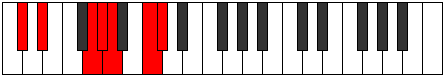

# Mode Ralimic

## Links

- [Documentation](index.md)
- [Scales Index](Scales.md)
- [Modes Index](Modes.md)
- [Chords Index](Chords.md)

## Parent Scale

[Bolimic](ScaleBolimic.md)

## Number

[2501](https://ianring.com/musictheory/scales/2501)

## Interval Pattern

2, 4, 1, 1, 3, 1

## Chord Pattern

IV, v⁰, vi

## Perfection

- 3 Perfect notes
- 3 Perfect notes

## Perfection Profile

[true false false true false true]

## Permutations

| Tonic | Notes | Signature | Illustration | Audio |
|-------|-------|-----------|--------------|-------|
| [C](ModeCNaturalRalimic.md) | C, **D**, **E##**, F##, **G#**, A##, C | C |  | [midi](https://github.com/edipermadi/music/blob/main/docs/ModeCNaturalRalimic.mid?raw=true) |
| [C#](ModeCSharpRalimic.md) | C#, **D#**, **E###**, F###, **G##**, A###, C# | C |  | [midi](https://github.com/edipermadi/music/blob/main/docs/ModeCSharpRalimic.mid?raw=true) |
| [Db](ModeDFlatRalimic.md) | Db, **Eb**, **F##**, G#, **A**, B#, Db | C |  | [midi](https://github.com/edipermadi/music/blob/main/docs/ModeDFlatRalimic.mid?raw=true) |
| [D](ModeDNaturalRalimic.md) | D, **E**, **F###**, G##, **A#**, B##, D | C |  | [midi](https://github.com/edipermadi/music/blob/main/docs/ModeDNaturalRalimic.mid?raw=true) |
| [D#](ModeDSharpRalimic.md) | D#, **E#**, **Cbbb**, Cbb, **Dbbb**, Ebb, D# | C |  | [midi](https://github.com/edipermadi/music/blob/main/docs/ModeDSharpRalimic.mid?raw=true) |
| [Eb](ModeEFlatRalimic.md) | Eb, **F**, **G##**, A#, **B**, C##, Eb | C |  | [midi](https://github.com/edipermadi/music/blob/main/docs/ModeEFlatRalimic.mid?raw=true) |
| [E](ModeENaturalRalimic.md) | E, **F#**, **G###**, A##, **B#**, C###, E | C |  | [midi](https://github.com/edipermadi/music/blob/main/docs/ModeENaturalRalimic.mid?raw=true) |
| [F](ModeFNaturalRalimic.md) | F, **G**, **A##**, B#, **C#**, D##, F | C |  | [midi](https://github.com/edipermadi/music/blob/main/docs/ModeFNaturalRalimic.mid?raw=true) |
| [F#](ModeFSharpRalimic.md) | F#, **G#**, **A###**, B##, **C##**, D###, F# | C |  | [midi](https://github.com/edipermadi/music/blob/main/docs/ModeFSharpRalimic.mid?raw=true) |
| [Gb](ModeGFlatRalimic.md) | Gb, **Ab**, **B#**, C#, **D**, E#, Gb | C |  | [midi](https://github.com/edipermadi/music/blob/main/docs/ModeGFlatRalimic.mid?raw=true) |
| [G](ModeGNaturalRalimic.md) | G, **A**, **B##**, C##, **D#**, E##, G | C |  | [midi](https://github.com/edipermadi/music/blob/main/docs/ModeGNaturalRalimic.mid?raw=true) |
| [G#](ModeGSharpRalimic.md) | G#, **A#**, **B###**, C###, **D##**, E###, G# | C |  | [midi](https://github.com/edipermadi/music/blob/main/docs/ModeGSharpRalimic.mid?raw=true) |
| [Ab](ModeAFlatRalimic.md) | Ab, **Bb**, **C##**, D#, **E**, F##, Ab | C |  | [midi](https://github.com/edipermadi/music/blob/main/docs/ModeAFlatRalimic.mid?raw=true) |
| [A](ModeANaturalRalimic.md) | A, **B**, **C###**, D##, **E#**, F###, A | C |  | [midi](https://github.com/edipermadi/music/blob/main/docs/ModeANaturalRalimic.mid?raw=true) |
| [A#](ModeASharpRalimic.md) | A#, **B#**, **D##**, E#, **F#**, G##, A# | C |  | [midi](https://github.com/edipermadi/music/blob/main/docs/ModeASharpRalimic.mid?raw=true) |
| [Bb](ModeBFlatRalimic.md) | Bb, **C**, **D##**, E#, **F#**, G##, Bb | C |  | [midi](https://github.com/edipermadi/music/blob/main/docs/ModeBFlatRalimic.mid?raw=true) |
| [B](ModeBNaturalRalimic.md) | B, **C#**, **D###**, E##, **F##**, G###, B | C |  | [midi](https://github.com/edipermadi/music/blob/main/docs/ModeBNaturalRalimic.mid?raw=true) |
