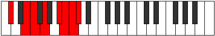

# Mode Ranian

## Links

- [Documentation](index.md)
- [Scales Index](Scales.md)
- [Modes Index](Modes.md)
- [Chords Index](Chords.md)

## Parent Scale

[Ranian](ScaleRanian.md)

## Number

[3673](https://ianring.com/musictheory/scales/3673)

## Perfection

- 4 Perfect notes
- 3 Perfect notes

## Perfection Profile

[false true true false true false true]

## Permutations

| Tonic | Notes | Signature | Illustration | Audio |
|-------|-------|-----------|--------------|-------|
| [C](ModeCNaturalRanian.md) | **C**, D#, E, **F#**, G##, **A#**, B, **C** | C |  | [midi](ModeCNaturalRanian.mid) [ogg](ModeCNaturalRanian.ogg) |
| [C#](ModeCSharpRanian.md) | **C#**, D##, E#, **F##**, G###, **A##**, B#, **C#** | C |  | [midi](ModeCSharpRanian.mid) [ogg](ModeCSharpRanian.ogg) |
| [Db](ModeDFlatRanian.md) | **Db**, E, F, **G**, A#, **B**, C, **Db** | C |  | [midi](ModeDFlatRanian.mid) [ogg](ModeDFlatRanian.ogg) |
| [D](ModeDNaturalRanian.md) | **D**, E#, F#, **G#**, A##, **B#**, C#, **D** | C |  | [midi](ModeDNaturalRanian.mid) [ogg](ModeDNaturalRanian.ogg) |
| [D#](ModeDSharpRanian.md) | **D#**, E##, F##, **G##**, A###, **B##**, C##, **D#** | C |  | [midi](ModeDSharpRanian.mid) [ogg](ModeDSharpRanian.ogg) |
| [Eb](ModeEFlatRanian.md) | **Eb**, F#, G, **A**, B#, **C#**, D, **Eb** | C |  | [midi](ModeEFlatRanian.mid) [ogg](ModeEFlatRanian.ogg) |
| [E](ModeENaturalRanian.md) | **E**, F##, G#, **A#**, B##, **C##**, D#, **E** | C |  | [midi](ModeENaturalRanian.mid) [ogg](ModeENaturalRanian.ogg) |
| [F](ModeFNaturalRanian.md) | **F**, G#, A, **B**, C##, **D#**, E, **F** | C |  | [midi](ModeFNaturalRanian.mid) [ogg](ModeFNaturalRanian.ogg) |
| [F#](ModeFSharpRanian.md) | **F#**, G##, A#, **B#**, C###, **D##**, E#, **F#** | C |  | [midi](ModeFSharpRanian.mid) [ogg](ModeFSharpRanian.ogg) |
| [Gb](ModeGFlatRanian.md) | **Gb**, A, Bb, **C**, D#, **E**, F, **Gb** | C |  | [midi](ModeGFlatRanian.mid) [ogg](ModeGFlatRanian.ogg) |
| [G](ModeGNaturalRanian.md) | **G**, A#, B, **C#**, D##, **E#**, F#, **G** | C |  | [midi](ModeGNaturalRanian.mid) [ogg](ModeGNaturalRanian.ogg) |
| [G#](ModeGSharpRanian.md) | **G#**, A##, B#, **C##**, D###, **E##**, F##, **G#** | C |  | [midi](ModeGSharpRanian.mid) [ogg](ModeGSharpRanian.ogg) |
| [Ab](ModeAFlatRanian.md) | **Ab**, B, C, **D**, E#, **F#**, G, **Ab** | C |  | [midi](ModeAFlatRanian.mid) [ogg](ModeAFlatRanian.ogg) |
| [A](ModeANaturalRanian.md) | **A**, B#, C#, **D#**, E##, **F##**, G#, **A** | C |  | [midi](ModeANaturalRanian.mid) [ogg](ModeANaturalRanian.ogg) |
| [A#](ModeASharpRanian.md) | **A#**, B##, C##, **D##**, E###, **F###**, G##, **A#** | C |  | [midi](ModeASharpRanian.mid) [ogg](ModeASharpRanian.ogg) |
| [Bb](ModeBFlatRanian.md) | **Bb**, C#, D, **E**, F##, **G#**, A, **Bb** | C |  | [midi](ModeBFlatRanian.mid) [ogg](ModeBFlatRanian.ogg) |
| [B](ModeBNaturalRanian.md) | **B**, C##, D#, **E#**, F###, **G##**, A#, **B** | C |  | [midi](ModeBNaturalRanian.mid) [ogg](ModeBNaturalRanian.ogg) |
