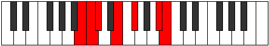

# Mode Ranimic

## Links

- [Documentation](README.md)
- [Scales Index](Scales.md)
- [Modes Index](Modes.md)
- [Chords Index](Chords.md)

## Parent Scale

[Pynimic](ScalePynimic.md)

## Number

[2215](https://ianring.com/musictheory/scales/2215)

## Transposition

1, 1, 3, 2, 4, 1

## Chord Pattern

vi⁰b3

## Perfection

- 3 Perfect notes
- 3 Perfect notes

## Perfection Profile

true, false, false, true, true, false

## Permutations

| Tonic | Notes | Signature | Illustration | Audio |
|-------|-------|-----------|--------------|-------|
| [C](ModeCNaturalRanimic.md) | C, **Db**, **Ebb**, F, G, **A##**, C | C |  | [midi](https://github.com/edipermadi/music/blob/main/docs/ModeCNaturalRanimic.mid?raw=true) |
| [C#](ModeCSharpRanimic.md) | C#, **D**, **Eb**, F#, G#, **A###**, C# | C |  | [midi](https://github.com/edipermadi/music/blob/main/docs/ModeCSharpRanimic.mid?raw=true) |
| [Db](ModeDFlatRanimic.md) | Db, **Ebb**, **Fbb**, Gb, Ab, **B#**, Db | C |  | [midi](https://github.com/edipermadi/music/blob/main/docs/ModeDFlatRanimic.mid?raw=true) |
| [D](ModeDNaturalRanimic.md) | D, **Eb**, **Fb**, G, A, **B##**, D | C |  | [midi](https://github.com/edipermadi/music/blob/main/docs/ModeDNaturalRanimic.mid?raw=true) |
| [D#](ModeDSharpRanimic.md) | D#, **E**, **F**, G#, A#, **B###**, D# | C |  | [midi](https://github.com/edipermadi/music/blob/main/docs/ModeDSharpRanimic.mid?raw=true) |
| [Eb](ModeEFlatRanimic.md) | Eb, **Fb**, **Gbb**, Ab, Bb, **C##**, Eb | C |  | [midi](https://github.com/edipermadi/music/blob/main/docs/ModeEFlatRanimic.mid?raw=true) |
| [E](ModeENaturalRanimic.md) | E, **F**, **Gb**, A, B, **C###**, E | C |  | [midi](https://github.com/edipermadi/music/blob/main/docs/ModeENaturalRanimic.mid?raw=true) |
| [F](ModeFNaturalRanimic.md) | F, **Gb**, **Abb**, Bb, C, **D##**, F | C |  | [midi](https://github.com/edipermadi/music/blob/main/docs/ModeFNaturalRanimic.mid?raw=true) |
| [F#](ModeFSharpRanimic.md) | F#, **G**, **Ab**, B, C#, **D###**, F# | C |  | [midi](https://github.com/edipermadi/music/blob/main/docs/ModeFSharpRanimic.mid?raw=true) |
| [Gb](ModeGFlatRanimic.md) | Gb, **Abb**, **Bbbb**, Cb, Db, **E#**, Gb | C |  | [midi](https://github.com/edipermadi/music/blob/main/docs/ModeGFlatRanimic.mid?raw=true) |
| [G](ModeGNaturalRanimic.md) | G, **Ab**, **Bbb**, C, D, **E##**, G | C |  | [midi](https://github.com/edipermadi/music/blob/main/docs/ModeGNaturalRanimic.mid?raw=true) |
| [G#](ModeGSharpRanimic.md) | G#, **A**, **Bb**, C#, D#, **E###**, G# | C |  | [midi](https://github.com/edipermadi/music/blob/main/docs/ModeGSharpRanimic.mid?raw=true) |
| [Ab](ModeAFlatRanimic.md) | Ab, **Bbb**, **Cbb**, Db, Eb, **F##**, Ab | C |  | [midi](https://github.com/edipermadi/music/blob/main/docs/ModeAFlatRanimic.mid?raw=true) |
| [A](ModeANaturalRanimic.md) | A, **Bb**, **Cb**, D, E, **F###**, A | C |  | [midi](https://github.com/edipermadi/music/blob/main/docs/ModeANaturalRanimic.mid?raw=true) |
| [A#](ModeASharpRanimic.md) | A#, **B**, **C**, D#, E#, **Cbbb**, A# | C |  | [midi](https://github.com/edipermadi/music/blob/main/docs/ModeASharpRanimic.mid?raw=true) |
| [Bb](ModeBFlatRanimic.md) | Bb, **Cb**, **Dbb**, Eb, F, **G##**, Bb | C |  | [midi](https://github.com/edipermadi/music/blob/main/docs/ModeBFlatRanimic.mid?raw=true) |
| [B](ModeBNaturalRanimic.md) | B, **C**, **Db**, E, F#, **G###**, B | C |  | [midi](https://github.com/edipermadi/music/blob/main/docs/ModeBNaturalRanimic.mid?raw=true) |
