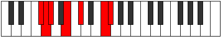

# Mode Ranimic

## Links

- [Documentation](index.md)
- [Scales Index](Scales.md)
- [Modes Index](Modes.md)
- [Chords Index](Chords.md)

## Parent Scale

[Pynimic](ScalePynimic.md)

## Number

[2215](https://ianring.com/musictheory/scales/2215)

## Perfection

- 3 Perfect notes
- 3 Perfect notes

## Perfection Profile

[true false false true true false]

## Permutations

| Tonic | Notes | Signature | Illustration | Audio |
|-------|-------|-----------|--------------|-------|
| [C](ModeCNaturalRanimic.md) | C, **Db**, **Ebb**, F, G, **A##**, C | C |  | [midi](ModeCNaturalRanimic.mid) [ogg](ModeCNaturalRanimic.ogg) |
| [C#](ModeCSharpRanimic.md) | C#, **D**, **Eb**, F#, G#, **A###**, C# | C |  | [midi](ModeCSharpRanimic.mid) [ogg](ModeCSharpRanimic.ogg) |
| [Db](ModeDFlatRanimic.md) | Db, **Ebb**, **Fbb**, Gb, Ab, **B#**, Db | C |  | [midi](ModeDFlatRanimic.mid) [ogg](ModeDFlatRanimic.ogg) |
| [D](ModeDNaturalRanimic.md) | D, **Eb**, **Fb**, G, A, **B##**, D | C |  | [midi](ModeDNaturalRanimic.mid) [ogg](ModeDNaturalRanimic.ogg) |
| [D#](ModeDSharpRanimic.md) | D#, **E**, **F**, G#, A#, **B###**, D# | C |  | [midi](ModeDSharpRanimic.mid) [ogg](ModeDSharpRanimic.ogg) |
| [Eb](ModeEFlatRanimic.md) | Eb, **Fb**, **Gbb**, Ab, Bb, **C##**, Eb | C |  | [midi](ModeEFlatRanimic.mid) [ogg](ModeEFlatRanimic.ogg) |
| [E](ModeENaturalRanimic.md) | E, **F**, **Gb**, A, B, **C###**, E | C |  | [midi](ModeENaturalRanimic.mid) [ogg](ModeENaturalRanimic.ogg) |
| [F](ModeFNaturalRanimic.md) | F, **Gb**, **Abb**, Bb, C, **D##**, F | C |  | [midi](ModeFNaturalRanimic.mid) [ogg](ModeFNaturalRanimic.ogg) |
| [F#](ModeFSharpRanimic.md) | F#, **G**, **Ab**, B, C#, **D###**, F# | C |  | [midi](ModeFSharpRanimic.mid) [ogg](ModeFSharpRanimic.ogg) |
| [Gb](ModeGFlatRanimic.md) | Gb, **Abb**, **Bbbb**, Cb, Db, **E#**, Gb | C |  | [midi](ModeGFlatRanimic.mid) [ogg](ModeGFlatRanimic.ogg) |
| [G](ModeGNaturalRanimic.md) | G, **Ab**, **Bbb**, C, D, **E##**, G | C |  | [midi](ModeGNaturalRanimic.mid) [ogg](ModeGNaturalRanimic.ogg) |
| [G#](ModeGSharpRanimic.md) | G#, **A**, **Bb**, C#, D#, **E###**, G# | C |  | [midi](ModeGSharpRanimic.mid) [ogg](ModeGSharpRanimic.ogg) |
| [Ab](ModeAFlatRanimic.md) | Ab, **Bbb**, **Cbb**, Db, Eb, **F##**, Ab | C |  | [midi](ModeAFlatRanimic.mid) [ogg](ModeAFlatRanimic.ogg) |
| [A](ModeANaturalRanimic.md) | A, **Bb**, **Cb**, D, E, **F###**, A | C |  | [midi](ModeANaturalRanimic.mid) [ogg](ModeANaturalRanimic.ogg) |
| [A#](ModeASharpRanimic.md) | A#, **B**, **C**, D#, E#, **Cbbb**, A# | C |  | [midi](ModeASharpRanimic.mid) [ogg](ModeASharpRanimic.ogg) |
| [Bb](ModeBFlatRanimic.md) | Bb, **Cb**, **Dbb**, Eb, F, **G##**, Bb | C |  | [midi](ModeBFlatRanimic.mid) [ogg](ModeBFlatRanimic.ogg) |
| [B](ModeBNaturalRanimic.md) | B, **C**, **Db**, E, F#, **G###**, B | C |  | [midi](ModeBNaturalRanimic.mid) [ogg](ModeBNaturalRanimic.ogg) |
